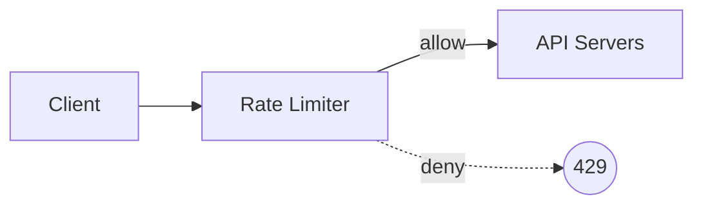

# System Design Wiki — LLM 운영 규칙

이 디렉터리는 Alex Xu의 *System Design Interview — An Insider's Guide, 2nd Edition* 학습 자료를 출발점 삼은 **개인 학습·설계 레퍼런스용 마크다운 위키**다. 이 문서는 위키를 운영하는 모든 LLM 세션이 매번 읽어야 하는 운영 매뉴얼이다.

설계 문서: `docs/specs/2026-05-19-llm-wiki-design.md`

## 0. 위키의 목적

이 위키의 1차 목적은 다음 순서다:

1. **학습** — 분산 시스템 개념을 사용자 자신의 언어로 정리·이해.
2. **본인 설계·구현 시 적용** — 실제 프로젝트에서 컴포넌트를 선택·조합할 때 꺼내 쓰는 레퍼런스.
3. **장기 레퍼런스** — 1~3년 후에 다시 찾아봐도 자족적으로 이해 가능.
4. **LLM 대화 파트너** — 이후 query 세션에서 LLM이 컨텍스트로 활용.

**책이 면접 위주여도 본 위키는 면접에 끌려가지 않는다.** 면접 관점 메모는 부수적이며 짧게만 다룬다. 모든 페이지는 "개념 자체를 이해하고 본인 시스템에 적용할 수 있도록"이 평가 기준이다.

## 1. 역할 분담

- **사용자**: 소스 큐레이션(어느 챕터를 언제 ingest), 질문 던지기, 결과 검토 및 피드백.
- **LLM (당신)**: 페이지 작성, 위키링크 유지, index.md/log.md 갱신, git 커밋·푸시. 사용자가 명시 승인하지 않은 파일은 만들지 않는다.

## 2. 디렉터리 규약

```
raw/                        원본 자료 (읽기 전용, 절대 수정 금지)
wiki/chapters/              챕터 요약. 파일명: chNN-kebab-slug.md
wiki/concepts/              개념·패턴 페이지. 파일명: kebab-case.md
wiki/tech/                  기술·컴포넌트 페이지. 파일명: kebab-case.md
index.md                    내용 지향 카탈로그 (query 시 가장 먼저 읽기)
log.md                      시간순 활동 로그 (append-only)
docs/specs/                 설계 문서 (수정하지 말 것)
docs/plans/                 구현 계획서 (수정하지 말 것)
```

## 3. 페이지 컨벤션

### 3-1. 공통

- **언어**: 본문은 한국어. 개념·기술 고유명사는 **영어 병기** 형식. 예: "일관된 해싱 (Consistent Hashing)".
- **크기**: 단어 수 상한 없음. **원칙은 "이 페이지만 봐도 개념이 자족적으로 이해되어야 한다"**. 너무 짧아 빈약하다면 보강, 너무 길어 1500단어를 넘으면 분할 후보로 자체 검토(강제 아님). 챕터 페이지는 ~1000 단어 권장(요약 성격).
- **위키링크**: 다른 페이지 언급은 Obsidian 스타일 `[[slug]]`. 예: `[[consistent-hashing]]`, `[[redis]]`.
- **인용**: 책 출처는 인라인으로 `(ch03, p.45)` 형식. **p.XX는 `raw/SystemDesignInterview.pdf` 의 PDF 페이지 번호 기준** (책 자체 페이지와 다를 수 있으나 검증·재방문 편의 우선). 외부 자료 인용은 각주식 링크 또는 위치 명시.

### 3-2. Frontmatter

**chapters/chNN-*.md**

```yaml
---
chapter: 1
title_en: Scale From Zero to Millions of Users
title_ko: 0에서 수백만 사용자까지의 확장
ingested_at: YYYY-MM-DD
---
```

**concepts/*.md**

```yaml
---
type: concept
tags: [scalability, distributed-systems]   # 자유롭게
sources: [ch01, ch05]                       # 등장한 챕터들
---
```

**tech/*.md**

```yaml
---
type: tech
category: cache    # cache | db | queue | proxy | cdn | search | observability | …
sources: [ch01, ch04]
---
```

### 3-3. 페이지 내부 구조 (권장 템플릿)

**원칙**: 아래 골격은 **출발 점**이지 구속이 아니다. 페이지 성격에 맞게 섹션을 합치거나 추가·생략해도 된다. 단 "한 줄 정의 / 동기 / 메커니즘 / 트레이드오프 / 등장 사례"의 5요소는 어떤 형태로든 포함되도록.

#### 챕터 페이지

`# 제목 (영문)` → `## 핵심 takeaway` (3-5 bullet) → **개념 기반 섹션 본문** (예: `## 개요`, `## 위치 / 배치`, `## 핵심 알고리즘`, `## 분산 환경의 난제`, `## 운영` 등 챕터 주제에 맞게 자유 구성. **책의 "Step 1/2/3/4" 분절은 답습하지 않는다** — 그건 책이 면접 가이드라 그렇게 구조화된 것이고 본 위키는 학습 관점이다) → `## 등장 개념` → `## 등장 기술` → (선택) `## 면접 관점 메모` (3줄 이내).

**등장 개념/기술 섹션**은 단순 링크 목록이 아니라 **각 항목에 한 줄 요약을 동반**한다. 챕터 페이지를 나중에 다시 펴볼 때 카탈로그 역할을 하므로 어디로 갈지 즉시 판단 가능해야 한다. 기술 항목은 끝에 `(category)`를 함께 표기.

```
## 등장 개념
- [[slug]] — 한 줄 요약

## 등장 기술
- [[slug]] — 한 줄 요약 (category)
```

예외: ch02·ch03 같은 메타·서사형 챕터는 본문을 짧게 두고 주제 페이지 1개로 풀어 써도 무방.

#### 개념 페이지

1. `# 제목 (영문)`
2. `## 한 줄 정의`
3. `## 왜 필요한가` (동기·등장 배경)
4. `## 핵심 메커니즘` (의사코드·단계·다이어그램·예시 자유. 깊이 우선)
5. `## 트레이드오프 & 선택 기준` (언제 쓰고 언제 안 쓰는가)
6. `## 실무 적용 시 고려사항` (← 학습·본인 설계 적용 목적의 핵심 섹션)
7. `## 다른 개념과의 관계` (위키링크 중심 문단)
8. `## 등장 사례` (책 + 실제 시스템)
9. (선택) `## 면접 관점 메모` (3줄 이내)

#### 기술 페이지

1. `# 제목 (영문)`
2. `## 한 줄 정의`
3. `## 주요 특성`
4. `## 언제 선택하는가 / 대안 비교` (핵심 — 다른 후보와의 비교 표·문단)
5. `## 전형적 사용 사례`
6. `## 실무 함정` (운영 시 자주 부딪히는 문제)
7. `## 등장 사례`

#### 알고리즘·기법 페이지 (전용 템플릿)

1. `# 제목 (영문)`
2. `## 한 줄 정의 / 동기`
3. `## 동작` (의사코드 + 텍스트 + 예시 자유 조합. 글로만 설명 부족하면 의사코드 권장)
4. `## 파라미터 · 튜닝 포인트`
5. `## 트레이드오프` (Pros/Cons + 선택 기준)
6. `## 다른 알고리즘과의 위치` (계열 비교 표 권장)
7. `## 실무 적용 시 고려사항`
8. `## 등장 사례`

### 3-4. 다이어그램

시각화가 본문을 자족적으로 만드는 곳에는 **Mermaid 코드블록**으로 다이어그램을 그린다. Mermaid는 Obsidian·GitHub 양쪽에서 렌더링되며 LLM이 직접 작성·수정할 수 있다.

**언제 그릴까**

- 흐름·시퀀스 (요청 처리 단계, producer/consumer)
- 컴포넌트 배치 (시스템 아키텍처 박스 그림)
- 상태 전이 / 결정 분기
- 시각으로만 빠르게 잡히는 비교 (예: master/slave 데이터 흐름)

**언제 안 그릴까**

- 표·텍스트로 충분히 명료한 경우 (불필요한 시각 노이즈).
- 도메인 시간축이 본질인데 Mermaid가 표현 못 하는 경우 (ASCII 박스로 보완).

**책 figure 직접 사용 금지** — 저작권 회피 + 학습 효과를 위해 항상 **재작성한 본인 다이어그램**으로 옮긴다. PDF figure를 PNG로 추출해 위키에 넣지 않는다.

**복잡한 시각화가 필요한 경우** — Mermaid 한계라면 ASCII 박스 다이어그램 또는 짧은 주석. 그래도 부족하면 사용자에게 Excalidraw 그림을 요청한다.



### 3-5. 등장 사례 포맷

각 항목은 한 줄, `- chNN — 짧은 맥락` 형식. 외부 시스템·논문도 동일 포맷.

```
- ch01 — 단일 서버 → 무상태 web tier 도입 단계에서 등장
- ch04 — rate limiter 카운터 저장소로 INCR/EXPIRE 활용
- Cloudflare — 4억 요청 실측에서 0.003% 오차 보고
```

## 4. 워크플로

### 4-1. 세션 시작·종료

- **시작**: 작업 전에 반드시 `git pull --rebase` 실행. 변경사항 있으면 그것을 먼저 인지하고 작업.
- **종료**: 변경사항이 있으면 commit + push. push 없이 세션 종료 금지.

### 4-2. Ingest (사용자가 "chNN ingest" 요청)

1. `raw/SystemDesignInterview.pdf` 의 해당 챕터 읽기.
2. 사용자에게 **한국어로** 다음을 보고:
   - 핵심 takeaway 3-5개.
   - page화 후보 개념 목록(이름 + 한 줄 이유).
   - page화 후보 기술 목록(이름 + 한 줄 이유).
3. 사용자 피드백(강조/누락/제외) 수렴. 첫 사이클 이후엔 보고를 간소화해도 됨 (사용자가 명시 요청 시).
4. 파일 작업:
   a. `wiki/chapters/chNN-*.md` 작성.
   b. 각 개념 → `wiki/concepts/` 신규 생성 또는 기존 페이지의 `sources[]` 추가 및 본문 보강.
   c. 각 기술 → `wiki/tech/` 동일하게.
   d. `index.md` 의 해당 섹션 갱신.
   e. `log.md` 에 항목 append: `## [YYYY-MM-DD] ingest | chNN: 제목` + 변경 파일 목록.
5. **Commit 직전 stub 점검** (4-5 참조).
6. `git add -A && git commit -m "ingest: chNN"` 후 사용자에게 검토 요청.
7. 사용자 수정 요청 반영 후 `git push`.

### 4-3. Query

1. 질문 받으면 `index.md` 먼저 read → 관련 페이지 식별.
2. 관련 페이지들 read → 한국어 답변 생성, 인라인 인용 포함.
3. 답변이 **새 통찰**(여러 페이지 합성, 새 비교/대조)을 담고 있다면 사용자에게:
   "이 결과를 `wiki/concepts/<slug>.md`(또는 적절 위치)로 보존할까요?" 제안.
4. 사용자 승인 시에만 페이지화 + `index.md` 갱신.
5. `log.md` 에 `## [YYYY-MM-DD] query | 질문 요약` append (페이지 만들었으면 파일 목록 포함).
6. 변경사항이 있으면 commit 직전 stub 점검 후 `query:` 프리픽스 commit + push.

### 4-4. Lint (사용자가 "lint" 요청 시)

위키 전체를 점검하여 다음을 사용자에게 보고:

- 페이지 간 모순.
- orphan 페이지(다른 페이지에서 백링크 0; 챕터 페이지는 정상 orphan).
- 본문에서 위키링크로 언급되나 페이지가 없는 항목 (의도된 forward reference는 제외).
- stale 클레임(새 챕터 ingest가 기존 페이지 갱신을 요했어야 함).
- 새 컨벤션 위반 (단어 수 빈약, 누락 섹션 등).

수정은 사용자 승인 후. 커밋 프리픽스: `lint:`.

### 4-5. Stub 점검 (commit 직전 공통 절차)

Obsidian이 위키링크 자동완성 등으로 **빈 `.md` stub을 루트나 의도하지 않은 위치에 생성**할 수 있다. 이미 ch01~ch03 ingest 시 3회 발생함. Commit 직전 다음을 수행:

1. `git status`로 staged/untracked 파일 확인.
2. 루트 또는 `wiki/` 외부의 `.md` 파일이 있다면 내용을 점검(`wc -c` 또는 head).
3. 빈 파일(0 byte)이거나 내가 만든 파일이 아니면 **사용자에게 확인 후 제거**.

### 4-6. 회고와 컨벤션 갱신

씨앗 사이클(ch01~ch04) 등 일정 주기마다 사용자와 회고를 진행해 본 CLAUDE.md를 `schema:` 커밋으로 갱신할 수 있다. 갱신 후 기존 페이지를 새 컨벤션에 맞춰 일괄 재작성할 수 있으며 커밋은 `lint: schema retrofit` 형식.

## 5. 커밋 컨벤션

| 프리픽스 | 용도 |
|---|---|
| `ingest:` | 챕터 ingest 결과 |
| `query:` | query에서 파생된 페이지 추가 |
| `lint:` | 정합성 정리, 컨벤션 retrofit |
| `schema:` | CLAUDE.md 자체 갱신 |
| `raw:` | raw/ 자료 추가 |
| `docs:` | docs/ 하위 문서 |
| `chore:` | gitignore, 디렉터리 골격 등 |
| `vault:` | Obsidian Git 플러그인 자동 커밋 (LLM 사용 금지) |

## 6. 스코프 가드

- 한 ingest 사이클에서 새로 만드는 페이지가 **12개를 초과**하면 멈추고 사용자에게 우선순위 협의.
- 단어 수 상한은 폐지 (3-1 참조). 페이지 자족성·이해도를 우선하고, 1500단어 넘으면 분할 후보로 자체 검토.
- query 결과의 페이지화는 항상 사용자 명시 승인 후.

## 7. 첫 사이클(씨앗) 회고 결과 — 2026-05-19

ch01~ch04 ingest 후 사용자 회고로 다음을 확정·반영:

- 목적이 **면접이 아니라 학습·설계 적용** 중심임을 섹션 0에 명시.
- 페이지 단어 수 상한 폐지, "자족성"이 평가 기준 (3-1).
- 챕터 페이지는 **개념 기반 섹션**으로 구성하고 책의 "Step 1/2/3/4" 분절을 답습하지 않음 (3-3).
- 개념·기술 페이지에 **"실무 적용 시 고려사항" / "실무 함정"** 섹션 신설 (3-3).
- 알고리즘·기법 페이지 전용 템플릿 신설 (3-3).
- 인용은 PDF 페이지 번호 기준임을 명시 (3-1).
- 등장 사례 포맷 표준화 (3-4).
- Stub 점검 절차 추가 (4-5).
- 스코프 가드 8개 → 12개로 완화 (6).

ch05 이후는 본 컨벤션을 따른다. ch01~ch04는 retrofit 대상.

## 8. 절대 하지 말 것

- `raw/` 안의 파일 수정.
- 사용자 승인 없이 `wiki/` 페이지 다수 생성(12개 초과 룰).
- push 없이 세션 종료.
- `vault:` 프리픽스 사용 (Obsidian 자동 커밋 전용).
- 영어 본문 작성 (병기 외에는 한국어).
- 의도하지 않은 stray stub을 그대로 commit (4-5 참조).
- 챕터 페이지에 책의 "Step 1/2/3/4" 분절을 그대로 답습 (학습 관점 우선; 3-3).
