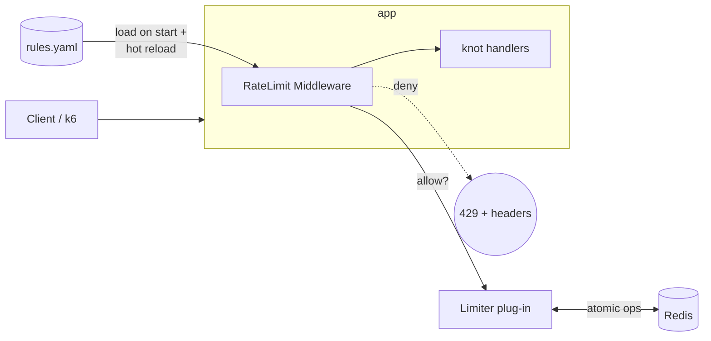

# Rate Limiter 학습 프로젝트 설계 (knot)

- **문서 종류**: Spec (설계 문서)
- **작성일**: 2026-05-24
- **연관 챕터**: ch04 — Design a Rate Limiter
- **위치**: `experiments/knot/`
- **상태**: 작성 직후 (구현 미착수)

## 0. 목적과 학습 의도

본 프로젝트는 **ch04에 등장하는 모든 핵심 개념과 추가 토픽**을 직접 구현해 검증하기 위한 학습용 코드 베이스다. 위키 페이지([[ch04-rate-limiter]] 및 그 등장 개념·기술 페이지)의 의사코드·트레이드오프·실측 수치를 본인 손으로 재현해 학습 효과를 강화하는 것이 1차 목적이다.

부차 목적:

- 가상 서비스 **knot** (URL 단축 SaaS)을 캐리어로 깔아두고, 이후 챕터(ch05 일관된 해싱 → ch06 KV store → ch07 unique ID → **ch08 URL Shortener**)에서 같은 서비스를 점진적으로 확장하는 베이스로 재사용한다. 본 사이클의 산출물은 rate limiter 미들웨어 + 최소 mock 단축 로직에 한정한다.
- 위키 페이지의 "등장 사례"에 본 실험을 cross-link하여 위키와 코드를 양방향으로 연결한다.

비목표:

- 실제 운용 가능한 URL 단축 서비스 만들기.
- 멀티 DC, OSI L3 차단 등 ch04 후반 토픽의 풀 구현 — 회고 페이지에서 "왜 안 했는지 + 어디서 다룰지"로 정리만 한다.

## 1. 가상 서비스 — knot

URL 단축 SaaS. 명칭은 "URL을 매듭으로 묶다"의 비유.

### 1-1. 엔드포인트 (이번 사이클 mock)

| 엔드포인트      | 메서드  | 동작                                                          | 비용 특성     | 식별          |
| ---------- | ---- | ----------------------------------------------------------- | --------- | ----------- |
| `/shorten` | POST | `{"url": "…"}` → `{"code": "abc123"}` 발급, in-memory dict 저장 | 쓰기, 빡빡 제한 | `X-API-Key` |
| `/{code}`  | GET  | 302 redirect to 원본 URL                                      | 읽기, 헐겁게   | 익명 IP       |

### 1-2. 향후 진화 노트 (이번 사이클 스코프 외)

실서비스에서는 두 경로의 부하 특성이 정반대라 거의 항상 분리한다:

| | `POST /shorten` | `GET /{code}` |
|---|---|---|
| QPS | 낮음 | 압도적으로 높음 (클릭마다 1회) |
| 지연 민감도 | 보통 | 극도로 민감 |
| 저장소 | primary DB, 중복 검사 | read replica / KV / **edge cache** |
| 배포 | 중앙 | edge 가까이, 다지역 |
| rate limit | API 키 단위 쿼터 | IP·지역 단위 abuse 방어 |

이 분리는 본 위키의 ch05(consistent hashing)·ch06(KV store)·ch07(unique ID)·**ch08(URL Shortener)** 에서 다뤄질 주제다. 본 사이클에서는 같은 앱 안에 두 엔드포인트를 mock으로 두되, 미들웨어가 **엔드포인트별로 다른 규칙·다른 알고리즘**을 적용할 수 있도록 설계해 ch08 시점에 양쪽 서비스로 rate limiter 코드를 거의 그대로 이식할 수 있게 한다.

## 2. 아키텍처



### 2-1. 컴포넌트

- **FastAPI 앱** — knot mock 핸들러 2개.
- **RateLimit Middleware** — 모든 요청에 대해 식별자 추출 → 규칙 조회 → limiter 호출 → 헤더 주입 → 거부 시 429.
- **Limiter (plug-in)** — 알고리즘 모듈 N개를 동일 인터페이스로 제공. 엔드포인트별 규칙에 따라 모듈 선택.
- **Redis** — 모든 카운터의 단일 진실 (single source of truth). race condition은 Lua/sorted-set 원자 연산으로 해결.
- **rules.yaml** — Lyft envoy 포맷 차용. 시작 시 로드 + 핫리로드.
- **k6** — 호스트에서 Docker 컨테이너로 실행. 부하 시나리오 + 결과 JSON.
- **Report generator** — k6 JSON → matplotlib PNG + 마크다운 리포트.

### 2-2. 디렉터리

```
experiments/knot/
  app/
    main.py              # FastAPI 앱, 라우트
    middleware.py        # RateLimit Middleware
    rules.py             # YAML 로더 + 캐시 + 핫리로드
    limiter/
      base.py            # Limiter Protocol, Decision, Rule
      registry.py        # 알고리즘 이름 -> 모듈 매핑
      token_bucket.py
      leaking_bucket.py
      fixed_window.py
      sliding_window_log.py
      sliding_window_counter.py
  rules.yaml
  load/
    token_bucket.k6.js
    leaking_bucket.k6.js
    ...
    race_demo.k6.js
  reports/
    token_bucket.md
    ...
  tests/
    unit/
    integration/
  scripts/
    report.py            # k6 JSON -> matplotlib PNG -> md
  docker-compose.yml     # redis + app
  pyproject.toml
  README.md              # 빠른 시작 + ch08 진화 노트
```

## 3. 인터페이스

### 3-1. Limiter 프로토콜

```python
# app/limiter/base.py
class Rule(NamedTuple):
    algorithm: str        # "token_bucket" | "leaking_bucket" | ...
    unit: str             # "second" | "minute" | "hour"
    requests_per_unit: int
    burst: int | None = None      # token_bucket
    mode: str = "hard"            # "hard" | "soft"

class Decision(NamedTuple):
    allowed: bool
    limit: int
    remaining: int
    retry_after: float    # 거부 시 재시도까지 초; allowed=True면 0.0

class Limiter(Protocol):
    async def allow(self, key: str, rule: Rule) -> Decision: ...
```

- `key` 형식: `f"knot:{endpoint}:{identity}"` — 예: `knot:shorten:api_key=abc123`.
- `rule`은 입력(정책 설정), `Decision`은 출력(판정 + 클라이언트 헤더용 메타데이터).
- 모든 알고리즘은 **단일 `allow()` 호출 안에서 원자 연산으로 완료** — Lua script 또는 sorted set + atomic 연산.

### 3-2. rules.yaml (Lyft envoy 포맷)

```yaml
domain: knot
descriptors:
  - key: endpoint
    value: shorten
    rate_limit:
      algorithm: sliding_window_log
      unit: minute
      requests_per_unit: 10
      mode: hard
  - key: endpoint
    value: redirect
    rate_limit:
      algorithm: token_bucket
      unit: second
      requests_per_unit: 50
      burst: 100
      mode: soft
```

- 엔드포인트별로 다른 알고리즘·다른 정책 지정 가능 → 한 앱 안에서 5개 알고리즘 공존 시연.
- 핫리로드는 사이클 6에서 구현 (파일 watcher 또는 SIGHUP).

## 4. 데이터 흐름 (요청 1회 생명주기)

```
1. HTTP request 도착
2. Middleware:
   a. identity = headers["X-API-Key"] or request.client.host
   b. endpoint = route name ("shorten" | "redirect")
   c. rule = rules.lookup(domain="knot", descriptor=("endpoint", endpoint))
        - 없음 → 기본 allow + 경고 로그
        - 있음 → 진행
   d. key = f"knot:{endpoint}:{identity}"
   e. decision = await LIMITERS[rule.algorithm].allow(key, rule)
3. 응답 헤더 주입 (allow 여부 무관):
   X-Ratelimit-Limit, X-Ratelimit-Remaining
4. decision.allowed == False:
   X-Ratelimit-Retry-After 추가, return 429
5. allowed == True:
   handler 실행 후 응답
```

## 5. 에러 처리

| 상황 | 동작 | 이유 |
|---|---|---|
| Redis 연결 실패 | **fail-open** + `X-Ratelimit-Degraded: true` 헤더 + 경고 로그 | 학습용 + UX 우선. `FAIL_MODE=open\|closed` 환경변수로 토글 가능 |
| Lua 스크립트 에러 | fail-open + ERROR 로그 | 동일 |
| 규칙 없음 | 통과 + INFO 로그 | 의도하지 않은 엔드포인트 무차별 차단 방지 |
| 잘못된 API 키 형식 | 그대로 식별자로 사용 | auth는 본 사이클 스코프 외 |
| 시계 skew | sliding window 계열은 Redis `TIME` 명령으로 서버 시각 사용 | race 방지 연장선 |

## 6. 테스트 전략

| 계층 | 도구 | 검증 대상 |
|---|---|---|
| Unit (알고리즘) | pytest + **fakeredis** + frozen time (`freezegun`) | 알고리즘 자체 정확성 (경계 burst, 윈도우 전환 등). 결정적·빠름 |
| Integration | pytest + 실제 Redis(docker-compose) + httpx | 미들웨어 + Lua 스크립트 실동작. race condition은 `asyncio.gather`로 동시 100요청 |
| Load / 거동 | **k6** 시나리오 → JSON → matplotlib → `reports/<algo>.md` | 알고리즘 비교표 검증, 위키 cross-link |
| Race demo | 비원자 버전 vs Lua 버전 둘 다 두고 동시 1000 요청 → 카운터 차이 비교 | ch04 "race condition" 섹션 코드로 증명 |

## 7. 사이클 로드맵

각 사이클 = 1 commit 단위. 끝마다 `log.md` 항목 추가, 위키 페이지 cross-link 갱신.

| # | 사이클 | 다루는 ch04 개념 | status |
|---|---|---|---|
| 0 | Foundation — FastAPI 앱, mock 핸들러, 미들웨어 셸, 규칙 로더, Redis docker-compose, "always-allow" dummy limiter, 429 헤더 포맷 | API gateway 위치, 응답 헤더 표준 | done (2026-05-24) |
| 1 | Token bucket (redirect 엔드포인트) + k6 burst 시나리오 + report | token bucket, 버스트 허용 | done (2026-05-24) |
| 2 | **Fixed window demo lite** — Lua + unit + 경계 burst k6 시나리오 1개 + short report. knot 엔드포인트 정책 변경 없음 (데모 목적, 임시 rules.yaml override로 실행) | fixed window + 경계 burst 한계 시연 | done (2026-05-24) |
| 3 | Sliding window log (Redis sorted set) for shorten + race demo (비원자 vs Lua 비교) | sliding window log, race condition, 원자 연산 | done (2026-05-24) |
| 4 | 다차원 규칙 + Lyft YAML 규칙 엔진 심화 — endpoint × identity 복합 키, 핫리로드 | 분산 동기화(중앙 저장소), rules-as-data | done (2026-05-24) |
| 5 | Hard vs soft 정책 — 같은 규칙에 enforcement 모드 토글, soft는 throttle(지연) | hard/soft rate limiting | done (2026-05-24) |
| 6 | 클라이언트 SDK 미니 — 429 + `Retry-After` 존중 + exponential backoff. SDK vs naive 클라이언트 비교 | 클라이언트 모범 사례, exponential backoff | done (2026-05-25) |
| 7 | 회고 페이지 — **스킵된 leaking_bucket / sliding_window_counter 정리** (왜 안 했나·실세계 어디서 쓰나) + multi-DC eventual consistency, OSI L3 차단, edge 분산 배치 "왜 뺐는지 + ch06/08에서 어떻게 등장하는지" + 정직성 점검 3건 | DC 간 동기화, OSI 레이어, edge 배치, 미구현 알고리즘 회고 | **done (2026-05-25)** |

**2026-05-24 로드맵 갱신** (cycle 2 시작 직전, cycle 1 완료 후):

원안의 9 사이클(leaking·fixed·sliding_log·sliding_counter 4개를 full cycle로 다 구현)에서 7 사이클로 단축. 결정 사유:

1. **knot은 learning carrier** — 운영 제품 아님. **knot 엔드포인트가 실제 쓰는 알고리즘**(token_bucket → redirect, sliding_window_log → shorten)만 full cycle로 충분
2. **fixed_window는 학습 가치 보존** — "윈도우 경계 burst" 시연은 글로만 봐선 안 박힘. demo lite(k6 시나리오 1개 + 짧은 report)로 유지
3. **leaking_bucket / sliding_window_counter는 회고에서 처리** — token_bucket(거울)과 sliding_window_log(엄격 버전)가 있으면 두 알고리즘의 개념 차이는 wiki 글로 충분. 실세계 사용처(Shopify · Cloudflare)와 함께 회고 페이지에 정리

원안 cycle 2(leaking) → 회고 / cycle 3(fixed) → 신 cycle 2 / cycle 4(sliding_log) → 신 cycle 3 / cycle 5(sliding_counter) → 회고 / cycle 6~9 → 신 cycle 4~7로 시프트.

각 사이클 산출물:

- 코드 (`app/limiter/*.py` 등)
- 테스트 (unit + integration)
- k6 시나리오 + report (`.md` + PNG 차트)
- 위키 페이지 cross-link 업데이트 (예: `[[token-bucket-algorithm]]`의 "등장 사례"에 본 실험 항목 추가)

## 8. 운영 규칙

- 본 디렉터리(`experiments/knot/`)는 위키 본문 컨벤션(한국어, 1500단어, frontmatter)을 따르지 않는다. 코드 주석·식별자는 영어 OK, README는 한국어.
- Obsidian의 Settings → Files & Links → **Excluded files**에 `experiments/`를 등록할 것 (vault 인덱싱 부하 및 탐색기 오염 방지).
- 사이클 완료 시 commit prefix는 `experiment:` 사용 (새 컨벤션 — CLAUDE.md §5에 추가 예정).
- 사이클 완료마다 `log.md`에 한 줄 append:
  `## [YYYY-MM-DD] experiment | knot cycle N: <제목>`
- 본 spec 파일의 §7 status 컬럼은 사이클 끝날 때마다 직접 수정 후 commit.

## 9. 위키 cross-link 계획

| 위키 페이지 | 추가될 항목 |
|---|---|
| [[ch04-rate-limiter]] | "등장 사례" 또는 별도 섹션에 본 실험 링크 |
| [[token-bucket-algorithm]] | "등장 사례"에 `experiments/knot/app/limiter/token_bucket.py` |
| [[leaking-bucket-algorithm]] | 동일 |
| [[fixed-window-counter-algorithm]] | 동일 |
| [[sliding-window-log-algorithm]] | 동일 + race demo 결과 |
| [[sliding-window-counter-algorithm]] | 동일 |
| [[rate-limiting]] | hard/soft·OSI 레이어·클라이언트 backoff 항목에 실험 결과 인용 |
| [[redis]] | Lua script, sorted set 활용 사례 |
| [[api-gateway]] | 미들웨어 형태로 rate limit 얹은 실측 사례 |

## 10. 미해결·후속 결정

- 단축 코드 생성 알고리즘: 본 사이클은 `secrets.token_urlsafe(6)`. ch07(unique ID generator)에서 교체.
- 부하 환경: 단일 머신 단일 Redis. 분산 limiter 다 노드 시연은 ch05/06에서.
- 인증: API 키는 헤더 값을 식별자로만 사용. 실제 검증은 스코프 외.
