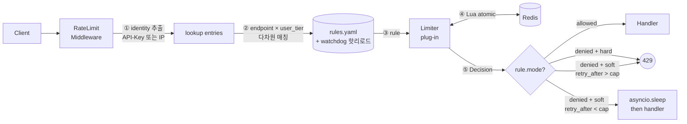

# knot — URL 단축 SaaS의 처리율 제한 설계

> Alex Xu, *System Design Interview 2nd ed.* 4장 "Design a Rate Limiter"를 실제 코드로 옮기고 부하 실측으로 검증하기 위한 학습 프로젝트. 가상 서비스 **knot**(URL 단축 SaaS)을 캐리어로 깔고, 책의 모든 핵심 개념을 단계별로 적용한다.
>
> 본 문서는 **설계 결정과 그 이유**를 책의 4단계 프레임워크 순서로 정리. 사이클별 진행 일지·실측 차트·함정 기록은 `../../wiki/projects/knot.md`(옵시디언 그래프 포함)에 분리되어 있다.

---

## 0. 왜 rate limiting이 필요한가

책은 처리율 제한의 효용을 세 가지로 정리한다:

1. **DoS 방어** — 자원 고갈 방지
2. **비용 절감** — *"제3자 API에 사용료를 지불하는 회사들에게 매우 중요"*
3. **서버 과부하 방지**

knot은 학습용 mock 서비스지만 두 엔드포인트가 **정반대 성격**이라 위 세 동기가 비대칭으로 적용된다.

### 0-1. 두 엔드포인트의 성격

|                   | `POST /shorten` (쓰기)  | `GET /{code}` (읽기)          |
| ----------------- | --------------------- | --------------------------- |
| QPS               | 낮음                    | **압도적으로 높음** (클릭마다 1회)      |
| 비용                | 코드 발급 + 저장 (DB write) | 캐시히트 (read replica/edge)    |
| 악용                | 스팸 단축 양산, 봇 가짜 코드 생성  | 봇 크롤링                       |
| 식별                | API 키 (`X-API-Key`)   | 익명 IP (로그인 없음)              |
| 차단의 비용            | 정상 사용자가 단축 못 함 → 짜증   | 클릭 실패 → 짜증 (더 큼, UX 직격)     |
| **rate limit 동기** | **악용 방지 (#1, #3)**    | **abuse·봇 차단 + 비용 안전 (#3)** |

같은 시스템 안에 **정반대 트래픽 특성**이 공존하므로 단일 정책이 아닌 엔드포인트별 차등 정책이 필요하다는 결론.

### 0-2. 단일 정책(예: 분당 100 한도 하나)으로 부족한 시나리오

| 시나리오 | 단일 정책이 잡는가 | 추가 보호가 필요한 이유 |
|---|---|---|
| **① shorten으로 단축 코드 무한 양산 (스팸 봇)** | △ 총량은 잡음 | API 키 단위로 끊지 않으면 한 봇이 시스템 전체 한도 점유 |
| **② redirect 한 코드에 봇 크롤링 폭주** | ❌ | shorten 한도와 redirect 한도가 같은 차원이면 정상 redirect 사용자도 함께 막힘 |
| **③ 정각 분 경계의 burst (1초에 2배 통과)** | ❌ | fixed window면 윈도우 경계가 모든 사용자에게 동일 → 경계마다 폭주 |
| **④ 다중 노드 운영 시 카운터 불일치** | ❌ | 노드마다 자체 카운터면 정책 폭증 가능 (sticky session 안티패턴) |
| **⑤ 무료/유료 사용자 차등 (UX 우선)** | ❌ | 단일 한도는 차등 표현 불가 |

→ 결론: **엔드포인트별 다른 알고리즘 + 다차원 키(`endpoint × user_tier`) + 중앙 공유 저장소 + 정책 강도(hard/soft) 토글**의 4축 표현력이 필요.

이 4축이 본 프로젝트의 사이클별 진화 방향이다.

---

## 1단계 — 문제 이해 및 설계 범위 확정

처리율 제한 장치를 만들기 전 **"무엇을 / 누구를 기준으로 / 어디에 둘까"**를 정해야 한다.

### 1-1. 핵심 결정 3가지

| 결정               | 선택                                      | 한 줄 이유                                                             |
| ---------------- | --------------------------------------- | ------------------------------------------------------------------ |
| **무엇을 기준으로 셀까**  | `endpoint × identity (× user_tier)` 다차원 | endpoint = 자원 보호, identity = 사용자별 공평성, user_tier = 비즈니스 차등         |
| **어디에 둘까**       | **FastAPI 인프로세스 미들웨어**                  | 인증 후 단계라 API key/tier 정보 활용 가능. 별도 gateway는 학습 목적상 알고리즘 코드를 볼 수 없음 |
| **카운터는 어디 저장할까** | **Redis 단일 인스턴스**                       | 책의 권고 그대로. 다중 노드 확장 시 정책 일관성. Lua atomic 가능                        |

**① 왜 다차원 키인가?**

- `endpoint`만 보면: 한 사용자가 시스템 전체 한도를 독점 가능. 공평성 실패
- `identity`만 보면: 사용자별 한도는 같지만 엔드포인트가 다른 비용·특성을 가짐을 표현 못 함
- 둘 다: 엔드포인트별 다른 알고리즘·다른 한도 + 사용자별 독립 카운터. 두 차원이 모두 막아야 통과
- `user_tier`(cycle 4 추가): 무료/유료 차등. **트리 매칭 → 가장 구체적(depth 큰) 매치 우선** → 명시 안 한 사용자는 default fallback

**② 왜 in-process 미들웨어인가? (책의 "API gateway 미들웨어"와의 차이)**

책은 마이크로서비스에서 [[api-gateway]]에 얹는 걸 권한다. 우리는 **같은 패턴의 in-process 버전**:

| 방식 | 학습 가치 | 운영 가치 |
|---|---|---|
| Envoy/Nginx의 ratelimit filter | 낮음 (`config.yaml` 한 줄로 끝남, 코드 X) | 높음 (실제 운영 표준) |
| **FastAPI BaseHTTPMiddleware** | **높음** — 의사코드 → Lua → 부하 실측 닫힌 루프 | 학습 단계에선 충분 |

→ ch08 시점에 실제 서비스로 진화하면 Envoy로 옮길 수 있게 알고리즘은 추상화된 상태로 유지.

**③ 왜 Redis인가?**

- 책: *"카운터는 DB가 아니라 Redis에 둔다. INCR/EXPIRE로 자연스러운 카운터·TTL"*
- 다중 노드 확장 시 카운터 동기화 — 노드마다 자체 카운터면 정책이 N배 폭증
- Lua script로 "read-check-increment"를 단일 원자 연산화 — 락 사용 0회

### 1-2. 일반 엔드포인트와 다른 정책: 알고리즘과 강도

대부분의 시스템은 모든 엔드포인트에 같은 알고리즘·같은 강도를 쓴다. knot은 의도적으로 다르게:

| 엔드포인트 | 알고리즘 | 강도 (cycle 5) | 이유 |
|---|---|---|---|
| `POST /shorten` (free) | sliding_window_log | **hard** (즉시 429) | 무료 사용자의 악용은 빠르고 명확히 차단 |
| `POST /shorten` (premium) | sliding_window_log | **soft** (throttle 후 200) | 유료 = UX 우선. 한도 초과 시 거부 대신 지연 |
| `POST /shorten` (enterprise) | sliding_window_log | hard | 대량 사용자라 거부가 명확해야 함 (지연으로 숨기지 않음) |
| `GET /{code}` (모든 사용자) | token_bucket | hard | 익명 IP라 tier 의미 약함. 봇 차단 명확히 |

**→ 같은 시스템 안에 알고리즘 2개 + 정책 강도 2개 + 차등 3티어 공존**. 이 표현력이 다음 단계의 추상화 결정을 강제한다.

---

## 2단계 — 개략적 설계

### 2-1. 전체 흐름 (요청 1회 생명주기)



5단계가 명확히 분리됨:
1. **식별**: API key 우선, 없으면 IP
2. **매칭**: `(endpoint, user_tier)` entries → 트리 DFS specificity 우선 → Rule
3. **선택**: rule.algorithm → registry → 알고리즘 인스턴스
4. **판정**: Lua 한 번에 시각·카운터·차감·결과 반환
5. **응답**: allowed면 통과, denied면 hard/soft 분기

### 2-2. 알고리즘 선택 — 엔드포인트별 다른 답

책의 비교표에 5개 알고리즘이 있다. 엔드포인트 성격에 맞는 걸 다르게 고름:

| 알고리즘                                  | knot에서 평가        | 이유                                                                                |
| ------------------------------------- | ---------------- | --------------------------------------------------------------------------------- |
| **token bucket** ✅ (`/{code}`)        | redirect에 채택     | 클릭은 **자연스러운 burst** 패턴 (사용자가 페이지 열 때 여러 redirect 동시 발생). capacity로 burst 흡수       |
| 누출 버킷                                 | ✗                | 처리율 고정 → redirect를 큐잉하면 클릭 지연 → UX 나쁨                                             |
| 고정 윈도 카운터                             | ✗ (운영) / ✅ (시연만) | **윈도 경계 burst** → shorten은 비용 직결, redirect는 abuse 차단 둘 다에 위험. cycle 2에서 한계 시연용으로만 |
| **sliding window log** ✅ (`/shorten`) | shorten에 채택      | **가장 정확** — 분 단위 한도를 엄밀히 지켜야 하는 쓰기 엔드포인트. 메모리는 한도가 작아(분당 10~500) 부담 X             |
| 이동 윈도 카운터                             | △ (스킵)           | sliding log의 근사. 양 극단 잡았으므로 회고에서 글로만                                              |

**책의 단점 인용**: *"버킷 크기와 토큰 공급률을 적절히 튜닝하는 것은 까다로운 일"* — 모니터링 후 조정 필수.

### 2-3. 파라미터 초안 (cycle 4 적용 후)

```yaml
domain: knot
descriptors:
  - key: endpoint
    value: shorten                          # 쓰기 — 엄격
    descriptors:
      - key: user_tier
        value: premium
        rate_limit: { algorithm: sliding_window_log, unit: minute, requests_per_unit: 50, mode: soft }
      - key: user_tier
        value: enterprise
        rate_limit: { algorithm: sliding_window_log, unit: minute, requests_per_unit: 500 }
    rate_limit: { algorithm: sliding_window_log, unit: minute, requests_per_unit: 10 }   # default = free
  - key: endpoint
    value: redirect                         # 읽기 — 관대
    rate_limit: { algorithm: token_bucket, unit: second, requests_per_unit: 50, burst: 100 }
```

**숫자의 의미를 풀어 쓰면**:

- **shorten free 분당 10**: 무료 사용자가 1분에 10번 단축 가능. 11번째는 즉시 429. 봇이 1초에 100번 요청해도 10개만 통과
- **shorten premium 분당 50, soft**: 유료는 5배 한도. 51번째 요청은 거부 대신 **자동 대기 후 처리** (가장 오래된 timestamp가 윈도우 밖으로 나갈 때까지, 보통 1초 미만)
- **redirect 초당 50 + 버스트 100**: 한 사용자가 페이지 열고 redirect 100개를 동시 흡수 가능 (탭 한꺼번에 열기 같은 자연 burst). 그 후엔 초당 50 페이스
- **enterprise 분당 500, hard**: 대량 사용자. 한도 넘으면 명확한 429 (지연으로 숨기면 사용자가 한도를 인지 못 함)

### 2-4. 장애 대응 정책 — 엔드포인트별 다르게

책은 *"여러 limiter 노드가 카운터를 각자 가지면 정책이 어긋난다"*라 한 후 **결함 감내(fail-open vs fail-close)** 결정은 시스템 성격에 위임.

| 엔드포인트           | Redis 장애 시            | 이유                                                       |
| --------------- | --------------------- | -------------------------------------------------------- |
| `GET /{code}`   | **fail-open** (통과)    | 읽기 + 트래픽 폭증 위험. 차단되면 정상 사용자 클릭 실패 — UX 직격. 잠시 통과시키는 게 안전 |
| `POST /shorten` | **fail-open** (학습 단계) | 학습용이라 단순화. 실서비스라면 abuse 위험으로 fail-close 검토               |

본 프로젝트는 학습용이라 모든 엔드포인트가 fail-open. 환경변수(`FAIL_MODE=open|closed`)로 토글 가능하게 둠.

---

## 3단계 — 상세 설계

### 3-1. 핵심 추상화 — `Limiter` Protocol

5개 알고리즘이 같은 입출력 인터페이스를 가져야 plug-in 가능. 책의 비교표를 코드로 명문화:

```python
class Rule(NamedTuple):
    algorithm: str        # "token_bucket" | "sliding_window_log" | ...
    unit: str             # "second" | "minute" | "hour"
    requests_per_unit: int
    burst: int | None = None      # token_bucket용
    mode: str = "hard"            # "hard" | "soft"

class Decision(NamedTuple):
    allowed: bool
    limit: int                    # → X-Ratelimit-Limit
    remaining: int                # → X-Ratelimit-Remaining
    retry_after: float            # → X-Ratelimit-Retry-After (초)

class Limiter(Protocol):
    async def allow(self, key: str, rule: Rule) -> Decision: ...
```

`Decision` 4 필드 = **책의 클라이언트 응답 헤더 표준 4종과 1:1**. 알고리즘 내부가 무엇이든 클라이언트에 노출되는 정보는 표준화. 이게 추상화 경계.

### 3-2. 응답 포맷

성공·실패·throttle 3 케이스 모두 같은 헤더 체계:

**성공 (200)**:
```
X-Ratelimit-Limit: 10
X-Ratelimit-Remaining: 9
```

**거부 (429, hard)**:
```
X-Ratelimit-Limit: 10
X-Ratelimit-Remaining: 0
X-Ratelimit-Retry-After: 42.500
```
```json
{"detail": "rate limit exceeded"}
```

**Throttle (200, soft mode, cycle 5)**:
```
X-Ratelimit-Limit: 50
X-Ratelimit-Remaining: 0
X-Ratelimit-Throttled: true
X-Ratelimit-Throttle-Ms: 612
```

**핵심**: `X-Ratelimit-Throttled` 헤더가 있으면 클라이언트는 "200이지만 한도 hit이라 느려진 것"으로 인지 → exponential backoff 트리거 가능 (cycle 6).

### 3-3. 알고리즘별 자료구조 결정

| 알고리즘 | Redis 자료구조 | 이유 |
|---|---|---|
| token_bucket | **HASH** (tokens, last_refill 두 필드) | 한 명령(HMGET/HMSET)으로 두 필드 묶음 → Lua 짧아짐 |
| fixed_window | **String 카운터** (INCR + EXPIRE) | 단일 정수면 충분. HASH 불필요 |
| sliding_window_log | **Sorted Set (ZSET)** | timestamp가 자연스러운 score. ZREMRANGEBYSCORE로 윈도우 밖 일괄 제거 |

### 3-4. 동시성 — Lua atomic이 락을 대체

책: *"락은 답이 아니다 — 느리다. 표준 해법: ① Redis Lua 스크립트 ② Redis sorted set"*

우리는 모든 알고리즘이 **단일 `allow()` 호출 안에서 Lua 한 번**으로 완료되도록:

| 알고리즘 | Lua 안에서 묶이는 명령 |
|---|---|
| token_bucket | TIME + HMGET + (계산) + HMSET + EXPIRE |
| fixed_window | TIME + INCR + (conditional) EXPIRE |
| sliding_window_log | TIME + ZREMRANGEBYSCORE + ZCARD + (conditional) ZADD + EXPIRE |

**시각 출처**: 모두 Lua 안의 `redis.call('TIME')` 사용. 책의 권고 — 다중 노드 clock skew 면역. Redis 7+ effects replication으로 replication-safe.

**실측 — race demo가 atomic을 직접 증명**:

| 알고리즘 | 동시 요청 | 허용 한도 | 통과 | jitter |
|---|---:|---:|---:|---|
| token_bucket | 200 | 100 | **101** | +1 (dispatch ~20ms 동안 50tok/s × 0.02s = 1 토큰 리필) |
| sliding_window_log | 50 | 10 | **10** | **0** (timestamp 엄격 비교라 dispatch 동안 새 entry 안 생김) |

Lua atomic이 아니었다면 둘 다 모든 요청이 통과했을 것. **이게 책의 race condition 그림(Figure 4-14)의 실측 증명**.

### 3-5. Rules-as-Data와 핫리로드

책: *"규칙은 디스크에 yaml로 두고, 워커가 정기적으로 캐시로 로드"*

cycle 0은 시작 시 1회 로드만. cycle 4에서 **watchdog 파일 watcher 도입**:

```python
# 의사코드
def reload():
    try:
        app.state.rules = load_rules(RULES_PATH)   # atomic swap
    except Exception:
        pass   # 실패 시 이전 rules 유지 — partial reload 함정 회피

observer = Observer()
observer.schedule(_RulesReloader(path, reload), str(path.parent))
observer.start()
```

**왜 atomic swap?** 부분 적용된 잘못된 yaml로 미들웨어가 깨지면 모든 요청이 영향. 새 객체 만들기 → 전부 또는 전무.

**watcher 함정 미리 대응**:
- vim/emacs atomic save (`tmp → rename`) → `on_modified` 외 `on_moved`도 핸들
- macOS FSEvents 지연 → 빠르고 안정 (실측 1.09초). Linux/CI는 PollingObserver fallback 코드 한 줄로 가능

**실측**: yaml 수정 → ~100ms 이내 새 정책 반영. 다음 요청부터 즉시 적용.

### 3-6. 다차원 매칭의 우선순위

cycle 4에서 평면 lookup → **트리 DFS specificity matching**:

```
요청: entries = [("endpoint", "shorten"), ("user_tier", "premium")]

매칭 후보:
  - root → endpoint=shorten → user_tier=premium  (depth 2) ← 채택 (가장 구체적)
  - root → endpoint=shorten                       (depth 1)
  - root                                          (depth 0)

후보 중 depth 큰 것 우선.
```

→ user_tier 미선언 시 endpoint default rule로 자연 fallback. 정의 안 된 tier도 fallback. **명시 안 한 사용자가 의도치 않게 차단되는 일 없음**.

---

## 4단계 — 마무리

### 4-1. 경성(hard) vs 연성(soft) — 정책 강도 토글

책은 이 둘을 한 단락으로 다룸. 우리는 cycle 5에서 코드로 풀어냄:

| 모드       | 한도 초과 시                                                               | knot에서 적용                  |
| -------- | --------------------------------------------------------------------- | -------------------------- |
| **hard** | 즉시 429 + `Retry-After`                                                | free, enterprise, redirect |
| **soft** | `asyncio.sleep(retry_after_ms)` 후 200 + `X-Ratelimit-Throttled: true` | **premium만**               |

**Soft의 정확한 의미**:
- `retry_after_ms` = limiter가 계산한 정확한 재시도 시각 (sliding_window_log의 경우: 가장 오래된 timestamp가 윈도우 밖으로 나갈 시각)
- 보통 200~700ms — 클라이언트는 "응답 느림"으로 자연스럽게 한도 인지
- **카운터에 추가 안 함** — limiter.allow()가 deny 반환했으므로 카운터 변경 X. "한도는 유지하되 거부 대신 지연으로 표현"

**안전 장치 `MAX_THROTTLE_MS = 2000`**: retry_after가 2초 초과 시 soft → hard 폴백. 장기 폭주 사용자가 서버 thread 무한 점유 방지. soft도 무제한 아님.

**왜 premium만 soft?**
- **free**: 무료 사용자는 한도가 작아 거부가 명확해야 자기 한도를 인지. soft면 모르고 계속 호출
- **premium**: 유료 = UX 우선. 한도 잠깐 넘어도 차단보다 지연이 좋음
- **enterprise**: 대량 사용자. 500/min 초과는 진짜 abuse — 지연으로 숨기면 위험
- **redirect**: token bucket이라 자연 burst 흡수. throttle 의미 약함

### 4-2. 클라이언트(SDK) 측 대응 — 책의 4가지 권고 (cycle 6 예정)

서버만으로 부족하다. 클라이언트도 헤더를 읽고 적절히 대응해야 함:

**① 응답 캐시 — 같은 요청 중복 호출 방지**

```python
# 의사코드
cache: dict[str, (response, ts)] = {}
TTL = 5 * 60

async def shorten(url):
    if url in cache and now() - cache[url][1] < TTL:
        return cache[url][0]    # 캐시 히트, 서버 호출 X
    response = await client.post("/shorten", json={"url": url})
    cache[url] = (response, now())
    return response
```

**② 한도 인지 — 응답 헤더로 UI 표시**

서버가 `X-Ratelimit-Remaining`을 보내줌. 클라이언트는 "오늘 남은 요청: 4회" 식으로 미리 표시 → 사용자가 폭주를 자제.

**③ 예외 처리 — 429와 200+Throttled 모두 핸들**

```python
if response.status_code == 429:
    retry_after = float(response.headers["X-Ratelimit-Retry-After"])
    raise RateLimitError(retry_after)
elif response.headers.get("X-Ratelimit-Throttled") == "true":
    throttle_ms = int(response.headers["X-Ratelimit-Throttle-Ms"])
    log.warning(f"throttled {throttle_ms}ms — consider slowing down")
# 정상 응답
```

**④ Exponential backoff 재시도**

```python
# 의사코드
async def with_backoff(call, max_attempts=4):
    for i in range(max_attempts):
        try:
            return await call()
        except RateLimitError as e:
            wait = min(e.retry_after, 2 ** i)
            await asyncio.sleep(wait)
    raise GiveUpError()
```

`Retry-After` 헤더가 있으면 그 값 사용, 없으면 `2^attempt` 초로 backoff. 책: *"서버에 트래픽이 가중되지 않도록 지수 백오프 같은 알고리즘 적용"*.

### 4-3. 모니터링 — 무엇을 봐야 하는가

처리율 제한을 적용했으면 **실제로 효과가 있는지** + **임계치가 적절한지** 봐야 함. 책: *"① 알고리즘이 효과적인가 ② 규칙이 적절한가"*.

| 신호 | 무엇이 잘못된 신호 | 어떻게 조정 |
|---|---|---|
| 정상 사용자 429 비율 ↑ | 한도가 너무 빡빡 | `requests_per_unit` 상향 |
| 한도 초과 사용자가 거의 없음 | 한도가 너무 헐겁 | `requests_per_unit` 하향 |
| burst 시 정상 호출도 거부 | algorithm 잘못 선택 (예: redirect에 sliding window) | algorithm 변경 |
| 같은 시점에 여러 노드 429 패턴 다름 | Redis 동기화 깨짐 | 노드/Redis 연결 점검 |
| Redis 연결 실패 빈도 ↑ | 저장소 안정성 문제 | fail-open vs fail-close 결정 재검토 |

본 프로젝트는 학습용이라 로그 + `/healthz` 한 줄짜리 health check만. 실서비스는 Prometheus + Grafana 권장.

### 4-4. 한도 자체 조정 — 운영하면서 어떻게 결정하나

처음엔 임시값 (분당 10/50/500, burst 100). 다음 신호로 조정:

- **거짓 차단 (false positive)**: 정상 사용자가 429 받음 → 한도 ↑
- **저비용 abuse 통과 (false negative)**: 한도 안 걸리는데 비용 폭주 → 한도 ↓
- **비대칭 부하**: 한 사용자가 항상 한도까지 차고 다른 사용자는 0 → tier 차등 검토
- **분당 vs 시간당 vs 일일**: 단기 burst만 막으면 충분한가, 일일 총량도 별도 필요한가

knot은 mock이라 실제 신호 없음. 실서비스 진화 시 모니터링 데이터로 결정.

---

## 5. 실측 시나리오와 결과

각 사이클의 부하 시험이 책의 비교표를 그래프로 증명. 자세한 차트·해설은 `reports/<algorithm>.md` + `wiki/projects/knot.md`.

### 5-1. token_bucket (redirect, cycle 1)

| 시나리오 | 부하 패턴 | 결과 | 시연 목적 |
|---|---|---|---|
| **burst** | 0초에 200req 폭주 (capacity 100, rate 50/s) | 116 통과 / 84 거부 = 58% | "**버스트 허용**" — capacity 흡수 + 거부 |
| **ramp** | 60초 동안 0→100rps 선형 증가 | 78% pass | 평균 rate 50/s 초과 지점부터 429 ↑ |
| **steady_burst_cycle** | 1초 burst(100req) + 5초 휴식 ×3 | 100% pass | 5초 휴식 동안 250 토큰 생성(50/s×5) → capacity 100으로 cap → 다음 burst 100% — **refill 회복 로직 직접 확인** |

총 4,099 요청, p95 7.88ms. 책의 비교표 **token_bucket 행 "버스트: 허용" 셀 그래프 증명**.

### 5-2. fixed_window (demo, cycle 2)

knot 엔드포인트엔 안 쓰지만 책의 "경계 burst" 한계를 그래프로 시연.

| 시나리오 | 부하 패턴 | 결과 | 시연 목적 |
|---|---|---|---|
| **boundary_burst** | 12초간 200rps, 분 경계가 부하 중간에 떨어지도록 시각 동기화 (limit 100/min) | 200 통과 / 2,201 거부 = 8.33% | **차트에 두 spike**: 53초에 100 통과 + 60초(분 경계)에 다시 100 통과 → **2초 구간에 의도(분당 100)의 2배 통과** |

책의 비교표 **fixed_window 행 "정확도: 낮음 (경계 burst)" 셀 그래프 증명**.

### 5-3. sliding_window_log (shorten, cycle 3)

| 시나리오 | 부하 패턴 | 결과 | 시연 목적 |
|---|---|---|---|
| burst (20 VUs × 1 req) | VU별 다른 api-key (각자 bucket) | 100% pass | VU별 격리 작동 |
| ramp (60s에 0→30rps) | 다수 VU에 분산 | 33% pass | VU별 bucket이 시간 흐를수록 소진 |
| steady_burst_cycle | VU별 burst 1s + 휴식 5s ×3 | 100% pass | VU별 한도 내 |
| **boundary_burst_replay** | 12초간 30rps, 분 경계 통과 (cycle 2와 동일 구조) | 55% pass | **분 경계 무관한 smooth ramp → wall → resume** — cycle 2와 시각적 대조 |

총 1,459 요청, p95 5ms. **boundary_burst_replay**가 가장 중요한 차트:
- cycle 2 fixed_window: spike-deny-spike 2개 spike
- cycle 3 sliding_window_log: smooth, spike 없음

→ 같은 부하 구조에 두 알고리즘이 어떻게 다르게 동작하는지 정성적 비교. 책의 비교표 **sliding_window_log 행 "정확도: 높음" 셀 그래프 증명**.

**주의 — "공정 비교"의 한계**: cycle 2와 cycle 3의 boundary 시나리오는 부하 rate(200rps vs 30rps), limit(100/min vs 10/min), key 전략(단일 vs VU별)이 모두 다름. **차트 모양(shape)의 정성적 비교**만 가능하고, pass_rate 숫자 직접 비교는 의미 없음. 진짜 공정 비교는 회고(cycle 7)에서 별도 사이드 사이클 가능.

### 5-4. race condition 실증 (cycle 1, 3)

책의 race condition 그림(Figure 4-14)을 실측 숫자로:

| 알고리즘 | 동시 요청 | 한도 | 통과 | 의미 |
|---|---:|---:|---:|---|
| token_bucket | 200 | 100 | 101 (+1 jitter) | dispatch 동안 1 토큰 리필 |
| sliding_window_log | 50 | 10 | **10 (0 jitter)** | timestamp 엄격 비교 — 더 정확한 atomic |

**Lua 없었다면 둘 다 모든 요청이 통과**했을 것. ch04의 race condition 그림이 정성 시연인 것을 우리는 실측 숫자로 변환.

### 5-5. 다차원 정책 + 핫리로드 (cycle 4)

| 검증 | 시나리오 | 결과 |
|---|---|---|
| free tier 한도 | `X-User-Tier: free` 11회 POST | 11번째 429 |
| premium tier 한도 | `X-User-Tier: premium` 51회 POST | 51번째 429 (cycle 5에서 soft 적용) |
| tier 미선언 fallback | 헤더 없이 11회 POST | 11번째 429 (= free default) |
| 핫리로드 atomic swap | rules.yaml 수정 → 다음 요청 | ~100ms 내 새 정책 반영 |
| 핫리로드 실패 안전 | 잘못된 yaml로 수정 | 이전 rules 유지 (rollback) |

총 38개 테스트 통과 (cycle 0~4). 알고리즘 코드는 cycle 4에서 한 줄도 안 바뀌었지만 정책 표현력이 극적 확장 — **plug-in 추상화의 가치 검증**.

---

## 6. 책에 충실한 부분 vs 우리가 확장한 부분

**책 충실** (의사코드·표현 그대로):
- 알고리즘 5종의 내부 메커니즘
- 응답 헤더 표준 (`X-Ratelimit-*`, 429)
- Lyft envoy yaml 포맷
- "락 안 쓴다, Lua/sorted set atomic" 원칙
- Redis 단일 저장소
- hard/soft 트레이드오프 개념

**책에서 확장** (책이 안 다룬 디테일):
- ZSET member 형식 (`ts_us-random_hex_4`) — 책의 묵시 가정 "timestamps are unique" 보강
- Race condition 실측 (101/200 vs 0/50) — 책은 그림만
- Boundary burst 직접 그래프 — 책은 한 줄 비교표만
- 다차원 매칭의 specificity 우선 — Lyft 동작 추가 명시
- Hot reload watchdog 메커니즘 — 책은 "워커가 로드"만 언급
- `mode: soft`의 구체 구현 (asyncio.sleep + Throttled 헤더 + MAX_THROTTLE_MS) — 책의 한 단락의 구체화
- `KNOT_RULES_PATH` env override — 운영 유연성

**의도적으로 안 함** (cycle 7 회고):
- 멀티 DC eventual consistency
- OSI L3 차단 (iptables 등)
- Edge 분산 배치 (Cloudflare 194 edge 사례)
- leaking_bucket / sliding_window_counter 풀 구현 (양 극단 잡았으니 글로 정리)

---

## 7. ch04 본문에 없는 발견 (학습 자산)

직접 구현하지 않으면 안 보이는 함정 6개:

1. **`fakeredis` Lua 지원 = `lupa` 패키지 필요** (cycle 1)
2. **redis-py `Script` 객체의 stale client binding** — 등록 시점 클라이언트 참조 잡음, 교체 시 재등록 필수 (cycle 1)
3. **`httpx.ASGITransport`의 `request.client.host` 공통** — 테스트마다 API key로 명시 격리 (cycle 1)
4. **pandas `dt.floor("S")` deprecated** → `"s"` (cycle 2)
5. **`df.to_markdown()` ↔ `tabulate` 의존성** (cycle 2)
6. **watchdog vim/emacs atomic save**: `on_modified` 외 `on_moved`도 핸들 (cycle 4, 미리 대응으로 함정 0)

이 함정들은 cycle별 진행 일지(`wiki/projects/knot.md`)에 발견 맥락·해결 코드와 함께 영구 보존.

---

## 8. 다음 단계 (cycle 5~7)

| Cycle | 무엇 | 형태 | 상태 |
|---|---|---|---|
| 5 | hard vs soft 정책 | full | 진행 중 (spec/plan 완성) |
| 6 | 클라이언트 SDK 미니 (4가지 권고 직접 구현) | full | 예정 |
| 7 | 회고 — 스킵된 알고리즘 + multi-DC·OSI L3·edge | wiki 글 | 예정 |

cycle 5·6 완료 시 본 문서 §4 (hard/soft, 클라이언트) 부분을 실측 결과로 보강. cycle 7 완료 시 §5에 비교 사이드 사이클 결과 추가 검토.

---

## 부록 — 본 문서와 다른 자료의 관계

| 어디 | 무엇을 다루나 |
|---|---|
| **본 문서 (DESIGN.md)** | **설계 narrative + 책의 4단계 적용 + 실측 결과 요약** — 1~2년 후 재방문해도 자족 |
| `README.md` | 빠른 시작·디렉터리·실행법 |
| `../../wiki/projects/knot.md` | **사이클별 진행 일지** — task별 결정·함정·실측 차트·옵시디언 그래프 |
| `../../docs/specs/2026-05-24-knot-cycle-N-*.md` | 사이클별 sub-spec (시스템 설계 결정 표) |
| `../../docs/plans/2026-05-24-knot-cycle-N-*.md` | 사이클별 TDD 구현 계획 (코드 포함) |
| `reports/<algorithm>.md` | k6 부하 실측 + matplotlib PNG 차트 |
| `../../log.md` | 한 줄짜리 활동 로그 (전체 위키) |

본 문서는 **설계 결정의 영구 기록**. 사이클 진행 다이어리(`wiki/projects/knot.md`)와 역할이 명확히 분리됨.
