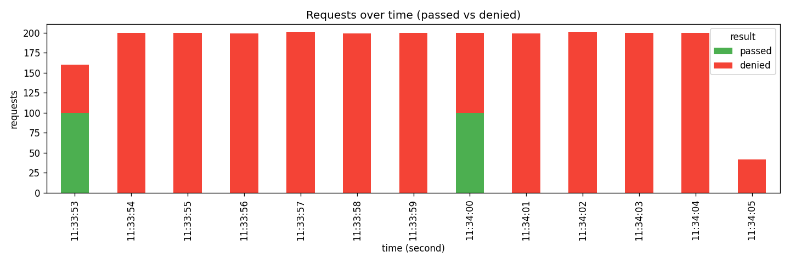

# fixed_window — 부하 시험 결과

> k6 시나리오 3종(burst·ramp·cycle) 결과. 알고리즘 비교는 cycle 2 이후 cross-link.

## 시간축별 통과/거부

## 시나리오별 요약

| scenario       |   total |   denied |   pass_rate |   p50_ms |   p95_ms |
|:---------------|--------:|---------:|------------:|---------:|---------:|
| boundary_burst |    2401 |     2201 |     8.32986 |      1.2 |      2.1 |

## 경계 burst 시연 (ch04 §"fixed window 한계")

위 차트에서 두 번의 "통과 spike"를 확인할 수 있다 — 첫 spike는 k6 시작 직후
(현재 윈도우의 한도 100 흡수), 두 번째는 분 경계 직후 (새 윈도우 시작, 한도
다시 100 흡수). 두 spike 사이 약 5~7초는 첫 윈도우 한도 소진 상태라 모두 거부.

결과: 100req/minute의 의도된 정책이 분 경계를 끼는 2초 구간 동안 **최대 200 요청
통과**를 허용. 이게 ch04 §"알고리즘 비교"가 fixed window의 "정확도: 낮음
(경계 burst)"이라 적은 이유의 그래프 증명.

이 문제를 해결한 게 cycle 3의 [[sliding-window-log-algorithm]] — 임의 시점 기준
직전 N초 윈도우를 동적 계산해 경계 burst 제거.

---

생성: `uv run python scripts/report.py --k6-json out/fixed_window.json --algorithm fixed_window --output reports/fixed_window.md`
