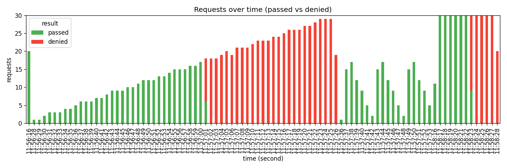

# sliding_window_log — 부하 시험 결과

> k6 시나리오 3종(burst·ramp·cycle) 결과. 알고리즘 비교는 cycle 2 이후 cross-link.

## 시간축별 통과/거부

## 시나리오별 요약

| scenario              |   total |   denied |   pass_rate |   p50_ms |   p95_ms |
|:----------------------|--------:|---------:|------------:|---------:|---------:|
| boundary_burst_replay |     361 |      161 |     55.4017 |      3.4 |      4.7 |
| burst                 |      20 |        0 |    100      |     13.9 |     15.4 |
| ramp                  |     899 |      599 |     33.3704 |      3.5 |      4.8 |
| steady_burst_cycle    |     179 |        0 |    100      |      4   |      5.4 |

## Boundary burst replay — cycle 2와의 비교

위 차트에서 `boundary_burst_replay` 시나리오를 cycle 2 `reports/fixed_window.md`의 동일 시나리오와 비교:

| 알고리즘 | 통과 패턴 | 분 경계 처리 |
|---|---|---|
| fixed_window (cycle 2) | spike-deny-spike (2 spike) | 경계 직후 추가 100 통과 → 의도 2배 |
| sliding_window_log (cycle 3) | 균등 throttle | 경계 무관 — 임의 시점 직전 60초 기준 |

sliding window의 핵심 가치: **경계 burst 부재**. ch04 §"알고리즘 비교"의 "정확도: 높음"의 그래프 증명.

---

생성: `uv run python scripts/report.py --k6-json out/sliding_window_log.json --algorithm sliding_window_log --output reports/sliding_window_log.md`
