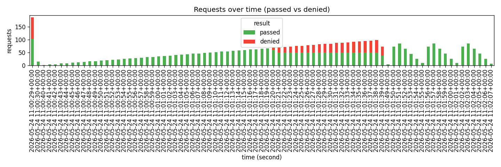

# token_bucket — 부하 시험 결과

> k6 시나리오 3종(burst·ramp·cycle) 결과. 알고리즘 비교는 cycle 2 이후 cross-link.

## 시간축별 통과/거부

## 시나리오별 요약

| scenario           | total | denied | pass_rate | p50_ms | p95_ms |
| :----------------- | ----: | -----: | --------: | -----: | -----: |
| burst              |   200 |     84 |        58 |     56 |   58.2 |
| ramp               |  2999 |    651 |   78.2928 |    3.2 |    5.7 |
| steady_burst_cycle |   900 |      0 |       100 |    3.1 |    4.7 |

---

생성: `uv run python scripts/report.py --k6-json out/token_bucket.json --algorithm token_bucket --output reports/token_bucket.md`
