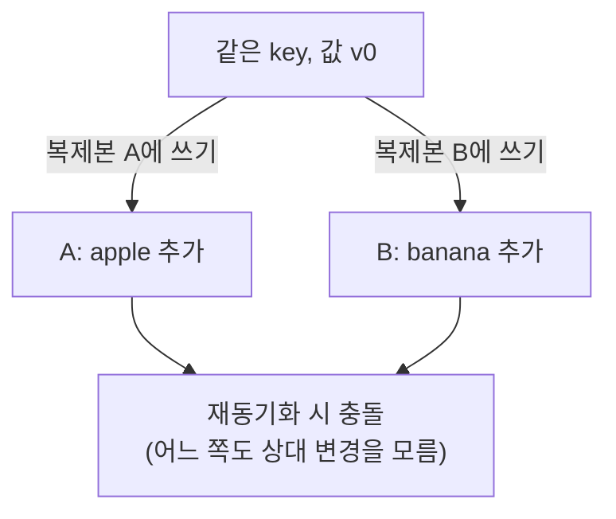
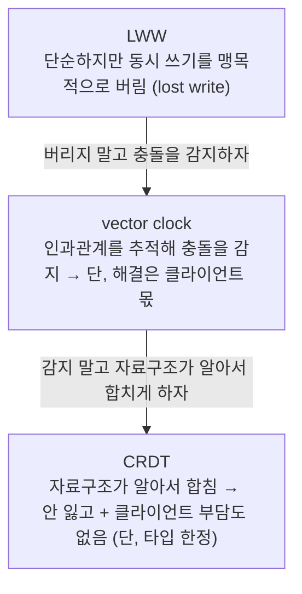
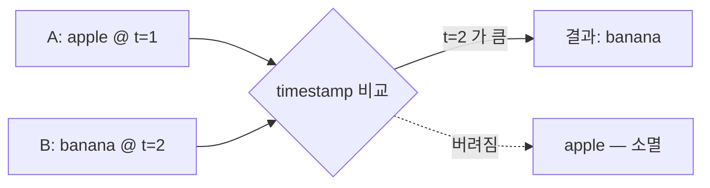
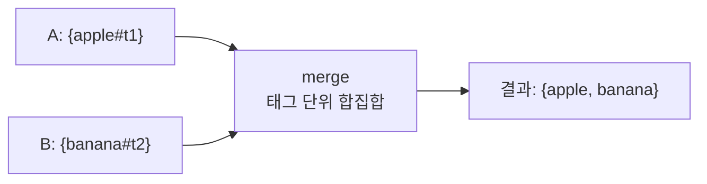
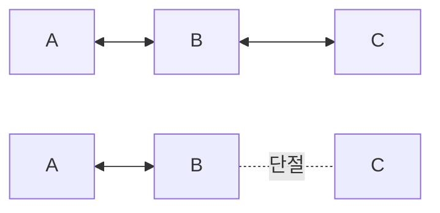
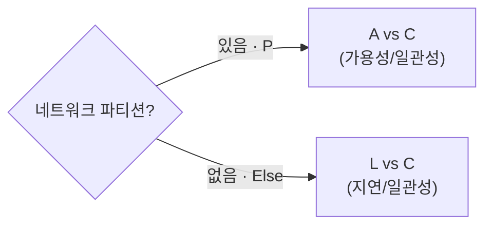

# 분산 KV, 책 이후의 이야기

ch06(Dynamo 논문, 2007)의 결론 중, 그 뒤로 현실이 다르게 간 지점들.

---

## 1. 충돌 해결: vector clock → LWW / CRDT

### 문제 상황

AP 시스템은 복제본이 잠깐 갈라질 수 있다. 같은 key에 두 복제본이 각각 다른 쓰기를 받으면, 나중에 만났을 때 어느 쪽이 맞는지 알 수 없다.

이 충돌을 처리하는 세 가지 방식이 vector clock, LWW, CRDT다. 각자 앞 방식의 약점을 푸는 계보다.

> LWW가 못 보는 "선후 vs 동시"를 vector clock이 인과관계로 구별해 맹목적 손실을 막고, vector clock이 남긴 클라이언트 머지 부담을 CRDT가 자료구조로 흡수한다. 뒤에 나오는 Cassandra의 LWW는 이 계보에서 단순함을 위해 일부러 베이스라인으로 되돌아간 선택이다.

한눈 요약:

| 방식 | 동작 | 위 예시 결과 | 머지 책임 |
|---|---|---|---|
| **vector clock** | `[서버,카운터]`로 선후/충돌 판정, 충돌이면 두 버전 모두 반환 | apple·banana 둘 다 → 클라이언트가 합침 | 클라이언트 |
| **LWW** | 모든 쓰기에 timestamp, 늦은 쪽 채택 | apple 또는 banana (한쪽 소멸) | 자동 (DB) |
| **CRDT** | 자료구조에 머지 규칙 내장, 순서 무관 수렴 | apple + banana (OR-Set이면 합집합) | 자동 (자료구조) |

#### vector clock

- 각 값에 `[서버, 카운터]` 배열을 붙여 버전 족보 추적
- 칸별 비교 — 한쪽이 모든 칸에서 ≥이면 선후(덮으면 됨), 서로 엇갈리면 충돌(sibling)
- 충돌이면 두 버전을 모두 클라이언트에 반환, 해결은 클라이언트 몫 — 즉 감지까지만 책임
- Dynamo 논문의 표준 방식

#### LWW (Last-Write-Wins)

- 모든 쓰기에 timestamp, 충돌 시 가장 큰 값 채택 — 족보 추적 없이 숫자 비교 한 번이라 단순하고 빠름

- 진 쪽 쓰기는 흔적 없이 소멸(lost write), 알림도 머지 기회도 없음 — aphyr 표현으로 "정보를 비결정적으로 파괴"
- 선후를 timestamp로 판단 → 시계 어긋나면(clock skew) 실제 나중 쓰기가 질 수도, NTP 동기화에 의존
- 프로필·캐시·센서 최신값처럼 하나 잃어도 무방하면 충분 / 장바구니처럼 양쪽이 의미를 담으면 부적합

#### CRDT (Conflict-free Replicated Data Type)

- 충돌을 사후에 풀지 않고, 머지 연산을 교환·결합·멱등하게 설계 → 변경을 어떤 순서/중복으로 받아도 같은 값으로 수렴(join semilattice), 클라이언트 머지 불필요
- 아무 데이터나 아니라 머지가 정의된 타입 한정
  - G-Counter — 증가 전용 카운터, 머지는 서버별 카운트의 최댓값
  - PN-Counter — 증가·감소 카운터
  - OR-Set — 추가/삭제 집합, 항목마다 고유 태그로 동시 추가·삭제 시 추가 보존
  - LWW-Register — 앞의 LWW도 머지가 정의된 단순 CRDT의 일종
- OR-Set으로 apple/banana — A `apple#t1` + B `banana#t2` → 태그 합집합 `{apple, banana}`, 한쪽도 안 잃음

- 머지 정의된 타입에 한정(임의 비즈니스 로직 불가), 태그·tombstone 메타데이터 누적
- 현장 — 협업 편집(Figma·Notion), Redis CRDT, Automerge

### 실제 채택

| 시스템 | 선택 | 메모 |
|---|---|---|
| Cassandra | LWW | 처음부터 vector clock 미사용. row를 column 단위로 쪼개 통째 덮임을 줄임 |
| Riak | vector clock → CRDT | 충돌 머지를 개발자가 직접 짜는 부담 → Riak 2.0에서 CRDT(Data Types)로 흡수 |
| Figma·Notion, Redis, Automerge | CRDT | 협업 편집·분산 자료구조 |

출처: [DataStax](https://www.datastax.com/blog/why-cassandra-doesnt-need-vector-clocks), [aphyr](https://aphyr.com/posts/299-the-trouble-with-timestamps), [Riak 2.0](https://riak.com/distributed-data-types-riak-2-0/), [CRDT 역사](https://christophermeiklejohn.com/erlang/lasp/2019/03/08/monotonicity.html)

---

## 2. CAP과 PACELC

#### CAP

- 분산 시스템은 C·A·P 중 동시에 둘만 보장 (Eric Brewer, 2000)
- C(일관성) — 어느 노드에 묻든 같은 값 / A(가용성) — 일부 노드가 죽어도 응답 / P(파티션 내성) — 노드 간 통신이 끊겨도 동작
- **파티션은 "상태"가 아니라 "사고"** — 스위치·회선 장애로 노드들이 갈라져 서로 못 보는 상황, 항상 있는 게 아니라 가끔 터짐

- 위: 평소(네트워크 정상) / 아래: 파티션(C 고립)
- 네트워크는 못 버리니 P는 사실상 필수 → 실제 선택은 **"파티션이 터졌을 때 A냐 C냐"**로 좁혀짐 (끊긴 채로도 stale 응답 vs 응답 거부하고 일관성 유지)

#### PACELC

- CAP은 파티션이 터진 순간만 다룸 — 근데 파티션은 드문 사고고, 대부분의 시간은 네트워크가 멀쩡한 평소
- 평소에도 복제 때문에 트레이드오프 존재 — 모든 복제본을 기다리면 일관성↑·느림 / 일부만 기다리면 빠름·stale 가능
- PACELC = 파티션(P)이면 A vs C, 평소(Else)면 L(지연) vs C(일관성) (Daniel Abadi, 2010 블로그 → 2012 논문)

| 분류 | 파티션 시 | 평소 | 예 |
|---|---|---|---|
| **PA/EL** | 가용성 | 저지연 | DynamoDB, Cassandra |
| **PC/EC** | 일관성 | 일관성 | Spanner, CockroachDB |

- 운영의 대부분이 평소라, "평소에 지연과 일관성 중 무엇을 택했나"까지 보는 PACELC가 시스템 성격을 더 정확히 가름

출처: [논문](https://www.researchgate.net/publication/220476540_Consistency_Tradeoffs_in_Modern_Distributed_Database_System_Design_CAP_is_Only_Part_of_the_Story), [Wikipedia](https://en.wikipedia.org/wiki/PACELC_design_principle)

---

## 나눠볼 것

- 우리 데이터(MySQL, ES)를 PACELC로 분류하면? 결제와 검색은 같은 선택일까.

## 출처

- [Why Cassandra Doesn't Need Vector Clocks — DataStax](https://www.datastax.com/blog/why-cassandra-doesnt-need-vector-clocks)
- [Dynamo — Apache Cassandra 공식 문서](https://cassandra.apache.org/doc/latest/cassandra/architecture/dynamo.html)
- [The trouble with timestamps — Kyle Kingsbury](https://aphyr.com/posts/299-the-trouble-with-timestamps)
- [Distributed Data Types – Riak 2.0](https://riak.com/distributed-data-types-riak-2-0/)
- [A Brief History of CRDTs in Riak — Christopher Meiklejohn](https://christophermeiklejohn.com/erlang/lasp/2019/03/08/monotonicity.html)
- [PACELC 논문(2012) — Daniel Abadi](https://www.researchgate.net/publication/220476540_Consistency_Tradeoffs_in_Modern_Distributed_Database_System_Design_CAP_is_Only_Part_of_the_Story)
- [PACELC — Wikipedia](https://en.wikipedia.org/wiki/PACELC_design_principle)
- Giuseppe DeCandia et al., *Dynamo: Amazon's Highly Available Key-value Store*, SOSP 2007
