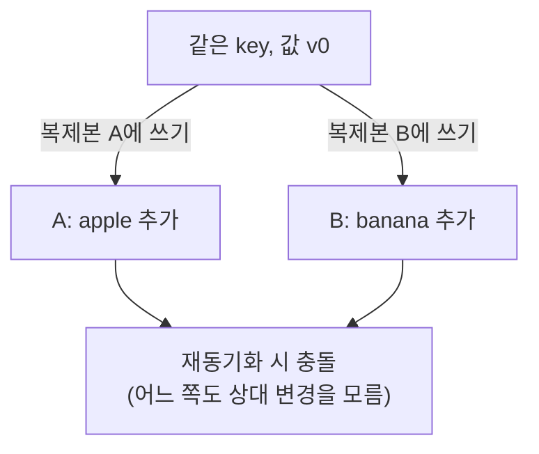
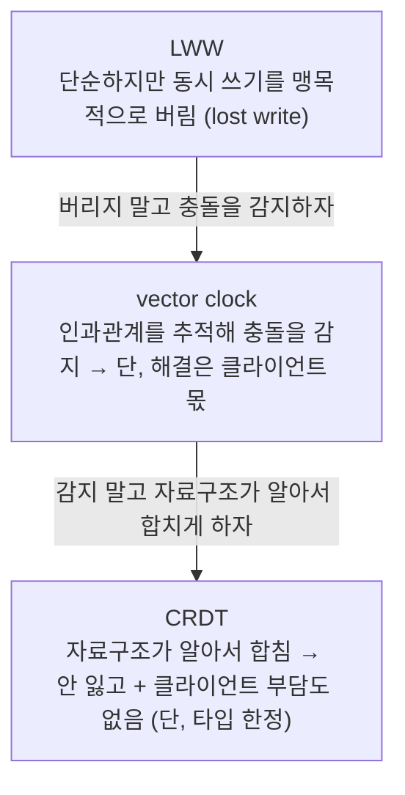
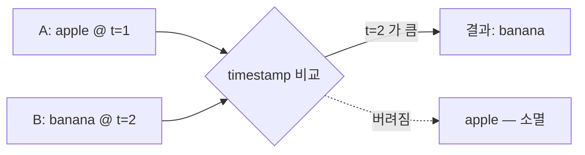
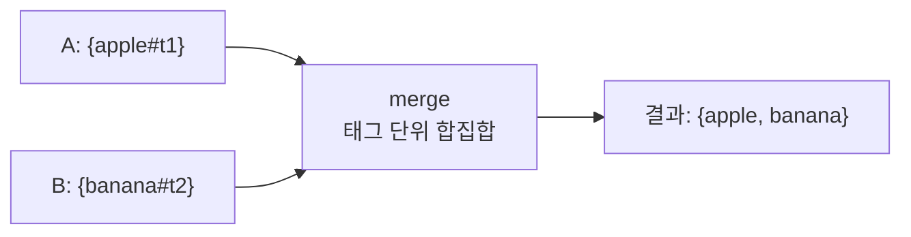
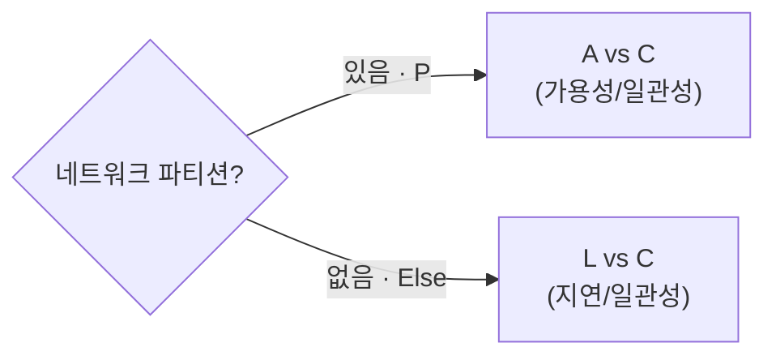

# 분산 KV, 책 이후의 이야기

ch06(Dynamo 논문, 2007)의 결론 중, 그 뒤로 현실이 다르게 간 지점들.

---

## 1. 충돌 해결: vector clock → LWW / CRDT

### 문제 상황

AP 시스템은 복제본이 잠깐 갈라질 수 있다. 같은 key에 두 복제본이 각각 다른 쓰기를 받으면, 나중에 만났을 때 어느 쪽이 맞는지 알 수 없다.

이 충돌을 처리하는 세 가지 방식이 vector clock, LWW, CRDT다. 각자 앞 방식의 약점을 푸는 계보다.

> LWW가 못 보는 "선후 vs 동시"를 vector clock이 인과관계로 구별해 맹목적 손실을 막고, vector clock이 남긴 클라이언트 머지 부담을 CRDT가 자료구조로 흡수한다. 뒤에 나오는 Cassandra의 LWW는 이 계보에서 단순함을 위해 일부러 베이스라인으로 되돌아간 선택이다.

한눈 요약:

| 방식 | 동작 | 위 예시 결과 | 머지 책임 |
|---|---|---|---|
| **vector clock** | `[서버,카운터]`로 선후/충돌 판정, 충돌이면 두 버전 모두 반환 | apple·banana 둘 다 → 클라이언트가 합침 | 클라이언트 |
| **LWW** | 모든 쓰기에 timestamp, 늦은 쪽 채택 | apple 또는 banana (한쪽 소멸) | 자동 (DB) |
| **CRDT** | 자료구조에 머지 규칙 내장, 순서 무관 수렴 | apple + banana (OR-Set이면 합집합) | 자동 (자료구조) |

#### vector clock

각 값에 `[서버, 카운터]` 배열을 붙여 버전 족보를 추적한다. 두 버전을 칸별로 비교해 한쪽이 모든 칸에서 ≥이면 선후 관계(덮으면 됨), 서로 엇갈리면 충돌(sibling)로 본다. 충돌이면 두 버전을 모두 클라이언트에 돌려주고 해결은 클라이언트가 한다. 즉 **감지까지만** 책임진다. Dynamo 논문의 표준 방식.

#### LWW (Last-Write-Wins)

- **동작**: 모든 쓰기에 timestamp(벽시계 또는 논리 시계)를 붙이고, 충돌이 나면 timestamp가 가장 큰 값을 최종값으로 택한다. 버전 족보 추적 없이 숫자 비교 한 번이라 단순하고 빠르다.

- **대가 — lost write**: 동시에 일어난 두 쓰기 중 진 쪽은 흔적 없이 사라진다. 사용자에게 알림도, 머지 기회도 없다. aphyr는 이를 "정보를 비결정적으로 파괴한다"고 표현한다.
- **시계 의존**: 어느 쪽이 "나중"인지 timestamp로 정하므로 노드 간 시계가 어긋나면(clock skew) 실제로 더 늦게 일어난 쓰기가 질 수 있다. NTP 동기화에 의존.
- **쓸 만한 곳 / 아닌 곳**: 프로필 필드·캐시·센서 최신값처럼 "둘 중 하나 잃어도 무방"한 데이터엔 충분. 장바구니처럼 양쪽 쓰기가 각자 의미를 담는 데이터엔 부적합.

#### CRDT (Conflict-free Replicated Data Type)

- **핵심 아이디어**: 충돌을 사후에 푸는 게 아니라, 자료구조의 머지 연산을 **교환법칙·결합법칙·멱등성**을 만족하게 설계한다. 그러면 복제본들이 변경을 **어떤 순서로, 몇 번 중복해서 받아도 결국 같은 값으로 수렴**한다(수학적으로 join semilattice). 클라이언트가 머지 로직을 짤 필요가 없다.
- **타입별로 정의됨**: 아무 데이터나 되는 게 아니라, 머지가 잘 정의되는 타입들이 준비돼 있다.
  - G-Counter — 증가 전용 카운터. 머지는 서버별 카운트의 최댓값.
  - PN-Counter — 증가·감소 카운터.
  - OR-Set — 추가/삭제 가능한 집합. 항목마다 고유 태그를 붙여, 동시 추가·삭제 시 추가를 살린다.
  - LWW-Register — 사실 LWW도 머지가 정의된 (단순한) CRDT의 일종.
- **OR-Set 예시(apple/banana)**: A는 `apple#t1`, B는 `banana#t2`를 태그와 함께 추가 → 머지는 태그 단위 합집합 → `{apple, banana}`. 한쪽도 잃지 않는다.

- **대가**: 머지가 정의된 타입에 한정되고(임의 비즈니스 로직은 안 됨), 태그·tombstone 같은 메타데이터가 쌓인다.
- **현장**: 협업 편집(Figma·Notion), Redis CRDT, Automerge.

### 실제 채택

| 시스템 | 선택 | 메모 |
|---|---|---|
| Cassandra | LWW | 처음부터 vector clock 미사용. row를 column 단위로 쪼개 통째 덮임을 줄임 |
| Riak | vector clock → CRDT | 충돌 머지를 개발자가 직접 짜는 부담 → Riak 2.0에서 CRDT(Data Types)로 흡수 |
| Figma·Notion, Redis, Automerge | CRDT | 협업 편집·분산 자료구조 |

출처: [DataStax](https://www.datastax.com/blog/why-cassandra-doesnt-need-vector-clocks), [aphyr](https://aphyr.com/posts/299-the-trouble-with-timestamps), [Riak 2.0](https://riak.com/distributed-data-types-riak-2-0/), [CRDT 역사](https://christophermeiklejohn.com/erlang/lasp/2019/03/08/monotonicity.html)

---

## 2. CAP → PACELC

CAP은 파티션이 났을 때 A와 C 중 하나를 고른다는 정리지만, 파티션이 없는 평소는 설명하지 않는다. 복제가 있으면 평소에도 트레이드오프가 있다 — 모든 복제본을 기다리면 일관성↑·느림, 일부만 기다리면 빠름·stale 가능.

PACELC는 이 평소 축을 더한다.

| 분류 | 파티션 시 | 평소 | 예 |
|---|---|---|---|
| **PA/EL** | 가용성 | 저지연 | DynamoDB, Cassandra |
| **PC/EC** | 일관성 | 일관성 | Spanner, CockroachDB |

운영의 대부분은 파티션 없는 평소라, "평소에 지연과 일관성 중 무엇을 택했나"까지 보는 PACELC가 시스템 성격을 더 정확히 가른다. (Daniel Abadi, 2010 블로그 → 2012 논문)

출처: [논문](https://www.researchgate.net/publication/220476540_Consistency_Tradeoffs_in_Modern_Distributed_Database_System_Design_CAP_is_Only_Part_of_the_Story), [Wikipedia](https://en.wikipedia.org/wiki/PACELC_design_principle)

---

## 나눠볼 것

- 충돌 해결의 복잡도를 어디에 둘까 — 클라이언트(vector clock) / DB(LWW) / 자료구조(CRDT).
- 우리 데이터(MySQL, ES)를 PACELC로 분류하면? 결제와 검색은 같은 선택일까.

## 출처

- [Why Cassandra Doesn't Need Vector Clocks — DataStax](https://www.datastax.com/blog/why-cassandra-doesnt-need-vector-clocks)
- [Dynamo — Apache Cassandra 공식 문서](https://cassandra.apache.org/doc/latest/cassandra/architecture/dynamo.html)
- [The trouble with timestamps — Kyle Kingsbury](https://aphyr.com/posts/299-the-trouble-with-timestamps)
- [Distributed Data Types – Riak 2.0](https://riak.com/distributed-data-types-riak-2-0/)
- [A Brief History of CRDTs in Riak — Christopher Meiklejohn](https://christophermeiklejohn.com/erlang/lasp/2019/03/08/monotonicity.html)
- [PACELC 논문(2012) — Daniel Abadi](https://www.researchgate.net/publication/220476540_Consistency_Tradeoffs_in_Modern_Distributed_Database_System_Design_CAP_is_Only_Part_of_the_Story)
- [PACELC — Wikipedia](https://en.wikipedia.org/wiki/PACELC_design_principle)
- Giuseppe DeCandia et al., *Dynamo: Amazon's Highly Available Key-value Store*, SOSP 2007
