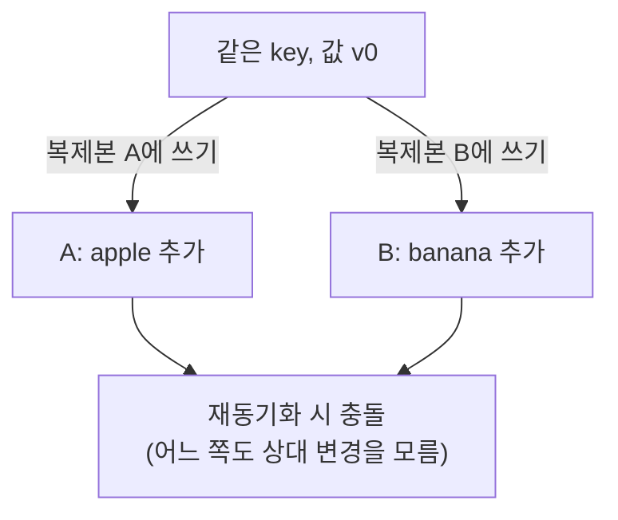
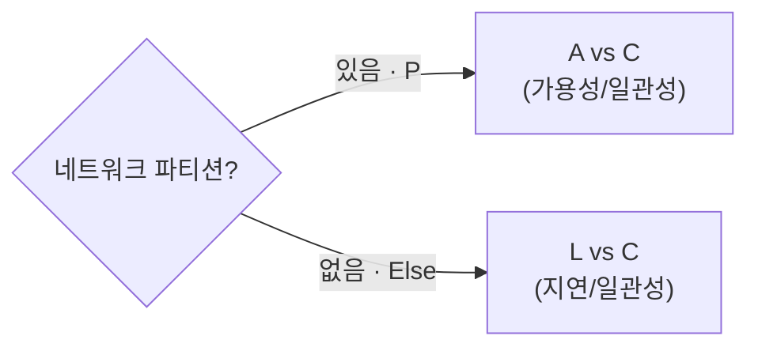

# 분산 KV, 책 이후의 이야기

ch06(Dynamo 논문, 2007)의 결론 중, 그 뒤로 현실이 다르게 간 세 지점.

---

## 1. 충돌 해결: vector clock → LWW / CRDT

### 문제 상황

AP 시스템은 복제본이 잠깐 갈라질 수 있다. 같은 key에 두 복제본이 각각 다른 쓰기를 받으면, 나중에 만났을 때 어느 쪽이 맞는지 알 수 없다.

이 충돌을 처리하는 세 가지 방식이 vector clock, LWW, CRDT다.

### 세 방식

| 방식 | 동작 | 위 예시 결과 | 머지 책임 |
|---|---|---|---|
| **vector clock** | `[서버,카운터]`로 선후/충돌 판정, 충돌이면 두 버전 모두 반환 | apple·banana 둘 다 → 클라이언트가 합침 | 클라이언트 |
| **LWW** | 모든 쓰기에 timestamp, 늦은 쪽 채택 | apple 또는 banana (한쪽 소멸) | 자동 (DB) |
| **CRDT** | 자료구조에 머지 규칙 내장, 순서 무관 수렴 | apple + banana (OR-Set이면 합집합) | 자동 (자료구조) |

- **vector clock** — 충돌을 *감지*까지만 하고 해결은 클라이언트에 맡긴다. Dynamo 논문의 표준.
- **LWW (Last-Write-Wins)** — timestamp 비교 한 번으로 끝나 단순·빠르다. 대신 진 쪽 쓰기가 흔적 없이 사라진다(lost write). "정보를 비결정적으로 파괴한다"는 비판.
- **CRDT (Conflict-free Replicated Data Type)** — 머지 연산을 교환·결합·멱등하게 설계해, 변경을 어떤 순서로 받아도 같은 값으로 수렴. 클라이언트가 머지 로직을 짤 필요가 없다. G-Counter(카운터), OR-Set(집합) 등 타입별로 정의.

### 실제 채택

| 시스템 | 선택 | 메모 |
|---|---|---|
| Cassandra | LWW | 처음부터 vector clock 미사용. row를 column 단위로 쪼개 통째 덮임을 줄임 |
| Riak | vector clock → CRDT | 충돌 머지를 개발자가 직접 짜는 부담 → Riak 2.0에서 CRDT(Data Types)로 흡수 |
| Figma·Notion, Redis, Automerge | CRDT | 협업 편집·분산 자료구조 |

출처: [DataStax](https://www.datastax.com/blog/why-cassandra-doesnt-need-vector-clocks), [aphyr](https://aphyr.com/posts/299-the-trouble-with-timestamps), [Riak 2.0](https://riak.com/distributed-data-types-riak-2-0/), [CRDT 역사](https://christophermeiklejohn.com/erlang/lasp/2019/03/08/monotonicity.html)

---

## 2. CAP → PACELC

CAP은 파티션이 났을 때 A와 C 중 하나를 고른다는 정리지만, 파티션이 없는 평소는 설명하지 않는다. 복제가 있으면 평소에도 트레이드오프가 있다 — 모든 복제본을 기다리면 일관성↑·느림, 일부만 기다리면 빠름·stale 가능.

PACELC는 이 평소 축을 더한다.

| 분류 | 파티션 시 | 평소 | 예 |
|---|---|---|---|
| **PA/EL** | 가용성 | 저지연 | DynamoDB, Cassandra |
| **PC/EC** | 일관성 | 일관성 | Spanner, CockroachDB |

운영의 대부분은 파티션 없는 평소라, "평소에 지연과 일관성 중 무엇을 택했나"까지 보는 PACELC가 시스템 성격을 더 정확히 가른다. (Daniel Abadi, 2010 블로그 → 2012 논문)

출처: [논문](https://www.researchgate.net/publication/220476540_Consistency_Tradeoffs_in_Modern_Distributed_Database_System_Design_CAP_is_Only_Part_of_the_Story), [Wikipedia](https://en.wikipedia.org/wiki/PACELC_design_principle)

---

## 3. Dynamo 논문 ≠ DynamoDB

책의 Dynamo는 2007년 논문 속 Amazon 내부 시스템, AWS DynamoDB(2012)는 이름만 이어받은 별개 제품이다.

| | Dynamo (2007 논문) | DynamoDB (2012 서비스) |
|---|---|---|
| 복제 | 리더 없는 quorum | 파티션별 리더 + MultiPaxos |
| 충돌 해결 | vector clock | LWW |
| 성격 | 분산 KV의 원형 | 매니지드 서비스 |

2022 USENIX ATC 논문(AWS 엔지니어 작성)이 직접 명시한다: "DynamoDB는 2007 Dynamo와 공유하는 부분이 별로 없다." (참고: 2021 Prime Day 초당 8,920만 요청)

출처: [USENIX ATC 2022](https://www.usenix.org/system/files/atc22-elhemali.pdf), [Marc Brooker](https://brooker.co.za/blog/2022/07/12/dynamodb.html)

---

## 나눠볼 것

- 충돌 해결의 복잡도를 어디에 둘까 — 클라이언트(vector clock) / DB(LWW) / 자료구조(CRDT).
- 우리 데이터(MySQL, ES)를 PACELC로 분류하면? 결제와 검색은 같은 선택일까.
- Amazon이 리더 없는 구조에서 Paxos로 간 건 "규모에선 단순함보다 예측 가능성"의 신호일까.

## 출처

- [Why Cassandra Doesn't Need Vector Clocks — DataStax](https://www.datastax.com/blog/why-cassandra-doesnt-need-vector-clocks)
- [Dynamo — Apache Cassandra 공식 문서](https://cassandra.apache.org/doc/latest/cassandra/architecture/dynamo.html)
- [The trouble with timestamps — Kyle Kingsbury](https://aphyr.com/posts/299-the-trouble-with-timestamps)
- [Distributed Data Types – Riak 2.0](https://riak.com/distributed-data-types-riak-2-0/)
- [A Brief History of CRDTs in Riak — Christopher Meiklejohn](https://christophermeiklejohn.com/erlang/lasp/2019/03/08/monotonicity.html)
- [PACELC 논문(2012) — Daniel Abadi](https://www.researchgate.net/publication/220476540_Consistency_Tradeoffs_in_Modern_Distributed_Database_System_Design_CAP_is_Only_Part_of_the_Story)
- [PACELC — Wikipedia](https://en.wikipedia.org/wiki/PACELC_design_principle)
- [Amazon DynamoDB (USENIX ATC 2022)](https://www.usenix.org/system/files/atc22-elhemali.pdf)
- [The DynamoDB paper — Marc Brooker](https://brooker.co.za/blog/2022/07/12/dynamodb.html)
- Giuseppe DeCandia et al., *Dynamo: Amazon's Highly Available Key-value Store*, SOSP 2007
