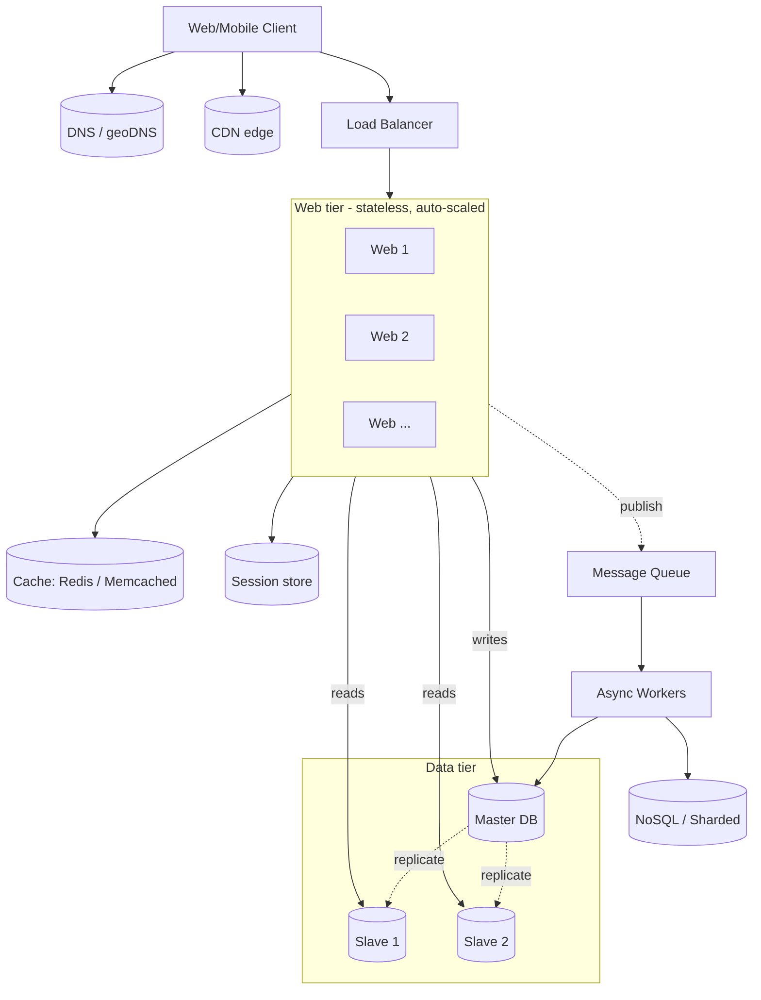

# Scale From Zero to Millions of Users

## 핵심 takeaway

- **확장은 한 번에 일어나지 않는다.** 단일 서버 → tier 분리 → DB 복제 → 캐시·CDN → 무상태 web tier → 멀티 DC → 메시지 큐 → DB 샤딩으로 이어지는 **점진적 진화**가 큰 그림이다 (ch01, p.7-37).
- **각 단계는 직전 단계의 병목을 해소하기 위해 등장한다.** "왜 이 컴포넌트가 필요한가"는 직전 시스템의 한계에서 자연스럽게 도출된다 — 카탈로그가 아니라 **인과 사슬**로 외워야 한다.
- **수평 확장이 대규모의 정답이지만 공짜는 아니다.** 상태 외부화·일관성·운영 자동화 같은 분산 시스템 비용을 함께 떠안는다.
- **수백만 사용자 청사진의 7원칙** (ch01, p.37): ① 무상태 web tier ② 모든 tier 이중화 ③ 가능한 만큼 캐시 ④ 멀티 데이터센터 ⑤ CDN으로 정적 자산 ⑥ 데이터 tier 샤딩 ⑦ 서비스 분리 + 모니터링·자동화.

## 개요 — 책이 그리는 진화 서사

장은 가상의 웹사이트가 사용자 1명 → 수백만 명으로 성장하는 시나리오를 따라가며 **언제 무엇을 도입할지**를 보여준다. 이 장의 가치는 컴포넌트 자체가 아니라 **도입 순서의 인과**에 있다. 본 페이지는 그 인과를 9개의 진화 단계로 정리한다.

## 1단계 — 단일 서버에서 tier 분리

웹·DB·캐시가 한 호스트에 동거하는 시작점. 사용자가 늘면 가장 먼저 **web tier와 data tier를 별도 서버로 분리**한다 (Figure 1-3). 동기는 단순하다 — 두 tier의 자원 요구·실패 양상이 다르므로 **독립적으로 확장**할 수 있게 만드는 것.

이 시점의 DB 선택은 후속 모든 결정에 영향을 준다. 책의 가이드: 기본은 RDBMS([[relational-database]]), 단 ① 초저지연 ② 비정형 데이터 ③ 직렬화 위주 ④ 대용량이면 [[nosql-database]] (key-value / graph / column / document) 고려.

## 2단계 — 수평 확장과 로드 밸런서

vertical scaling(서버 한 대의 사양 키우기)은 빠르고 단순하지만 **하드웨어 상한·SPOF·고비용**의 세 한계가 있다. 그래서 수평 확장으로 전환한다 — [[vertical-vs-horizontal-scaling]].

수평 확장을 가능하게 하는 정문 컴포넌트가 [[load-balancer]]다. 사용자는 LB의 public IP로 접속하고 내부 서버는 private IP로 통신. 한 web server가 죽으면 트래픽이 자동 우회되고, 풀에 서버를 추가하면 즉시 분배된다.

## 3단계 — DB 복제로 읽기 분산

LB로 web tier는 해결됐지만 DB는 여전히 단일 인스턴스 — [[single-point-of-failure]]다. 또한 대부분 애플리케이션은 **읽기:쓰기 비율이 매우 높아** 하나의 노드로는 곧 병목.

[[database-replication]] (master/slave 모델)로 master는 write 전담, N개의 slave가 read 분담. 부수 효과로 지리적 분산 사본을 가질 수 있어 신뢰성·가용성도 같이 올라간다. 다만 **복제 지연(replication lag)** 때문에 read-after-write가 어긋날 수 있는 점은 후속 챕터에서 일관성 모델로 다시 다룬다.

## 4단계 — 캐시 도입으로 DB 부하 완화

DB가 여전히 hot path에 있다. [[caching-strategies]] (read-through, expiration, eviction)로 자주 읽히고 덜 변경되는 데이터를 메모리 계층에 둔다. 대표 기술은 [[memcached]]와 [[redis]]. 캐시 자체가 새로운 SPOF가 될 수 있어 멀티 노드·오버프로비저닝이 권장된다.

## 5단계 — CDN으로 정적 자산 분리

응답 지연의 큰 부분은 정적 자산(JS/CSS/이미지/비디오) 전송에 있다. [[cdn]]은 사용자 근처 PoP에서 이를 서빙해 지연을 단축한다. TTL·invalidation·versioning이 운영 핵심.

## 6단계 — 무상태 web tier로 진정한 수평 확장

서버에 세션·이미지가 남아 있으면 sticky session이 필요해지고 오토스케일링·페일오버가 어려워진다. [[stateless-web-tier]] — 세션·상태를 RDB / [[memcached]] / [[redis]] / [[nosql-database]] 같은 공유 저장소로 외부화하면 임의 서버로 라우팅 가능해진다 (Figure 1-14).

## 7단계 — 글로벌화: 멀티 데이터센터

서비스가 글로벌화되면 단일 DC는 지연·DC급 장애의 SPOF 양면에서 한계. [[multi-data-center]] — geoDNS([[dns]])로 가까운 DC로 라우팅, DC간 비동기 복제, 자동화 배포로 일관성 유지. 도전은 ① 트래픽 리다이렉션 ② 데이터 동기화 ③ 다중 위치 테스트·배포.

## 8단계 — 메시지 큐로 결합도 낮추기

여러 컴포넌트가 동기 호출로 묶이면 한쪽 느려짐이 전체로 번지고 독립 확장이 어렵다. [[decoupling-with-message-queue]] — producer가 publish하고 consumer가 비동기 consume. 사진 처리 같은 무거운 백그라운드 작업, 부하 평탄화, 서비스 간 이벤트 통합의 표준 도구가 된다 ([[message-queue]] 기술 페이지 참조).

## 9단계 — DB 샤딩으로 쓰기·저장 분산

복제는 읽기만 분산했다. 데이터·쓰기 자체가 커지면 [[sharding]] — 동일 스키마·다른 데이터의 여러 shard로 수평 분할. **sharding key 선택**이 핵심이고, **resharding·celebrity(hotspot)·cross-shard join** 세 문제가 따라붙는다. resharding은 ch05의 [[consistent-hashing]]으로 정교화된다.

## 운영 — 로깅·메트릭·자동화

규모가 커지면 호스트 메트릭(CPU·메모리·디스크) / 집계 메트릭(DB tier·캐시 tier) / 비즈니스 메트릭(DAU·retention·revenue)을 모두 봐야 한다. CI/CD로 빌드·테스트·배포 자동화가 필수가 된다.

## 최종 청사진 (수백만 사용자급)

ch01의 9단계 진화가 모두 적용된 시스템:

## 인과 사슬 한눈에

| 단계 | 해결한 문제 | 도입된 컴포넌트·개념 |
|---|---|---|
| 1 | 자원 충돌 | tier 분리 |
| 2 | 단일 서버 한계 | [[load-balancer]] · [[vertical-vs-horizontal-scaling]] |
| 3 | DB SPOF · 읽기 부하 | [[database-replication]] |
| 4 | DB 응답 지연 | [[caching-strategies]] · [[memcached]]/[[redis]] |
| 5 | 정적 자산 지연 | [[cdn]] |
| 6 | sticky 의존 | [[stateless-web-tier]] |
| 7 | 글로벌 지연·DC 장애 | [[multi-data-center]] · [[dns]] geoDNS |
| 8 | 컴포넌트 결합도 | [[decoupling-with-message-queue]] · [[message-queue]] |
| 9 | 쓰기·저장 한계 | [[sharding]] |

## 등장 개념

- [[vertical-vs-horizontal-scaling]] — scale up vs scale out 트레이드오프
- [[database-replication]] — master/slave, 읽기 분산, failover
- [[stateless-web-tier]] — 세션 외부화, sticky session 회피
- [[caching-strategies]] — read-through, expiration, eviction, SPOF 회피
- [[sharding]] — 수평 DB 분할, sharding key 선택, hotspot 문제
- [[single-point-of-failure]] — SPOF 정의와 회피
- [[multi-data-center]] — geoDNS, 동기화, 장애 시 트래픽 우회
- [[decoupling-with-message-queue]] — 비동기 분리, 독립 스케일링

## 등장 기술

- [[load-balancer]] — 트래픽 분산·failover의 정문 컴포넌트 (proxy)
- [[cdn]] — 정적 자산 엣지 캐싱 (cdn)
- [[memcached]] — 분산 in-memory key-value 캐시 (cache)
- [[redis]] — 자료구조·원자 연산이 풍부한 in-memory store (cache)
- [[relational-database]] — RDBMS / SQL / join 기반 (db)
- [[nosql-database]] — key-value/graph/column/document 4계열 (db)
- [[message-queue]] — 비동기 메시지 미들웨어 (queue)
- [[dns]] — 도메인 해석, geoDNS (proxy)

## 면접 관점 메모

- 1장은 컴포넌트 카탈로그가 아니라 **"언제 무엇을 도입하는가"의 순서 감각**을 묻는다. 진화 서사로 풀어내자.
- "왜 sticky session 대신 무상태인가", "왜 샤딩 전에 복제·캐시인가" 같은 후속 질문이 자연스럽게 따라붙는다.
