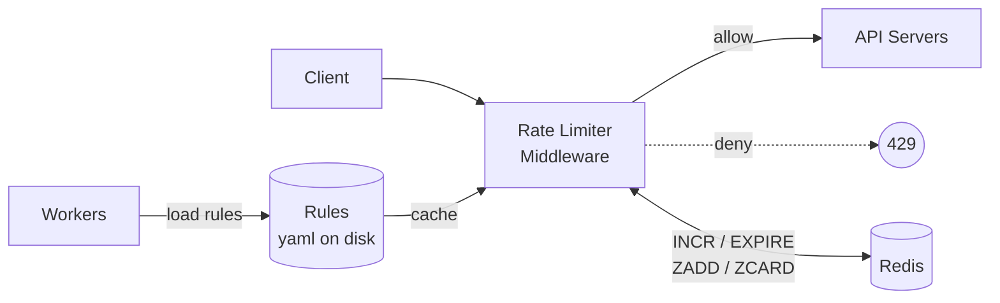

# Design a Rate Limiter

## 핵심 takeaway

- Rate limiter는 **자원 고갈·비용·과부하 세 가지 위협**을 막기 위한 트래픽 제어 컴포넌트다. 대부분의 공개 API가 어떤 형태로든 적용한다 (Twitter 3시간 300트윗, Google Docs 60초 300read 등).
- 단일 노드 구현은 쉬워도 **분산 환경의 race condition·동기화**가 진짜 어려움. 정답은 락이 아니라 **원자 연산**(Redis Lua·sorted set)과 **중앙 공유 저장소**다.
- 알고리즘 선택은 비즈니스 요구(버스트 허용? 평탄 outflow? 정확도? 메모리?)에 따라 달라진다. 5개 핵심 알고리즘은 각각 별도 페이지로 정리.
- 클라이언트 UX는 자주 빠진다 — **HTTP 429** + `X-Ratelimit-*` 헤더 + 적절한 `Retry-After`가 표준.

## 개요 — 왜 처리율을 제한해야 하는가

세 가지 동기 (ch04, p.55):

1. **자원 고갈 방지** — DoS(의도적이든 우발적이든) 차단.
2. **비용 절감** — 외부 유료 API(결제·신용·헬스 등) 호출 통제.
3. **서버 과부하 방지** — 봇·악성 사용자 트래픽 차단.

상세: [[rate-limiting]].

## 위치 / 배치

| 위치 | 장단 | 사용 시기 |
|---|---|---|
| Client-side | 위·변조 쉬워 단독 사용 비추천 | 보조 방어선 정도 |
| Server-side | 알고리즘 자유도 ↑, 구현 책임은 자신 | 자체 정책이 정교해야 할 때 |
| **API gateway 미들웨어** | rate limit + SSL + auth + IP whitelist 묶음 | microservices 표준 |

[[api-gateway]]가 이미 있는 마이크로서비스 환경이면 거기 얹는 게 자연스럽다. 알고리즘 통제·언어 의존성·인력 여력이 자체 구현 vs 게이트웨이 선택의 기준 (ch04, p.59).

## 알고리즘 비교

5개 알고리즘이 각각 다른 트레이드오프를 가진다. 한눈 비교:

| 알고리즘 | 정확도 | 메모리 | 버스트 | 대표 사용 |
|---|---|---|---|---|
| [[token-bucket-algorithm]] | 중 | 적음 | **허용** | AWS, Stripe |
| [[leaking-bucket-algorithm]] | 중 | 적음 | 평탄화 | Shopify |
| [[fixed-window-counter-algorithm]] | 낮음 (경계 burst) | 적음 | — | 단순 정책 |
| [[sliding-window-log-algorithm]] | **높음** | **많음** | — | 엄격 한도 |
| [[sliding-window-counter-algorithm]] | 중·근사 | 적음 | 평탄화 | Cloudflare |

**선택 기준 요약**
- 버스트가 정상 패턴 → token bucket.
- 다운스트림 처리율 평탄화 필요 → leaking bucket.
- 단순·인간 친화적 단위 → fixed window (경계 burst 감수).
- 엄밀하게 막아야 함 → sliding window log (메모리 비용 감수).
- 균형이 필요 → sliding window counter (Cloudflare 실측 오차 0.003%).

각 알고리즘 페이지에 의사코드·예시·파라미터 튜닝까지 정리되어 있다.

## 기본 아키텍처



- **카운터는 DB가 아니라 [[redis]]에 둔다.** 디스크 접근은 느리고, Redis는 `INCR`·`EXPIRE`로 자연스럽게 카운터·TTL을 표현한다.
- **규칙(rules)** 은 디스크에 yaml로 두고, 워커가 정기적으로 캐시로 로드 (Lyft 오픈소스 포맷):

```yaml
domain: messaging
descriptors:
  - key: message_type
    value: marketing
    rate_limit:
      unit: day
      requests_per_unit: 5
```

## 클라이언트 응답 형식

| 요소 | 값 | 의미 |
|---|---|---|
| 상태 코드 | **429 Too Many Requests** | 임계 초과 |
| `X-Ratelimit-Limit` | 정수 | 창당 허용량 |
| `X-Ratelimit-Remaining` | 정수 | 현재 창의 잔여 |
| `X-Ratelimit-Retry-After` | 초 | 재시도까지 대기 |

drop 대신 **메시지 큐 enqueue**로 후처리하는 옵션도 가능 (일시 과부하 시 주문 보존 등).

## 분산 환경의 난제

### Race condition

`read → check → increment`이 비원자적. 두 요청이 동시에 read하면 둘 다 통과되며 카운터가 1만 증가 (Figure 4-14).

**락은 답이 아니다 — 느리다.** 두 가지 표준 해법:

1. **Redis Lua 스크립트**: read-check-increment를 한 atomic 실행으로 묶음.
2. **Redis sorted set**: 타임스탬프를 score로 ZADD, 윈도우 밖을 ZREMRANGEBYSCORE로 일괄 제거, ZCARD로 카운트 — [[sliding-window-log-algorithm]]에 자연스럽게 매핑.

### Synchronization

여러 rate limiter 서버가 카운터를 각자 가지면 정책이 어긋난다. sticky session으로 같은 클라이언트를 같은 서버로 보내는 건 **확장·유연성 측면에서 비추** ([[stateless-web-tier]] 원칙의 연장). 표준은 **중앙 공유 저장소**([[redis]] 단일/클러스터)에 카운터를 모으는 것.

## 성능과 운영

- **Edge 가까이 배치**: 사용자 지연 단축. Cloudflare는 194개 edge 서버 분산 배치 (ch04, p.74).
- **DC 간 동기화는 eventual consistency**: 강한 일관성을 요구하면 지연이 폭증. 상세는 ch06 key-value store에서.
- **모니터링**: ① 알고리즘 자체가 효과적인가 ② 규칙이 적절한가. 정상 요청이 다수 drop되면 규칙 완화, flash sale 같은 급증을 못 막으면 알고리즘 교체(예: token bucket).

## 추가 토픽

- **Hard vs soft rate limiting**: hard = 임계 초과 절대 불가, soft = 단기 초과 허용. 사용자 경험과 보호 강도 사이 트레이드오프.
- **OSI 레이어**: 본 장은 layer 7 (HTTP). layer 3에서는 `iptables` 등으로 IP 차단 가능 — 비용은 싸지만 식별 정밀도 ↓.
- **클라이언트 모범 사례**: 응답 캐시, 한도 인지, 예외 처리, **exponential backoff**.

## 등장 개념

- [[rate-limiting]] — 정의·필요성·위치·hard/soft·OSI 레이어 총론
- [[token-bucket-algorithm]] — 토큰 버킷 (버스트 허용)
- [[leaking-bucket-algorithm]] — 누출 버킷 (FIFO, 평탄 outflow)
- [[fixed-window-counter-algorithm]] — 고정 윈도우 카운터 (단순·경계 burst 취약)
- [[sliding-window-log-algorithm]] — 슬라이딩 윈도우 로그 (정확·메모리 큼)
- [[sliding-window-counter-algorithm]] — 슬라이딩 윈도우 카운터 (근사·균형)

## 등장 기술

- [[redis]] — 카운터·sorted set·Lua 스크립트 (cache)
- [[api-gateway]] — microservices 미들웨어 (proxy)

## 면접 관점 메모

- 알고리즘 선택 근거를 트레이드오프로 답할 수 있어야 한다. 분산 race condition 해법으로 락이 아니라 **원자 연산**을 말하는 게 가점 포인트.
