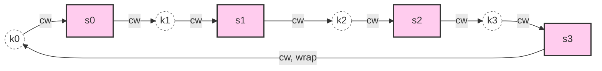

# Design Consistent Hashing

## 핵심 takeaway

- **Rehashing problem**: `hash(key) % N`은 N(서버 수)이 변하면 거의 모든 키가 재배치되어 **cache miss 폭풍**·데이터 마이그레이션 폭주를 부른다 (ch05, p.72-74).
- **Consistent hashing** (Karger et al., MIT)은 키·서버를 같은 해시 링에 놓고 시계 방향으로 첫 서버를 찾아 매핑함으로써 **서버 1대 변동 시 평균 k/n 키만 재배치**되게 만든다.
- **두 가지 약점 — 파티션 불균등·키 분포 불균등** — 은 **virtual nodes(replicas)** 로 해결한다. 한 물리 서버를 여러 가상 노드로 링에 흩뿌리면 분포가 균등해진다 (V=200 → 표준편차 ~5%).
- 거의 모든 대규모 분산 시스템(Dynamo, Cassandra, Discord, Akamai, Maglev LB)이 이 알고리즘 또는 변형을 채택한다.

## 개요 — 본 챕터의 위치

ch01에서 [[sharding]] 절은 **resharding 비용**을 명시적으로 문제 제기하며 "ch05에서 해결한다"고 예고한다. ch05는 그 약속을 갚는 챕터다.

내용은 한 가지 알고리즘에 집중되어 있고 페이지화 가치가 높은 단독 개념이 [[consistent-hashing]] 하나라 챕터 페이지는 짧다. 깊이 있는 설명은 그 페이지에 두고, 본 페이지는 **"왜 이 알고리즘이 필요했고 어디에 쓰이는가"** 의 큰 그림만 정리한다.

## 1. Modular Hash의 한계

분산 캐시·샤딩의 가장 단순한 방식 — `serverIndex = hash(key) % N` — 은 N이 고정일 땐 균등 분포·O(1) lookup으로 훌륭하다. 그러나 N이 바뀌면:

- N=4에서 N=3으로 줄어들 때 8개 키 중 **6~7개**가 다른 서버로 이동 (책 예시 Table 5-1 → 5-2, Figure 5-1 → 5-2).
- 캐시 환경: 클라이언트 다수가 일제히 빈 캐시를 만나며 origin으로 트래픽 폭주.
- 샤딩 환경: 거의 모든 데이터가 옮겨져야 하므로 사실상 운영 정지 수준의 재배치 작업.

이게 **rehashing problem**이다.

## 2. Consistent Hashing의 아이디어

[[consistent-hashing]] 페이지가 알고리즘 자체를 깊이 다루므로 여기서는 핵심 아이디어만:

- 해시 출력 공간(0 ~ 2^160-1)을 **원형 링**으로 본다.
- 서버는 IP·이름의 해시로 링에 자리 잡는다.
- 키도 같은 해시 함수로 링에 자리 잡는다 (modular 없음!).
- 키 위치에서 **시계 방향으로 가장 먼저 만나는 서버**가 그 키의 소유자.

이 단순한 규칙 덕에 서버를 추가·제거해도 **영향 받는 키는 그 서버 주변 호 구간뿐**이다.

## 3. 두 약점과 Virtual Nodes

기본 알고리즘은 서버를 균등하게 배치할 수 없다 (ch05, p.81-82). 두 가지가 어긋남:

- **파티션 크기 불균등**: 어떤 서버는 큰 hash 구간을, 어떤 서버는 좁은 구간을 책임짐.
- **키 분포 불균등**: 서버가 한쪽에 몰리면 키도 한 서버에 쏠림.

해법은 **virtual nodes(replicas)** — 한 물리 서버를 V개의 가상 노드로 링에 흩어뿌리는 것. 가상 노드가 많을수록 분포가 균등해진다 (V=100 → 표준편차 ~10%, V=200 → ~5%). 메모리 비용과 균등성의 트레이드오프.

이 부분이 ch05의 실용적 핵심 — 단순 알고리즘에 한 단계의 엔지니어링 보강을 더하는 패턴.

## 4. 어디에 쓰이는가

ch05 wrap up에서 언급되는 실제 채택 사례 (각각 책 reference 번호):

| 시스템 | 용도 |
|---|---|
| **Amazon Dynamo** [3] | 데이터 파티셔닝 컴포넌트 |
| **Apache Cassandra** [4] | 클러스터 데이터 분산 |
| **Discord** [5] | 채팅 백엔드 (Elixir) |
| **Akamai CDN** [6] | 콘텐츠 분배 |
| **Google Maglev** [7] | 네트워크 로드 밸런서 |

이 시스템들은 ch06(key-value store) 이후 챕터에서 본격 등장하며 본 알고리즘이 그곳들의 기초 빌딩 블록이 된다.

## 5. 의의 — 본 위키의 흐름에서

ch01~04에서 거의 모든 챕터가 "수평 확장이 답"이라고 결론지었지만, 실제 수평 확장의 기초 알고리즘은 ch05에서 처음 등장한다. 이 한 알고리즘은:

- ch01 [[sharding]]의 resharding 비용 문제 해결.
- ch04 [[memcached]] 클러스터 노드 변경 함정 해결.
- ch06+ key-value store·분산 DB의 데이터 분배 기초.

즉 ch05는 1~4장의 누적된 약속을 한 번에 갚는 **기술적 인플렉션 포인트**다.

## 등장 개념

- [[consistent-hashing]] — 해시 링, 시계방향 lookup, virtual nodes, 실무 적용까지 깊이 있는 단독 페이지
- [[sharding]] — ch01에서 본 알고리즘이 해결할 문제를 명시적으로 예고
- [[caching-strategies]] — modular hash의 cache miss 폭풍 문제가 발생하는 맥락

## 등장 기술

(이 장은 알고리즘 자체에 집중하므로 새로 도입되는 기술 컴포넌트는 없음. Dynamo·Cassandra 등 실제 시스템은 ch06+에서 본격 다룬다.)

## 면접 관점 메모

- "분산 캐시 노드 추가 시 캐시 미스 폭주를 어떻게 막을까?" → consistent hashing 답변이 가점. 가상 노드까지 언급하면 더 좋음.
- Resharding·hotspot 회피 같은 면접 단골 질문의 근본 답이 본 알고리즘.
