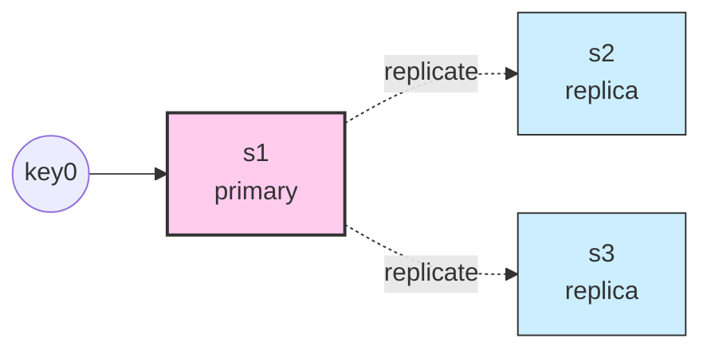
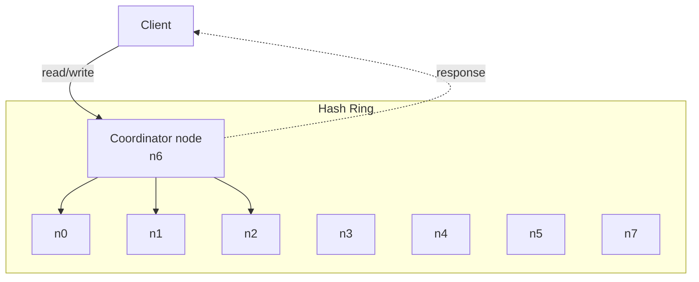

# Design a Key-Value Store

## 핵심 takeaway

- **CAP 정리**가 분산 KV 설계의 출발점이다. 네트워크 파티션은 불가피하므로 실세계는 **CP vs AP 선택** 문제이며 이 챕터의 모든 후속 결정이 이 갈림길에서 분기한다 (ch06, p.91-93).
- **Quorum consensus(N/W/R)** 는 강한·약한 일관성 사이를 슬라이딩하는 표준 다이얼. `W+R > N`이면 strong consistency, 작으면 fast read/write. 단순한 수식이지만 latency·consistency·availability 셋의 트레이드오프를 한 줄에 담는다.
- AP 시스템에서 동시 쓰기 충돌은 **vector clock**으로 감지·해결한다. ancestor면 자동 머지, sibling이면 클라이언트로 reconcile 위임 (Dynamo 방식).
- 장애는 세 층위로 다룬다: **Gossip protocol**(탐지) → **Sloppy quorum + Hinted handoff**(임시) → **Merkle tree anti-entropy**(영구) → 그 위에 **cross-DC replication**(DC 단위 장애).
- **Storage engine**은 LSM 계열이 표준 (Cassandra·BigTable·DynamoDB). Commit log + memtable + SSTable + Bloom filter의 조합으로 write는 sequential append, read는 memory→bloom→disk 단계 lookup.
- 본 챕터는 ch05의 [[consistent-hashing]]을 데이터 파티셔닝의 기초로 깔고, 그 위에 replication·consistency·failure handling 층을 쌓아 올린다 — **분산 시스템 디자인의 종합편**.

## 개요 — 본 챕터의 위치

이 챕터는 본 위키의 첫 **종합 시스템 설계** 챕터다. ch01~05는 개별 기법(LB, 캐시, 복제, sharding, consistent hashing)을 따로 다뤘는데, ch06은 그것들을 **하나의 일관된 분산 데이터 시스템 안에서 어떻게 결합하는지** 보여준다.

설계 대상의 특성 요구는 다음과 같다 (ch06, p.87):

- 작은 KV 쌍 (<10KB)
- 빅데이터 저장
- High availability (장애 중에도 응답)
- High scalability (수평 확장)
- Automatic scaling
- **Tunable consistency** (강·약 조정 가능)
- Low latency

이 7개 요구를 동시에 만족하는 "완벽한 설계"는 없고, 항상 **read·write·memory 트레이드오프**가 따라온다는 것이 챕터의 출발점이다.

## 1. Single Server에서 Distributed로

단일 서버 KV는 in-memory hash table로 단순하다. 압축·메모리/디스크 hybrid로 수십~수백 GB까지는 버틸 수 있지만 빅데이터에는 곧 한계. **분산 KV store(분산 해시 테이블)** 로의 이행은 불가피하다 (ch06, p.89).

분산으로 가는 순간 등장하는 새로운 문제들이 본 챕터의 본문이다.

## 2. CAP 정리 — 모든 설계 결정의 출발점

[[cap-theorem]] 참고. 분산 시스템은 **Consistency, Availability, Partition tolerance** 중 두 개만 동시에 만족할 수 있다. 네트워크 파티션은 실세계에서 불가피하므로 **CA는 환상**이고 실제 선택은:

- **CP (Consistency + Partition tolerance)**: 파티션 발생 시 일관성을 위해 가용성 포기. 은행·금융계 시스템.
- **AP (Availability + Partition tolerance)**: 파티션 발생 시 stale 데이터라도 응답. Dynamo·Cassandra 계열의 선택.

ch06이 설계하는 KV store는 high availability 요구 때문에 **AP 계열**로 간다. 이 결정이 이후 모든 컴포넌트의 성격을 결정한다.

## 3. 시스템 구성 요소 (8가지)

ch06이 다루는 핵심 컴포넌트:

| 영역 | 기법 | 본 위키 페이지 |
|---|---|---|
| Data partition | Consistent hashing | [[consistent-hashing]] |
| Data replication | Clockwise N nodes + cross-DC | [[multi-data-center]] |
| Consistency | Quorum (N/W/R) | [[quorum-consensus]] |
| Consistency model | Strong/Weak/Eventual | [[consistency-models]] |
| Inconsistency resolution | Vector clock | [[vector-clock]] |
| Failure detection | Gossip protocol | [[gossip-protocol]] |
| Temporary failure | Sloppy quorum + hinted handoff | [[sloppy-quorum-hinted-handoff]] |
| Permanent failure | Anti-entropy with Merkle tree | [[merkle-tree]] |
| Storage engine | LSM tree + SSTable + Bloom filter | [[lsm-tree-storage-engine]], [[bloom-filter]] |
| DC outage | Cross-DC replication | [[multi-data-center]] |

각 항목은 독립 페이지에서 깊이 다룬다. 본 챕터 페이지는 **이것들이 하나의 시스템으로 어떻게 엮이는지**를 본다.

## 4. Data partition & replication

[[consistent-hashing]]으로 키를 서버에 분배. virtual node를 통해 균등성·heterogeneity(서버 용량 차이)까지 흡수.

**Replication**은 키 위치에서 시계 방향 첫 N개 서버에 복제 (보통 N=3).

가상 노드 때문에 시계 방향 N개가 같은 물리 서버일 수 있으므로 **unique physical server**만 골라야 한다 (ch06, p.97). 신뢰성을 위해 **서로 다른 DC·rack**에 replica를 배치하는 것도 추가 정책이다.

## 5. 쓰기·읽기 일관성 — Quorum + Consistency model

[[quorum-consensus]]의 N/W/R 다이얼이 핵심:

- `W=1, R=N` → fast write
- `W=N, R=1` → fast read
- `W+R > N` → strong consistency (보통 N=3, W=R=2)

ch06의 권장은 [[consistency-models|eventual consistency]] + W=R=2 — Dynamo/Cassandra의 일반적 설정.

Eventual consistency는 **동시 쓰기로 인한 일시적 불일치**를 허용하므로, 그것을 해결할 [[vector-clock]]이 필요하다. 두 버전이 ancestor 관계면 자동 처리, sibling이면 클라이언트가 reconcile.

## 6. 장애 처리 — 3단 방어선

### 6-1. 탐지: Gossip protocol

[[gossip-protocol]]. 각 노드가 heartbeat counter를 들고 랜덤한 노드에 전파. all-to-all multicast의 O(N²)를 피하고 O(N log N)으로 클러스터 전체에 장애 정보를 퍼뜨린다.

### 6-2. 임시 장애: Sloppy quorum + Hinted handoff

[[sloppy-quorum-hinted-handoff]]. 일부 노드가 일시적으로 응답 못 해도 **링의 다음 healthy 노드**에 W/R을 수행 (sloppy quorum). 임시 대리 노드는 **hint**를 들고 있다가 원 노드 복귀 시 hand-back.

### 6-3. 영구 장애: Anti-entropy with Merkle tree

[[merkle-tree]]. 노드 간 데이터 비교를 효율화. 키 공간을 bucket으로 나누고 각 bucket 해시 → 상위 hash → root. **root hash만 비교**해서 같으면 끝, 다르면 트리를 내려가며 차이 나는 bucket만 동기화.

### 6-4. DC 장애

[[multi-data-center]] 패턴 (ch01 등장). KV store는 DC 단위 복제까지 포함해서 DC 전체 outage도 견딘다.

## 7. Storage engine — LSM 구조

[[lsm-tree-storage-engine]] 참고. ch06이 다루는 write/read path는 **Cassandra 모델**:

**Write path:**
1. Commit log에 append (durability)
2. Memory cache(memtable)에 기록
3. memtable이 차면 SSTable로 flush

**Read path:**
1. memtable 조회 → 있으면 반환
2. 없으면 [[bloom-filter]]로 어느 SSTable에 있을지 추정
3. 해당 SSTable에서 lookup → 반환

이 구조의 핵심 통찰:
- **Write는 sequential append만** (commit log + SSTable flush) → 디스크 I/O 친화.
- **Read는 bloom filter로 disk seek 폭증 회피**.
- compaction이 별도 백그라운드 작업으로 SSTable들을 머지·정리.

## 8. System architecture — 모든 노드가 동등

ch06 최종 아키텍처(Figure 6-17)의 본질은 **decentralized**:

특징:
- 모든 노드가 **같은 책임**: Client API, conflict resolution, replication, failure detection, failure repair, storage engine.
- **Coordinator는 역할이지 별도 노드 종류가 아니다** — 클라이언트가 닿은 노드가 그 요청의 coordinator가 된다.
- 단일 SPOF 없음 — [[single-point-of-failure]] 회피.

ch01에서 "수평 확장하고 SPOF 없애자"고 결론낸 모든 패턴이 여기서 한 시스템으로 종합된다.

## 9. 본 위키의 흐름에서 ch06의 위치

ch05까지가 **개별 기법**의 모음이었다면, ch06은 그것들을 **하나의 분산 데이터 시스템 안에서 어떻게 엮는가**의 실습이다.

- ch01의 [[sharding]] → ch06에서 [[consistent-hashing]] 기반 partition.
- ch01의 [[database-replication]] → ch06에서 N개 노드 multi-master 복제 + quorum.
- ch01의 [[single-point-of-failure]] 회피 → ch06에서 decentralized architecture로 완성.
- ch01의 [[multi-data-center]] → ch06에서 cross-DC replication으로 재등장.

그리고 새로 등장하는 분산 시스템의 핵심 이론([[cap-theorem]]·quorum·vector clock·gossip·Merkle tree·LSM)이 이후 챕터(분산 락, 분산 메시지 큐 등)의 기초가 된다.

## 등장 개념

- [[cap-theorem]] — C/A/P 중 둘만 선택, 실세계는 CP vs AP 분기
- [[consistency-models]] — strong / weak / eventual 일관성 스펙트럼
- [[quorum-consensus]] — N/W/R 다이얼로 일관성·지연 트레이드오프
- [[vector-clock]] — 동시 쓰기 충돌의 감지·해결 (ancestor / sibling)
- [[gossip-protocol]] — 분산 failure detection·membership 전파
- [[sloppy-quorum-hinted-handoff]] — 임시 장애 시 가용성 보존 + 복귀 hand-back
- [[merkle-tree]] — 영구 장애 anti-entropy, bucket hash로 차이만 동기화
- [[lsm-tree-storage-engine]] — Commit log + Memtable + SSTable의 LSM 표준
- [[bloom-filter]] — SSTable lookup 회피용 확률적 멤버십 자료구조
- [[consistent-hashing]] (ch05) — 데이터 파티셔닝의 기초
- [[multi-data-center]] (ch01) — DC outage 대비 cross-DC 복제

## 등장 기술

- [[dynamo]] — Amazon Dynamo (논문 [4]). AP·vector clock·sloppy quorum·Merkle tree의 원조 (db)
- [[cassandra]] — Apache Cassandra. ch06 write/read path의 직접 모델, gossip protocol 채택 (db)

## 면접 관점 메모

- "분산 KV store 설계해보라" 질문은 사실상 ch06 모든 컴포넌트를 한 줄씩 언급하는 것 = 만점 답.
- CAP 답변은 "CP/AP 어떤 시스템인가? 왜?"부터 시작 — 트레이드오프 명시가 핵심.
- vector clock·merkle tree는 잘 모르고 외워온 것이 보이면 감점, **왜 그게 필요한가** 설명할 수 있어야 함.
