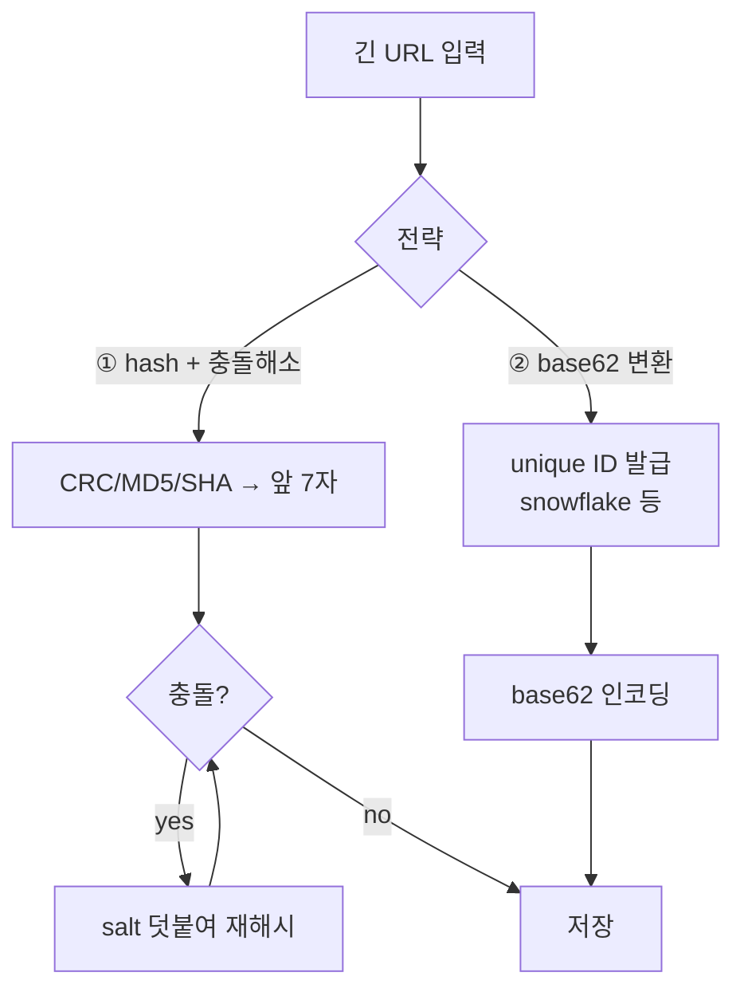
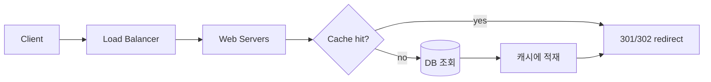

# Design a URL Shortener

## 핵심 takeaway

- URL 단축기의 본질은 **단축 코드 생성 전략** 하나로 수렴한다. 두 후보 — ① 긴 URL을 hash하고 충돌을 해소하는 방식, ② unique ID를 발급받아 [[base62-encoding]]으로 변환하는 방식 — 중 책은 **base62 변환**을 택한다. 충돌이 구조적으로 불가능하기 때문 (ch08, p.125-133).
- 읽기:쓰기 비율이 극단적으로 **읽기 우세(10:1 이상)**. 따라서 redirect 경로는 캐시([[caching-strategies]]) 우선 설계, 쓰기 경로는 ID 생성·DB 저장 중심으로 비대칭 설계한다.
- redirect는 **301(영구) vs 302(임시)** 선택이 핵심 트레이드오프 — 301은 브라우저 캐싱으로 서버 부하를 줄이지만 클릭 분석이 불가능해지고, 302는 매 요청이 서버를 거쳐 분석이 가능하다. [[url-redirection-301-302]].
- ch07의 [[snowflake-id]]가 여기서 곧장 재사용된다 — unique ID generator가 base62 변환의 입력. **ch07 → ch08은 직접 의존 체인**.
- back-of-the-envelope로 단축 코드 길이를 도출: 62^n ≥ 필요한 총 URL 수. 62^7 ≈ 3.5조로 대부분의 규모를 커버 ([[base62-encoding]]).

## 개요 — 요구사항과 규모 추정

핵심 기능은 단 둘 (ch08, p.118-120):

1. **단축**: 긴 URL → 짧은 URL.
2. **리다이렉트**: 짧은 URL 접속 → 원본 URL로 redirect.

규모 추정 예시 (ch08, p.120):

| 항목 | 가정 | 도출 |
|---|---|---|
| 쓰기 | 1억 URL/일 | ≈ 1,160 writes/s |
| 읽기 | 쓰기의 10배 | ≈ 11,600 reads/s |
| 저장 기간 | 10년 | 1억 × 365 × 10 ≈ **3,650억 레코드** |
| URL 평균 길이 | 100 byte | ≈ 36.5 TB |

**읽기 압도적 우세**가 모든 설계 결정을 지배한다 — redirect 경로를 캐시로 받아내는 게 1순위.

## 단축 코드 길이 — 왜 base62, 왜 7자

단축 코드 문자 집합은 `[0-9a-zA-Z]` = **62자**. 길이 n이면 표현 가능 수는 62^n.

| n | 62^n | 충분? |
|---|---|---|
| 6 | ≈ 568억 | 부족 (3,650억 < ) |
| **7** | **≈ 3.5조** | ✅ 3,650억 여유 커버 |
| 8 | ≈ 218조 | 과함 |

→ **7자**면 10년 규모를 커버. 상세는 [[base62-encoding]].

## API 설계

```
POST /api/v1/data/shorten
  body: { longUrl }
  → { shortUrl }

GET /api/v1/{shortUrl}
  → 301 또는 302 redirect (Location: longUrl)
```

## 단축 코드 생성 — 두 전략 비교



| 기준 | hash + 충돌해소 | **base62 변환 (채택)** |
|---|---|---|
| 길이 | 고정 (7자) | ID 크기에 따라 가변·증가 |
| 충돌 | **가능** → DB/[[bloom-filter]] 조회로 검사·재시도 | **불가능** (ID가 unique) |
| 다음 코드 예측 | 불가 (보안 ↑) | 가능 (id+1, 순차 → enumerate 위험) |
| 의존성 | 해시 함수 | [[snowflake-id]] 등 unique ID generator |
| 쓰기 비용 | 충돌 시 추가 DB 조회 | ID 발급 1회로 결정적 |

책은 **충돌 비용의 비결정성**을 피하려 base62를 택한다 (ch08, p.131-133). 단 순차 ID는 다음 코드 추측이 쉬워 보안이 필요하면 ID에 난수성을 더하거나 hash 방식을 고려.

## redirect 경로 — 캐시 우선



읽기 11,600/s를 DB로 직접 받으면 비싸다. **단축코드→원본 매핑을 캐시([[redis]]/[[memcached]])에 둔다.** 읽기 우세라 cache hit rate가 높다.

**301 vs 302** (ch08, p.123): 301은 브라우저가 캐싱 → 이후 요청이 서버를 거치지 않아 부하↓, 그러나 클릭 추적 불가. 302는 매번 서버 경유 → 분석 가능하나 부하↑. 분석이 비즈니스 가치면 302. 상세 [[url-redirection-301-302]].

## 운영 / 확장

ch08 wrap-up (p.137-139)에서 짚는 확장 토픽 — 모두 앞 챕터로 연결된다:

- **Rate limiter** ([[rate-limiting]]): 악의적 사용자가 shorten을 폭주시키지 못하게. → knot이 ch04에서 이미 구현.
- **Web tier 확장** ([[stateless-web-tier]]): 무상태라 수평 확장 용이.
- **DB 확장**: [[database-replication]]·[[sharding]]으로 3,650억 레코드 분산.
- **Analytics**: 클릭 수·지역·디바이스 집계 (302 전제).
- **가용성·일관성·신뢰성**: 단축 매핑은 immutable이라 캐시·복제 친화적.

## 등장 개념

- [[base62-encoding]] — unique ID를 62진수로 변환해 단축 코드 생성 (충돌 없음)
- [[url-redirection-301-302]] — 영구 vs 임시 redirect, 캐싱 vs 분석 트레이드오프
- [[snowflake-id]] — base62 변환의 입력이 되는 unique ID generator (ch07 재사용)
- [[bloom-filter]] — hash 전략에서 단축코드 존재 여부를 싸게 검사 (충돌 검사)
- [[caching-strategies]] — 읽기 우세 redirect 경로의 1차 방어선
- [[rate-limiting]] — shorten 엔드포인트 남용 방지

## 등장 기술

- [[redis]] — 단축코드→원본 매핑 캐시 (cache)
- [[memcached]] — 동일 용도 캐시 대안 (cache)
- [[load-balancer]] — redirect 트래픽 분산 (proxy)
- [[relational-database]] — URL 매핑 영속 저장 (db)

## 면접 관점 메모

- 단축 코드 생성 두 전략(hash+충돌 vs base62)의 트레이드오프를 즉시 말할 수 있어야. "왜 base62?" → 충돌이 구조적으로 불가능 + ID 발급 1회로 결정적.
- 301 vs 302를 캐싱(부하) vs 분석(추적) 프레임으로 답하면 가점.
- 읽기:쓰기 = 10:1 비대칭에서 캐시 우선 설계를 끌어내는 게 핵심.
