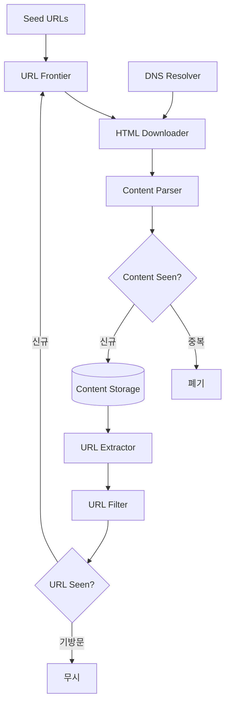

# Design a Web Crawler

## 핵심 takeaway

- 웹 크롤러의 기본 알고리즘은 단순하다 — "URL 다운로드 → 링크 추출 → 새 URL 추가 → 반복". 그러나 **웹 규모(수십억 페이지)**로 가면 politeness·priority·freshness·robustness가 모두 난제가 되고, 이를 흡수하는 핵심 컴포넌트가 [[url-frontier]]다 (ch09, p.132-134).
- 그래프 순회는 **BFS(FIFO 큐)**를 쓴다. DFS는 깊이가 무한정 깊어질 수 있어 부적합. 단 순수 BFS에는 두 결함 — ① 같은 호스트로 요청이 몰려 **impolite**(DoS 유사), ② URL 우선순위 무시 — 이 있고, URL Frontier가 front queue(우선순위)/back queue(politeness)로 이를 보정한다 (ch09, p.140-141).
- **중복 제거가 두 곳**에서 일어난다: 콘텐츠 중복(Content Seen? — 웹의 ~29%가 중복)과 URL 중복(URL Seen? — 무한 루프·중복 방문 방지). 둘 다 character 비교 대신 **hash/checksum**으로 싸게 판정하며 URL Seen?은 [[bloom-filter]]가 전형 ([[content-deduplication]]).
- **politeness**는 호스트당 한 번에 한 페이지, 다운로드 사이에 지연을 둔다. hostname→FIFO 큐→worker thread 1:1 매핑으로 구현 ([[robots-txt]] 준수도 politeness의 일부).
- robustness는 [[consistent-hashing]](다운로더 추가/제거), 크롤 상태 저장(재시작), 예외 처리, 짧은 timeout으로 확보. DNS는 동기 인터페이스라 병목이라 **DNS 캐시**가 필수 ([[dns]]).

## 개요 — 요구사항과 규모

크롤러 용도: 검색엔진 인덱싱(Googlebot), 웹 아카이빙, 웹 마이닝, 웹 모니터링(저작권). 책은 **검색엔진 인덱싱**을 가정 (ch09, p.132).

좋은 크롤러의 4대 특성 (ch09, p.133):

| 특성 | 의미 |
|---|---|
| Scalability | 수십억 페이지를 병렬화로 효율 처리 |
| Robustness | 잘못된 HTML·무응답 서버·악성 링크·크래시 등 함정 대응 |
| Politeness | 짧은 시간에 한 사이트로 과도한 요청 금지 |
| Extensibility | 새 콘텐츠 타입(이미지 등) 추가 시 최소 변경 |

규모 추정 (ch09, p.134):

| 항목 | 가정 | 도출 |
|---|---|---|
| 다운로드 | 10억 페이지/월 | QPS ≈ **400**, peak ≈ 800 |
| 페이지 평균 | 500 KB | 10억 × 500KB = **500 TB/월** |
| 보관 | 5년 | 500TB × 12 × 5 = **30 PB** |

## 고수준 설계 — 컴포넌트와 워크플로

| 컴포넌트 | 역할 |
|---|---|
| Seed URLs | 시작점. URL 공간을 지역·주제로 분할해 선정 |
| [[url-frontier]] | 다운로드 대기 URL 저장(FIFO). politeness·priority·freshness 관리 |
| HTML Downloader | Frontier가 준 URL을 HTTP로 다운로드 |
| DNS Resolver | URL→IP 변환. 동기 인터페이스라 병목 → 캐시 필요 |
| Content Parser | 다운로드한 HTML 파싱·검증 (별도 컴포넌트로 분리해 크롤 속도 보호) |
| Content Seen? | 콘텐츠 중복 판정 (hash 비교). 웹의 ~29%가 중복 |
| Content Storage | HTML 저장. 대부분 디스크, 인기 콘텐츠는 메모리 |
| URL Extractor | HTML에서 링크 추출, 상대경로→절대 URL |
| URL Filter | 특정 확장자·에러 링크·blacklist 제외 |
| URL Seen? | 기방문/Frontier 내 URL 추적 → 중복·무한 루프 방지 ([[bloom-filter]]) |

## 핵심 심화

### BFS를 쓰는 이유와 그 한계

웹 = 방향 그래프(페이지=노드, 링크=엣지). 순회는 **BFS(FIFO 큐)**. DFS는 깊이가 너무 깊어질 수 있어 부적합. 그러나 순수 BFS의 두 문제 (ch09, p.140):

1. **호스트 편중** — 한 페이지의 링크 대부분이 같은 호스트(내부 링크) → 병렬 다운로드 시 그 서버에 요청 폭주 = impolite.
2. **우선순위 무시** — 모든 페이지 품질이 같지 않은데 BFS는 동일 취급.

→ 이 둘을 [[url-frontier]]가 흡수한다.

### URL Frontier — politeness · priority · freshness

[[url-frontier]] 참조. 핵심만:

- **Politeness (back queues)**: hostname→큐→worker thread를 1:1 매핑. 한 worker는 한 호스트만, 다운로드 사이 지연.
- **Priority (front queues)**: PageRank·트래픽·갱신빈도로 우선순위 큐 분리, 높은 우선순위 큐를 더 자주 선택.
- **Freshness**: 갱신 이력 기반 재크롤, 중요 페이지 우선·고빈도 재크롤.
- **Storage**: 수억 URL → 메모리만으론 비내구·비확장, 디스크만으론 느림 → **하이브리드**(대부분 디스크 + 메모리 enqueue/dequeue 버퍼).

### HTML Downloader — robots.txt와 성능

- [[robots-txt]]: 크롤 전 사이트의 robots.txt를 먼저 확인·준수. 결과는 캐시(주기적 갱신).
- 성능 최적화: ① 분산 크롤(URL 공간 분할), ② **DNS 캐시**([[dns]] 동기 호출이 10~200ms 병목), ③ locality(크롤 서버를 호스트 가까이), ④ short timeout(무응답 서버 회피).

### Robustness · Extensibility

- Robustness: [[consistent-hashing]](다운로더 add/remove), 크롤 상태·데이터 저장(재시작), 예외 처리, 데이터 검증.
- Extensibility: 모듈 플러그인 구조 (PNG Downloader, Web Monitor 등 추가).

### 문제 콘텐츠 회피

- 중복 콘텐츠: hash/checksum ([[content-deduplication]]).
- Spider trap: 무한 깊이 디렉터리. URL 최대 길이 제한 + 수동 식별·필터.
- Data noise: 광고·스팸·코드조각 등 무가치 콘텐츠 제외.

## 운영 / 확장 (wrap-up)

- **Server-side rendering**: JS/AJAX 동적 링크는 직접 파싱 불가 → 렌더링 후 파싱.
- **Anti-spam 필터**: 저품질·스팸 페이지 제외로 유한 자원 절약.
- [[database-replication]]·[[sharding]]: 데이터 계층 가용성·확장성.
- **Horizontal scaling**: 수백~수천 서버, 핵심은 stateless 유지 ([[stateless-web-tier]]).
- 가용성·일관성·신뢰성(ch01), Analytics.

## 등장 개념

- [[url-frontier]] — 다운로드 대기 URL 저장소. front(priority)/back(politeness) 큐로 BFS 결함 보정
- [[content-deduplication]] — Content Seen?/URL Seen?, hash·bloom filter 기반 중복 판정
- [[robots-txt]] — Robots Exclusion Protocol, 크롤 허용 범위 명세·politeness
- [[bloom-filter]] — URL Seen? 구현의 확률적 멤버십 필터 (ch06 재사용)
- [[consistent-hashing]] — 다운로더 서버 add/remove 시 부하 재분산 (ch05 재사용)
- [[caching-strategies]] — DNS 캐시·인기 콘텐츠 메모리 캐시
- [[sharding]] — 데이터 계층 수평 분할
- [[database-replication]] — 데이터 계층 가용성
- [[back-of-the-envelope-estimation]] — 30 PB·400 QPS 도출

## 등장 기술

- [[dns]] — URL→IP 변환, 동기 호출 병목 → DNS 캐시 (proxy)
- [[message-queue]] — URL Frontier의 큐 추상화와 연결되는 비동기 패턴 (queue)

## 면접 관점 메모

- "왜 BFS인가, 순수 BFS의 문제는?" → DFS 깊이 폭발 회피 + host 편중·우선순위 무시를 URL Frontier로 보정.
- politeness를 hostname→queue→worker 1:1 매핑으로 설명하면 가점.
- 중복이 콘텐츠/URL 두 층위에서 일어나고 둘 다 hash로 싸게 푼다는 점이 핵심.
