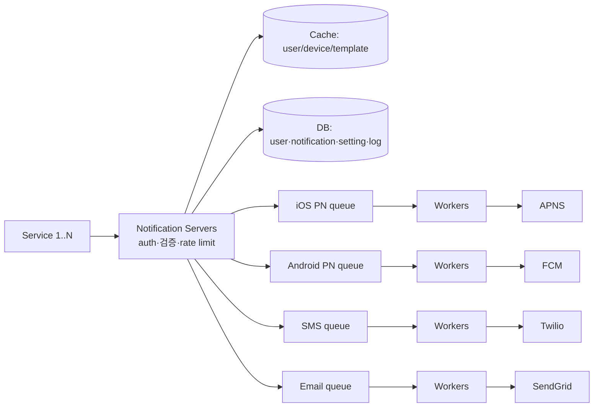

# Design a Notification System

## 핵심 takeaway

- 알림 시스템의 본질은 **다채널(push/SMS/email) × 비동기 전달 파이프라인**이다. 세 채널 모두 "트리거 → 메타데이터 조회 → 큐 적재 → worker가 third-party로 전송"이라는 동일 골격을 공유하며, 채널별 차이는 third-party 어댑터(APNS·FCM·Twilio·SendGrid)에 격리한다 (ch10, p.151-155).
- 단일 알림 서버는 **SPOF·확장 불가·성능 병목** 3종 문제를 동시에 안는다. 해법은 ① DB/캐시를 서버 밖으로, ② 알림 서버 수평 확장, ③ **채널별 message queue로 컴포넌트 디커플링** ([[decoupling-with-message-queue]], [[single-point-of-failure]]).
- **채널마다 별도 큐**를 두는 게 핵심 설계 결정 — 한 third-party(예: FCM)의 장애가 다른 채널(SMS·email)로 전파되지 않게 **장애 격리(blast radius 축소)**.
- 알림은 **지연·재정렬은 허용해도 유실은 불가**. 그래서 notification log DB에 영속화 + retry. 그러나 분산 환경에서 **exactly-once는 불가능** — at-least-once + event ID 기반 dedupe로 중복을 줄이는 게 현실적 타협 ([[delivery-semantics]]).
- 부가 요소가 사실상 시스템의 절반: notification template(일관성·재사용), **user opt-out 설정 존중**, [[rate-limiting]](과알림 방지), retry, appKey/appSecret 보안, 큐 적체 모니터링, 이벤트 트래킹(open/click rate).

## 개요 — 요구사항과 규모

세 알림 포맷: **mobile push · SMS · email**. soft real-time(고부하 시 약간 지연 허용). 트리거는 클라이언트 앱 또는 서버 스케줄. opt-out 지원 (ch10, p.151-152).

규모 (ch10, p.152): 일 1천만 push + 100만 SMS + 500만 email.

## 채널별 전송 메커니즘

각 채널은 **provider → 게이트웨이 → 디바이스** 구조가 같고 게이트웨이만 다르다 (ch10, p.153-154):

| 채널 | 게이트웨이 | 식별자 |
|---|---|---|
| iOS push | APNS (Apple) | device token + payload(JSON) |
| Android push | FCM (Firebase) | device token |
| SMS | Twilio·Nexmo 등 상용 | 전화번호 |
| Email | SendGrid·Mailchimp 등 상용 | 이메일 주소 |

**Contact info 수집**: 앱 설치/가입 시 API 서버가 토큰·전화·이메일을 DB에 저장. user 테이블(email/phone) + device 테이블(token, 1 user : N device).

## 고수준 설계 — 단일 서버에서 큐 기반으로

### 초기 설계의 3대 문제

단일 알림 서버 = ① **SPOF**, ② **확장 불가**(DB·캐시·처리 컴포넌트를 독립 확장 못 함), ③ **성능 병목**(HTML 렌더·third-party 응답 대기가 무거움).

### 개선 설계

흐름: ① 서비스가 알림 서버 API 호출 → ② 서버가 캐시/DB에서 user·token·setting 조회 → ③ 채널별 큐에 이벤트 적재 → ④ worker가 큐에서 pull → ⑤ third-party로 전송 → ⑥ 디바이스 도달.

**알림 서버 API는 내부/검증 클라이언트만 접근** (스팸 방지), 기본 검증(email·phone 형식) 수행.

## 핵심 심화

### 신뢰성 — 유실 금지와 전달 보장

- **데이터 유실 방지**: notification log DB에 영속화 + retry. "지연·재정렬 OK, 유실 NO".
- **exactly-once?** → 불가능. 분산 특성상 중복 발생. **event ID dedupe**: 이벤트 도착 시 ID를 본 적 있으면 폐기, 아니면 전송. 상세 [[delivery-semantics]].

### 부가 컴포넌트

| 요소 | 역할 |
|---|---|
| Notification template | 사전 포맷 + 파라미터/스타일/추적링크 커스터마이즈. 일관성·오류↓·시간↓ |
| Notification setting | `(user_id, channel, opt_in)`. 전송 전 **opt-in 여부 먼저 확인** |
| [[rate-limiting]] | user별 알림 빈도 캡 — 과알림은 전체 opt-out을 부른다 |
| Retry | third-party 실패 시 큐에 재투입, 지속 실패 시 개발자 알림 |
| Security | appKey/appSecret로 검증된 클라이언트만 API 사용 |
| 큐 모니터링 | 적체 큐 길이 = worker 부족 신호 → worker 증설 |
| Event tracking | open rate·click rate·engagement → analytics 연동 |

## 운영 / 확장 (wrap-up)

- Reliability: robust retry로 실패율 최소화 ([[delivery-semantics]]).
- Security: appKey/appSecret.
- 추적·모니터링: 모든 단계 stats 캡처.
- **user 설정 존중**: opt-out 우선 확인.
- Rate limiting: 빈도 캡.
- 확장성: third-party는 시장·시기별 가용성이 다름(FCM은 중국 불가 → Jpush·PushY) → 어댑터 plug/unplug 용이하게.

## 등장 개념

- [[delivery-semantics]] — at-least-once vs exactly-once, dedupe·idempotency·retry (유실 금지)
- [[decoupling-with-message-queue]] — 채널별 큐로 컴포넌트 분리·버퍼·장애 격리 (ch01 재사용)
- [[rate-limiting]] — user별 알림 빈도 캡 (ch04 재사용)
- [[single-point-of-failure]] — 단일 알림 서버 SPOF 제거 (ch01 재사용)
- [[caching-strategies]] — user/device/template 캐시
- [[stateless-web-tier]] — 알림 서버 수평 확장 전제

## 등장 기술

- [[message-queue]] — 채널별 비동기 버퍼·디커플링의 중심 (queue)
- [[load-balancer]] — 알림 서버 앞단 트래픽 분산 (proxy)

## 면접 관점 메모

- "왜 채널마다 큐를 분리?" → third-party 장애 격리(한 채널 outage가 다른 채널에 무영향).
- exactly-once는 불가능하다는 점을 명확히 + at-least-once/dedupe로 답하면 가점.
- 전송 전 opt-out·rate limit 체크 = "기술 외 user 존중"을 설계에 반영했다는 신호.
