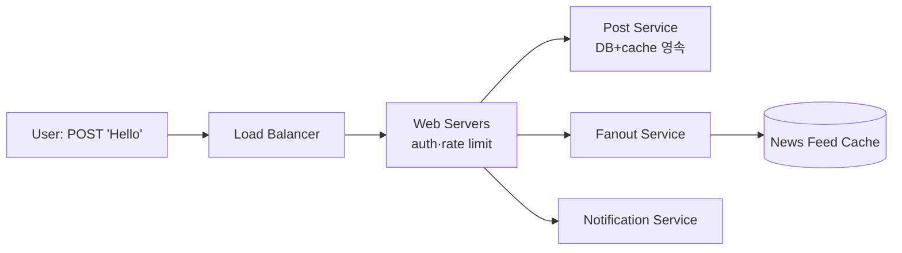
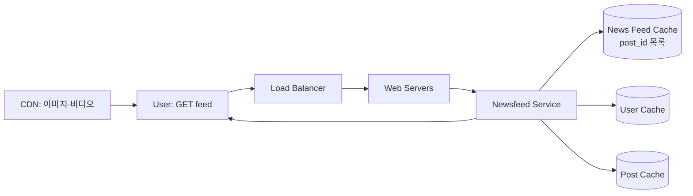

# Design a News Feed System

## 핵심 takeaway

- 뉴스 피드 설계는 **두 흐름**으로 쪼개진다 — feed publishing(글 작성 → 친구 피드에 전파)과 newsfeed building/retrieval(피드 조회). 이 둘을 분리해 사고하는 게 출발점 (ch11, p.166-168).
- 시스템의 심장은 **[[fanout]]** — 새 글을 친구들에게 어떻게 전달하는가. **fanout on write(push)**는 작성 시 미리 친구 피드에 밀어넣어 읽기가 빠르지만 친구 많은 사용자(celebrity)에서 **hotkey 문제**가 터지고, **fanout on read(pull)**는 조회 시 모아 읽기가 느린 대신 비활성 사용자 자원 낭비가 없다. 답은 **하이브리드** (ch11, p.171-173).
- 피드 캐시에는 **완전한 객체가 아니라 ID만**(`<post_id, user_id>`) 저장한다. 전체 객체를 넣으면 메모리 폭증. 사용자는 대부분 최신 글만 보므로 limit을 두어도 cache miss가 낮다 — 조회 시 ID로 user/post 객체를 hydrate ([[caching-strategies]]).
- celebrity의 hotkey는 **push 대신 그 사람만 pull**로 처리 + [[consistent-hashing]]으로 요청/데이터를 고르게 분산해 완화.
- 캐시를 5계층(News Feed/Content/Social Graph/Action/Counter)으로 분리 — 갱신 빈도·접근 패턴이 다른 데이터를 섞지 않는다.

## 개요 — 요구사항과 규모

- 웹+모바일, 글 작성 + 친구 글을 피드에서 조회.
- 정렬은 단순화해 **역시간순(reverse chronological)**.
- 친구 최대 5,000명, **1천만 DAU**, 미디어(이미지·비디오) 포함 (ch11, p.166).

## API

```
POST /v1/me/feed     # content, auth_token  — 글 작성
GET  /v1/me/feed     # auth_token           — 피드 조회
```

## 고수준 설계 — 두 흐름

### Feed publishing



- Post service: 글을 DB·캐시에 영속.
- **Fanout service**: 새 글을 친구 피드(캐시)로 전파 — 핵심 컴포넌트.
- Notification service: 친구에게 새 글 알림(ch10 연결).

### Newsfeed retrieval



피드는 ID 목록만이 아니라 username·프로필·본문·이미지를 포함 → newsfeed service가 user/post 캐시에서 객체를 **hydrate**해 완성된 JSON 반환. 미디어는 [[cdn]]에서.

## 핵심 심화

### Fanout — push vs pull

[[fanout]] 참조. 요약:

| | fanout on write (push) | fanout on read (pull) |
|---|---|---|
| 계산 시점 | 작성 시 미리 친구 피드에 밀어넣음 | 조회 시 친구 글을 모아 생성 |
| 읽기 | **빠름**(사전 계산) | 느림 |
| celebrity | **hotkey 문제** (친구 수만큼 쓰기) | 문제 없음 |
| 비활성 사용자 | 자원 낭비 | 낭비 없음 |

→ **하이브리드**: 대다수는 push(빠른 읽기), celebrity는 follower가 pull(과부하 회피). hotkey는 [[consistent-hashing]]으로 분산 완화.

### Fanout service 동작

1. **graph DB**에서 친구 ID 조회 ([[graph-database]] — 친구 관계·추천에 적합).
2. user cache에서 친구 정보 + **설정 필터링**(mute·선택 공유 반영).
3. 친구 목록 + post ID를 [[message-queue]]에 전송.
4. fanout worker가 큐에서 꺼내 news feed cache에 `<post_id, user_id>` 적재 (ID만, limit 설정).

### 5계층 캐시

| 계층 | 내용 |
|---|---|
| News Feed | 피드 ID 목록 |
| Content | 모든 post 데이터 (인기글은 hot cache) |
| Social Graph | 사용자 관계 |
| Action | like/reply 등 행위 |
| Counters | like·reply·follower·following 카운터 |

## 운영 / 확장 (wrap-up)

- DB 확장: [[vertical-vs-horizontal-scaling]], SQL vs NoSQL([[nosql-database]]), [[database-replication]](read replica), [[consistency-models]], [[sharding]].
- [[stateless-web-tier]], 최대한 캐시, [[multi-data-center]], [[decoupling-with-message-queue]], 핵심 지표(peak QPS·새로고침 latency) 모니터링.

## 등장 개념

- [[fanout]] — push(on write) vs pull(on read)·하이브리드·celebrity hotkey 문제 (핵심)
- [[consistent-hashing]] — hotkey 분산 완화 (ch05 재사용)
- [[caching-strategies]] — ID만 캐시·5계층 분리·hydrate (ch01 재사용)
- [[delivery-semantics]] — fanout worker 큐 처리의 전달 보장 (ch10 연결)
- [[database-replication]]·[[sharding]] — DB 확장
- [[consistency-models]]·[[nosql-database]]·[[vertical-vs-horizontal-scaling]] — DB 선택 축
- [[multi-data-center]]·[[stateless-web-tier]]·[[decoupling-with-message-queue]] — 확장 토픽

## 등장 기술

- [[graph-database]] — 친구 관계·friend-of-friend 추천 (db)
- [[cdn]] — 이미지·비디오 미디어 엣지 캐싱 (cdn)
- [[message-queue]] — fanout worker 비동기 처리 (queue)
- [[load-balancer]] — 양 흐름 트래픽 분산 (proxy)

## 면접 관점 메모

- "push vs pull, 무엇을 언제?" → 일반 사용자 push(빠른 읽기), celebrity pull(hotkey 회피), 하이브리드가 정답.
- 피드 캐시에 ID만 저장하고 조회 시 hydrate한다는 메모리 절약 트릭이 가점 포인트.
- 친구 관계는 graph DB가 자연스럽다는 점.
