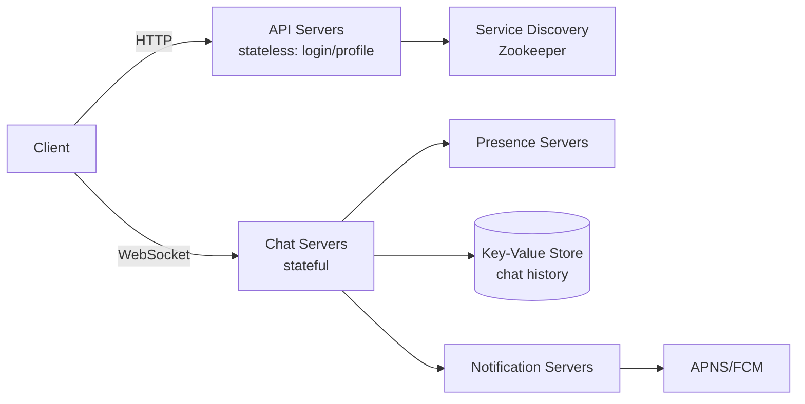
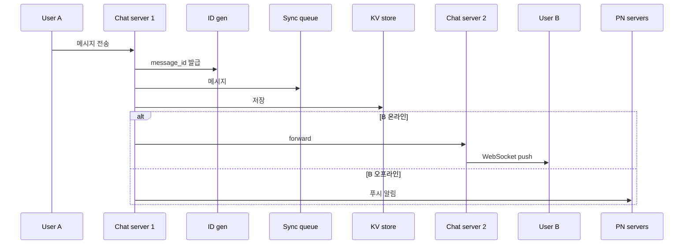

# Design a Chat System

## 핵심 takeaway

- 채팅의 본질적 난제는 **서버가 클라이언트에게 먼저 메시지를 밀어넣어야 한다**는 것. HTTP는 client-initiated라 수신 측이 어렵다. polling → long polling → **WebSocket**으로 진화하며, WebSocket(양방향·지속 연결)이 표준 답 ([[websocket]]) (ch12, p.180-183).
- 시스템은 **stateless 서비스(로그인·프로필 등 HTTP) + stateful 서비스(chat server, 지속 WebSocket 연결) + third-party(푸시 알림, ch10)**로 삼분된다. chat server만 stateful인 이유는 연결을 들고 있어야 하기 때문 (ch12, p.184-185).
- 채팅 이력은 **key-value store**가 정답 — 데이터 막대(일 600억 메시지), 수평 확장 용이, 낮은 지연, RDB는 long-tail 랜덤 접근에서 인덱스가 커지면 비쌈. 실제로 FB Messenger=HBase, Discord=[[cassandra]] (ch12, p.187-188).
- **message_id는 unique + 시간 정렬 가능**해야 메시지 순서를 보장. created_at은 동시 생성 충돌로 불가 → [[snowflake-id]] 같은 64-bit 시퀀스(전역) 또는 local 시퀀스(채널 내 유일) ([[ch07-unique-id-generator]] 재사용).
- 부가 메커니즘 셋: **service discovery**(Zookeeper로 최적 chat server 배정), **다기기 동기화**(기기별 `cur_max_message_id`로 KV에서 새 메시지 pull), **presence**(heartbeat로 잦은 끊김 흡수 + pub/sub로 친구에게 상태 fanout) ([[service-discovery]], [[presence-and-heartbeat]], [[publish-subscribe]]).

## 개요 — 요구사항과 규모

1:1 + 소규모 그룹(최대 100명), 웹+모바일, **5천만 DAU**, 텍스트만(≤10만 자), 온라인 표시, 다기기, 푸시 알림. 이력은 영구 보관 (ch12, p.178-180).

## 클라이언트-서버 통신 — 왜 WebSocket인가

[[websocket]] 참조. 핵심: 송신은 HTTP로도 충분하지만 **수신(server→client)**이 문제. 

| 기법 | 동작 | 한계 |
|---|---|---|
| Polling | 주기적으로 "새 메시지?" 질의 | 대부분 "없음" 응답 → 자원 낭비 |
| Long polling | 메시지 생기거나 timeout까지 연결 유지 | 송/수신 서버 불일치, 끊김 감지難, 비효율 |
| **WebSocket** | HTTP→upgrade, 양방향·지속 | 연결 관리 비용 (stateful) |

WebSocket을 송·수신 양쪽에 쓰면 설계가 단순해진다. 단 **지속 연결이라 서버 측 연결 관리가 핵심**.

## 고수준 설계

- **Stateless**: 로그인·가입·프로필 (HTTP, LB 뒤). 그중 [[service-discovery]]가 클라이언트에 접속할 chat server 목록 제공.
- **Stateful**: chat server (지속 WebSocket 연결 유지, 서버가 살아있는 한 재배정 안 함).
- **Third-party**: 푸시 알림 ([[ch10-notification-system]]).

### 스토리지 — KV store 선택

두 데이터: ① generic(프로필·친구목록) → [[relational-database]] + 복제·샤딩. ② **chat history** → [[nosql-database]] KV store. 읽기:쓰기 ≈ 1:1, 최근 메시지만 자주 접근하나 search·mention 같은 랜덤 접근도 필요.

### Message ID

unique + 시간 정렬 필수. 후보: MySQL auto_increment(NoSQL엔 없음), [[snowflake-id]](전역 64-bit), local 시퀀스(채널 내 유일 — 1:1/그룹 순서만 보장하면 충분해 더 단순).

## 핵심 심화

### Service discovery

[[service-discovery]] 참조. Zookeeper가 가용 chat server를 등록하고, 지리·용량 기준으로 최적 서버를 클라이언트에 추천. 로그인 → API 인증 → service discovery가 server 배정 → WebSocket 연결.

### 1:1 메시지 흐름

### 다기기 동기화

각 기기가 `cur_max_message_id` 보유. (recipient == 현재 사용자) AND (KV의 message_id > cur_max_message_id)면 새 메시지 → 기기별로 KV에서 독립적으로 pull. 단순·견고.

### 소규모 그룹 흐름

송신 메시지를 **각 멤버의 message sync queue(inbox)에 복사**. 클라이언트는 자기 inbox만 확인 → 동기화 단순. 소규모(WeChat 500명 상한)에선 복사 비용 OK. 대규모는 멤버마다 복사가 불가 → fan-out 비용 문제([[fanout]]와 같은 트레이드오프).

### Online presence

[[presence-and-heartbeat]] 참조. 핵심:

- **heartbeat**: 클라이언트가 주기적(예 5초) heartbeat 전송. x초(예 30초) 내 없으면 offline. 터널 통과 같은 잦은 끊김/재연결로 상태가 깜빡이는 걸 방지.
- **status fanout**: [[publish-subscribe]]로 친구쌍 채널(A-B, A-C…)에 상태 변경 발행. 단 10만 명 그룹이면 1회 변경에 10만 이벤트 → 그룹 진입/수동 새로고침 시에만 조회로 완화.

## 운영 / 확장 (wrap-up)

- 미디어 파일(사진·비디오): 압축·클라우드 스토리지·thumbnail.
- E2E 암호화(WhatsApp), 클라이언트 측 메시지 캐싱, 지리 분산 캐시(Slack Flannel).
- 에러 처리: chat server 다운 시 service discovery가 새 서버 배정, 메시지 재전송(retry·queue, [[delivery-semantics]]).

## 등장 개념

- [[websocket]] — server→client push: polling/long polling/WebSocket 비교 (핵심)
- [[service-discovery]] — Zookeeper로 최적 chat server 배정
- [[presence-and-heartbeat]] — 온라인 표시·heartbeat·상태 fanout
- [[publish-subscribe]] — 친구쌍 채널로 상태 변경 전파 (메시지 큐와 구별)
- [[snowflake-id]] — message_id의 unique+정렬 보장 (ch07 재사용)
- [[fanout]] — 그룹 메시지/상태 전파의 fan-out 트레이드오프 (ch11 연결)
- [[delivery-semantics]] — 메시지 재전송 retry/queue (ch10 연결)

## 등장 기술

- [[zookeeper]] — 분산 코디네이션, service discovery 구현 (observability)
- [[nosql-database]] — chat history KV store (db)
- [[cassandra]] — Discord의 메시지 저장 (db)
- [[relational-database]] — generic 데이터(프로필·친구목록) (db)
- [[message-queue]] — message sync queue(inbox) (queue)
- [[load-balancer]] — stateless 서비스 라우팅 (proxy)

## 면접 관점 메모

- "왜 WebSocket?" → HTTP는 client-initiated라 server push가 어렵고, polling/long polling의 비효율을 양방향 지속 연결로 해결.
- chat server만 stateful인 이유(지속 연결 보유)를 명확히.
- presence는 heartbeat로 깜빡임 방지 + 대규모 그룹은 fanout 비용 때문에 on-demand 조회로 전환.
