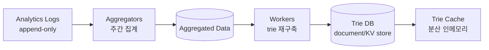
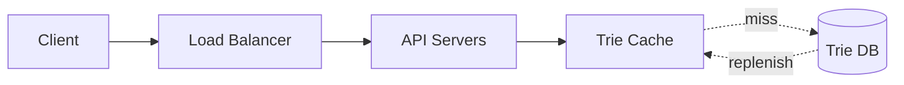

# Design a Search Autocomplete System

## 핵심 takeaway

- 자동완성("design top k")의 자료구조는 **[[trie]]**(prefix tree)다. RDB로 top-5를 뽑으면 데이터가 크면 병목 — trie는 prefix lookup이 O(p)로 자연스럽다 (ch13, p.203-206).
- 순진한 trie는 worst-case에 서브트리 전체를 순회해 O(p)+O(c)+O(c·log c)로 느리다. 두 최적화로 **O(1)**까지: ① prefix 최대 길이 제한(예 50자) → lookup O(1), ② **각 노드에 top-k를 미리 캐시** → 순회·정렬 제거. **공간을 시간과 맞바꾸는** 전형 (ch13, p.207-209).
- **읽기와 쓰기를 시간축으로 분리**한다. 매 질의마다 trie를 갱신하면(실시간) 질의 서비스가 느려진다. 대신 analytics log → aggregator(주간 집계) → worker가 **주기적으로 trie를 재구축**(보통 주 1회) → Trie Cache로 서빙. fast read와 build를 분리 (ch13, p.210-212).
- 응답은 **100ms 이내**여야 끊김이 없다. AJAX(전체 새로고침 회피) + **browser cache**(Google은 `cache-control: private, max-age=3600`로 1시간 캐시) + data sampling(1/N만 로깅)으로 달성 (ch13, p.214-215).
- trie가 한 서버를 넘으면 **첫 글자 기반 샤딩**이 출발점이나 'c'가 'x'보다 훨씬 많아 불균형 → **shard map manager**가 과거 분포를 보고 영리하게 분할 ([[sharding]]).

## 개요 — 요구사항과 규모

- prefix(시작 부분)만 매칭, 제안 **5개**, **인기도(과거 질의 빈도)** 순 정렬, 영어 소문자, spell check 없음, **1천만 DAU** (ch13, p.200-201).
- 요구: 빠른 응답(<100ms)·관련성·정렬·확장성·고가용성.

규모 (ch13, p.202): 사용자당 10검색/일, 질의당 ~20자 → 글자마다 요청. **~24,000 QPS**, peak ~48,000. 신규 질의 20% → 일 0.4 GB 추가.

## 고수준 설계 — 두 서비스

- **Data gathering service**: 사용자 질의를 모아 frequency table 집계.
- **Query service**: prefix를 받아 top-5 인기 질의 반환.

순진한 버전은 frequency table에 SQL `ORDER BY frequency LIMIT 5` — 데이터 작을 땐 OK, 크면 DB 병목.

## 핵심 심화

### Trie 자료구조

[[trie]] 참조. 노드에 글자 + **빈도** 저장. top-k 알고리즘:

1. prefix 노드 찾기 — O(p)
2. 서브트리 순회로 유효 자식 수집 — O(c)
3. 정렬 후 top-k — O(c·log c)

**두 최적화** → O(1):
- prefix 길이 제한 → 1단계 O(1).
- **노드마다 top-k 캐시** → 2·3단계 제거(노드에서 바로 반환). 공간↑ 대신 시간 O(1).

### Data gathering — 빌드/서빙 분리

- 실시간 갱신은 비현실적(일 수십억 질의 + top 제안은 잘 안 바뀜). → **주기적 재구축**(Twitter는 짧게, Google 키워드는 주 1회로 충분).
- **Trie DB** 두 옵션: ① document store(MongoDB) — trie를 직렬화해 스냅샷 저장, ② [[nosql-database]] KV store — prefix를 key, 노드 데이터를 value로 매핑([[ch06-design-key-value-store]] 참조).

### Query service 최적화

- Trie Cache 우선, miss 시 DB에서 채움.
- **AJAX**(부분 갱신), **browser cache**(짧은 시간 제안 불변), **data sampling**(1/N 로깅).

### Trie 연산

- **Create**: worker가 aggregated data로 빌드.
- **Update**: ① 주간 전체 교체(권장), ② 개별 노드 직접 갱신(느림 — 조상 노드의 top-k도 root까지 모두 갱신해야).
- **Delete**: 혐오·폭력·위험 제안 제거 → **filter layer**를 Trie Cache 앞에 두고, DB에선 비동기 물리 삭제 후 다음 빌드에 반영.

### 스케일 — 영리한 샤딩

첫 글자 샤딩(a-m / n-z …)은 최대 26 서버. 그러나 'c'≫'x' 불균형. → **shard map manager**가 과거 분포 룩업으로 분할 결정(예 's' 하나 = 'u'~'z' 합).

## 운영 / 확장 (wrap-up)

- 다국어: 노드에 **Unicode** 저장.
- 국가별 다른 인기 질의: 국가별 trie + [[cdn]]에 저장해 응답 단축.
- **실시간 trending**: 주간 빌드론 불가 → 샤딩으로 데이터셋 축소 + 최근 질의 가중 ranking + **stream processing**(Kafka/Spark/Storm). (책 범위 밖, 아이디어만)

## 등장 개념

- [[trie]] — prefix tree + 노드별 top-k 캐시로 O(1) 자동완성 (핵심)
- [[sharding]] — 첫 글자 샤딩·불균형·shard map manager (ch01 재사용)
- [[caching-strategies]] — Trie Cache·browser cache·공간-시간 트레이드오프
- [[back-of-the-envelope-estimation]] — 24K QPS·0.4GB/일 도출

## 등장 기술

- [[document-database]] — 직렬화된 trie 스냅샷 저장(MongoDB) (db)
- [[nosql-database]] — trie를 prefix→node hash로 저장하는 KV 옵션 (db)
- [[relational-database]] — 순진한 top-k SQL(작은 데이터셋) (db)
- [[cdn]] — 국가별 trie 엣지 캐싱 (cdn)
- [[load-balancer]] — query service 트래픽 분산 (proxy)

## 면접 관점 메모

- "왜 trie?" → prefix 매칭이 트리 경로 따라가기로 자연스럽고, 노드별 top-k 캐시로 O(1).
- 빌드(주기적 batch)와 서빙(캐시)을 분리한다는 점이 핵심 — 실시간 갱신의 함정을 피함.
- 100ms 제약을 browser cache·AJAX·sampling으로 푸는 클라이언트 측 최적화도 언급.
