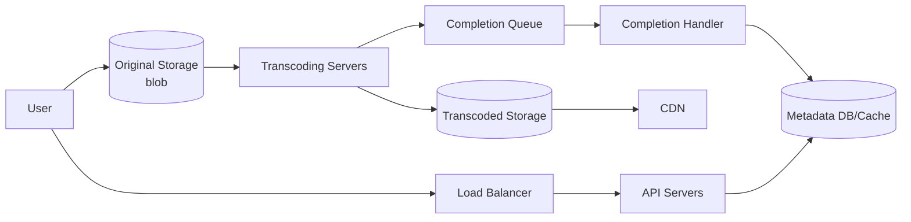

# Design YouTube

## 핵심 takeaway

- 설계의 출발은 **"직접 만들지 말 것"** — [[blob-storage]](원본·인코딩 영상)와 [[cdn]](스트리밍)은 기존 클라우드를 빌린다. Netflix=AWS, Facebook=Akamai. 면접에서도 blob storage를 "쓴다"고 말하면 충분, 내부 구현 설명은 overkill (ch14, p.222-223).
- 시스템은 **업로드 흐름 + 스트리밍 흐름** 두 갈래. 업로드는 ① 실제 영상(→blob→transcoding→CDN)과 ② 메타데이터를 **병렬**로 처리. 스트리밍은 CDN 엣지에서 직접 (ch14, p.224-227).
- **video transcoding(인코딩)**이 핵심 — raw 영상은 거대(HD 1시간 ≈ 수백 GB)하고 기기·대역폭마다 호환 포맷이 달라, 여러 해상도·코덱·비트레이트로 변환해 **adaptive bitrate streaming**을 가능케 한다 ([[video-transcoding]]).
- transcoding은 비싸고 창작자마다 요구(워터마크·썸네일)가 달라 **DAG 모델**로 작업을 단계화·병렬화한다 — preprocessor/DAG scheduler/resource manager/task workers ([[dag-task-pipeline]]).
- 최적화 3축: **속도**(GOP 청크 분할 → resumable·병렬 업로드, 지역 업로드 센터, 큐로 디커플링), **안전**([[pre-signed-url]] 직접 업로드, DRM/AES/워터마크), **비용**(영상은 long-tail → 인기작만 CDN, 나머지는 자체 스토리지·on-demand 인코딩·지역 한정·자체 CDN+ISP).

## 개요 — 요구사항과 규모

- 업로드 + 시청, 클라이언트: 모바일·웹·스마트TV, **500만 DAU**, 평균 30분/일, 국제 사용자, 최대 1GB, 암호화 필요 (ch14, p.220-221).

규모 (ch14, p.222):
- 저장: 500만 × 10% 업로드 × 300MB = **150 TB/일**.
- **CDN 비용**: 500만 × 5영상 × 0.3GB × $0.02/GB = **$150,000/일** — 비용이 막대해 cost-saving이 deep dive 핵심.

## 고수준 설계

3 컴포넌트: **Client / CDN(영상 스트리밍) / API servers(그 외 전부)**.

### 업로드 흐름

두 프로세스 병렬: **(a) 실제 영상** 업로드 → 원본 blob → transcoding → transcoded blob + CDN 배포, 완료 이벤트는 [[message-queue]](completion queue)로, completion handler가 메타데이터 갱신. **(b) 메타데이터**(URL·크기·해상도·포맷) 업로드 → API가 메타 DB/캐시 갱신.

- **Metadata DB**: 샤딩 + 복제 ([[sharding]], [[database-replication]]).

### 스트리밍 흐름

**streaming ≠ download**. 다운로드는 전체 복사, 스트리밍은 조금씩 연속 수신해 즉시 재생. 영상은 **CDN 엣지**(가장 가까운 서버)에서 직접 → 저지연. streaming protocol(MPEG-DASH, Apple HLS 등)은 인코딩·플레이어 호환을 결정 — 이름 암기보다 "용도에 맞는 프로토콜 선택"이 요점.

## 핵심 심화

### Video transcoding

[[video-transcoding]] 참조. **container**(.mp4/.mov — 영상+오디오+메타 바구니) + **codec**(H.264/VP9/HEVC — 압축 알고리즘). 여러 해상도·비트레이트로 인코딩 → 대역폭에 따라 화질 자동/수동 전환(ABR).

### DAG 처리 파이프라인

[[dag-task-pipeline]] 참조. 원본을 video/audio/metadata로 분리, 단계별 작업(inspection·encoding·thumbnail·watermark)을 DAG로 정의해 순차·병렬 실행. 아키텍처: **preprocessor**(GOP 분할·DAG 생성·캐시) → **DAG scheduler**(단계별 task 큐잉) → **resource manager**(task/worker/running 큐 + scheduler) → **task workers** → temporary storage → encoded video.

### 시스템 최적화

| 축 | 기법 |
|---|---|
| 속도 | GOP 청크 분할(resumable·병렬 업로드, 클라이언트가 분할), 지역 업로드 센터(CDN), [[message-queue]]로 단계 디커플링 → 병렬화 |
| 안전 | [[pre-signed-url]](인가된 위치에만 업로드), DRM(FairPlay/Widevine/PlayReady)·AES 암호화·워터마크 |
| 비용 | long-tail: 인기작만 CDN·나머지 자체 스토리지, on-demand 인코딩, 지역 한정 배포, 자체 CDN+ISP 제휴(Netflix Open Connect) |

### 에러 처리

- **recoverable**(세그먼트 transcode 실패): retry 몇 회 후 실패 시 에러 코드.
- **non-recoverable**(malformed): 작업 중단 + 에러 코드.
- 컴포넌트별 playbook: API server는 stateless라 다른 서버로([[stateless-web-tier]]), metadata DB master 다운 시 slave 승격([[database-replication]]), cache 다운 시 복제본.

## 운영 / 확장 (wrap-up)

- API tier: stateless → 수평 확장 용이.
- DB: 복제·샤딩.
- **Live streaming**: 업로드·인코딩·스트리밍은 유사하나 지연 요구 ↑(다른 프로토콜), 병렬성 요구 ↓, 에러 처리 다름.
- Video takedown: 저작권·불법 콘텐츠 제거(업로드 시 탐지 + 사용자 신고).

## 등장 개념

- [[video-transcoding]] — container/codec/bitrate, adaptive bitrate streaming (핵심)
- [[dag-task-pipeline]] — DAG 기반 작업 단계화·병렬 처리 아키텍처
- [[pre-signed-url]] — 클라이언트→스토리지 직접 업로드 인가
- [[sharding]]·[[database-replication]] — 메타데이터 DB 확장·가용성
- [[caching-strategies]] — 메타데이터 캐시
- [[decoupling-with-message-queue]] — completion queue·단계 디커플링 병렬화
- [[stateless-web-tier]] — API server 무상태 확장·장애 복구
- [[back-of-the-envelope-estimation]] — 150TB/일·$150K/일 CDN 비용

## 등장 기술

- [[blob-storage]] — 원본·인코딩 영상 저장(S3 등) (storage)
- [[cdn]] — 영상 스트리밍 엣지 배포·비용 최적화 핵심 (cdn)
- [[message-queue]] — completion queue·단계 디커플링 (queue)
- [[load-balancer]] — API 서버 트래픽 분산 (proxy)

## 면접 관점 메모

- "직접 만들지 말고 blob storage·CDN을 빌린다"는 판단이 출발점.
- transcoding은 왜 필요한가(저장·호환·ABR) + DAG로 유연·병렬.
- CDN 비용이 막대 → long-tail 기반 cost-saving이 deep dive의 백미.
