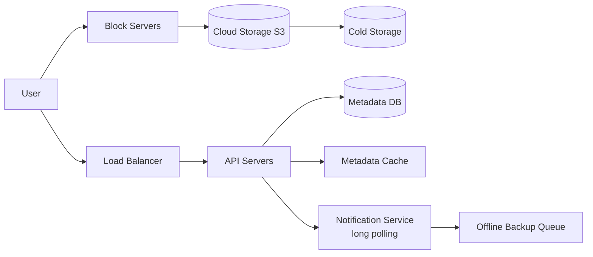

# Design Google Drive

## 핵심 takeaway

- 핵심 설계 분리: **메타데이터(파일·버전·블록 정보)는 DB에, 파일 본체는 [[blob-storage]](S3)에** 둔다. 메타 DB는 작고 질의가 많아 RDB+캐시, 파일은 크고 통째 읽고 쓰니 객체 스토리지. 이 분리가 모든 흐름을 관통한다 (ch15, p.249-251).
- **block server가 heavy lifting** — 파일을 블록(Dropbox 기준 4MB)으로 쪼개 **압축·암호화**한 뒤 업로드. 블록마다 hash를 메타 DB에 저장하고, 파일은 블록을 순서대로 이어 재구성 ([[delta-sync]]).
- 대역폭 절약 두 축: **delta sync**(수정된 블록만 전송)와 **compression**(파일 타입별 압축). 큰 파일을 매번 통째 보내면 망 비용이 폭발 ([[delta-sync]]).
- **strong consistency가 기본 요구** — 같은 파일이 클라이언트마다 다르게 보이면 안 됨. 캐시는 기본 eventual이라, DB write 시 **캐시 무효화** + master/replica 일관성 보장. RDB를 택한 이유도 **ACID 네이티브** ([[consistency-models]]).
- 동기화 알림은 **long polling**을 택한다([[websocket]] 대신) — 알림은 server→client 단방향이고 빈도가 낮아 양방향 지속 연결이 과함. 충돌은 **first-write-wins + 양쪽 버전 제시** ([[sync-conflict-resolution]]).

## 개요 — 요구사항과 규모

- 업로드/다운로드, **다기기 sync**, 파일 버전(revision), 공유, 알림. 암호화 필수, 파일 ≤10GB, **1천만 DAU** (ch15, p.244-245).
- 비기능: 신뢰성(데이터 유실 불가), 빠른 sync, 낮은 대역폭, 확장성, 고가용성.

규모 (ch15, p.246): 가입 5천만 × 10GB = **500 PB**. 업로드 QPS ≈ 240, peak 480. 읽기:쓰기 1:1.

## 고수준 설계 — 단일 서버에서 진화

단일 서버(web + MySQL + drive/ 디렉터리, namespace=사용자 루트) → 용량 한계 → **user_id 샤딩** → 유실 우려로 **S3**(same/cross-region 복제) → LB·web 다중화·메타 DB 외부화·복제.

| 컴포넌트 | 역할 |
|---|---|
| Block servers | 파일 블록 분할·압축·암호화·업로드 (delta sync 수행) |
| Cloud storage | 블록 저장(S3). cold storage는 비활성 데이터 |
| Metadata DB/Cache | user·file·block·version 메타만(파일 본체는 클라우드) |
| Notification service | pub/sub — 파일 변경을 관련 클라이언트에 통지 |
| Offline backup queue | 오프라인 클라이언트가 온라인 시 동기화할 변경 보관 |

## 핵심 심화

### Block servers & delta sync

[[delta-sync]] 참조. 새 파일: 블록 분할 → 블록별 압축 → 암호화 → 클라우드 업로드. 수정 시: **변경 블록만**(block 2, block 5처럼) 전송. 대역폭 대폭 절감.

### Strong consistency

기본 strong consistency 요구. 캐시는 eventual이 기본이라:
- 캐시 replica와 master 데이터 일치 보장.
- **DB write 시 캐시 무효화**.
- RDB 선택 — ACID 네이티브 지원([[relational-database]]). NoSQL은 ACID를 앱 로직으로 직접 구현해야.

### 메타데이터 스키마

User / Device(push_id) / Namespace(루트) / File / **File_version**(read-only로 revision 무결성) / Block(순서대로 join해 임의 버전 재구성).

### Upload / Download 흐름

- Upload: **메타 추가**(상태 pending → uploaded)와 **블록 업로드**를 병렬. 클라우드 업로드 완료 콜백 → API가 상태 갱신 → notification service가 다른 클라이언트에 통지.
- Download: notification(온라인) 또는 offline queue(오프라인)로 변경 인지 → 메타 fetch → block server가 클라우드에서 블록 받아 파일 재구성.

### Notification service — 왜 long polling

[[websocket]] vs long polling. **long polling 채택**: 알림은 server→client 단방향 + 저빈도. 변경 감지 시 연결 종료 → 클라이언트가 최신 다운로드 → 재연결. ([[publish-subscribe]] 모델로 변경 이벤트 라우팅.)

### 저장 공간 절약

- **블록 dedup**: 같은 hash 블록 제거(계정 단위).
- 지능형 백업: 버전 수 제한(오래된 것 교체), 가치 있는 버전만(최근 가중).
- **cold storage**: 수개월~년 미접근 데이터를 S3 Glacier 등 저렴한 곳으로.

### 실패 처리

LB(heartbeat로 secondary 승격), block server(다른 서버가 pending 인계), S3(region 복제), API(stateless 재라우팅), 메타 캐시/DB(복제·master 승격), notification(연결 유실 → 재연결, 머신당 100만+ 연결이라 재연결은 느림), offline queue(복제).

## 운영 / 확장 (wrap-up)

- **클라이언트 직접 클라우드 업로드** 대안: 1회 전송으로 빠르나, chunk/압축/암호화를 플랫폼마다 구현해야 하고 클라이언트 측 암호화는 변조 위험 → block server 중앙화 채택.
- online/offline 로직을 **presence service**로 분리하면 재사용 가능 ([[presence-and-heartbeat]]).

## 등장 개념

- [[delta-sync]] — 블록 분할 + 변경 블록만 전송 + dedup + 압축 (핵심)
- [[sync-conflict-resolution]] — first-write-wins·양쪽 버전 제시 (충돌 해소)
- [[consistency-models]] — strong consistency 요구·캐시 무효화 (ch06 재사용)
- [[publish-subscribe]] — notification service 변경 이벤트 전파 (ch12 재사용)
- [[sharding]]·[[database-replication]] — 메타 DB user_id 샤딩·master 승격
- [[caching-strategies]] — 메타데이터 캐시·무효화
- [[pre-signed-url]] — 클라이언트 직접 업로드 대안 (ch14 연결)
- [[single-point-of-failure]]·[[stateless-web-tier]] — 단일 서버 탈피·무상태 API

## 등장 기술

- [[blob-storage]] — 파일 블록 저장(S3 same/cross-region 복제) (storage)
- [[relational-database]] — ACID 네이티브로 strong consistency (db)
- [[load-balancer]] — 트래픽 분산·heartbeat failover (proxy)
- [[message-queue]] — offline backup queue (queue)

## 면접 관점 메모

- 메타데이터 DB와 파일 본체 스토리지 분리가 출발점.
- delta sync + compression으로 대역폭을 줄인다는 점이 핵심 차별.
- 알림에 WebSocket이 아니라 long polling을 고른 이유(단방향·저빈도)를 설명하면 가점.
