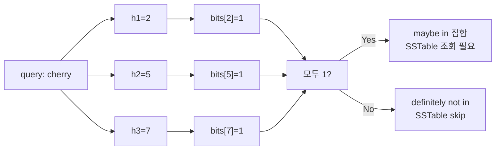

# Bloom Filter

## 한 줄 정의 / 동기

원소가 집합에 **확실히 없음**(definitely not in) 또는 **있을 수도 있음**(maybe in)을 판정하는 **공간 효율적·확률적** 자료구조. False positive는 허용하지만 **false negative는 절대 없음** (Burton Bloom, 1970) (ch06, p.113).

LSM tree read path에서 "이 SSTable에 키가 있는가?"를 디스크 seek 없이 메모리만으로 1차 필터하는 핵심 도구.

## 왜 필요한가

[[lsm-tree-storage-engine|LSM]] read는 여러 SSTable을 뒤져야 함. 모든 SSTable을 디스크에서 lookup하면 read amplification 폭증.

**bloom filter가 "없음"을 단언해주면 그 SSTable은 disk seek 안 함** → 90%+ SSTable을 즉시 배제 가능.

## 동작

### 자료구조

- 길이 m의 비트 배열 (모두 0으로 초기화).
- k개의 독립 해시 함수 h₁, h₂, ..., h_k.

### 삽입

```
insert(x):
  for i in 1..k:
    bits[h_i(x) % m] = 1
```

### 조회

```
contains(x):
  for i in 1..k:
    if bits[h_i(x) % m] == 0:
      return "definitely not in set"
  return "maybe in set"
```

### 예시

```
m=10, k=3
삽입 "apple":  h1→2, h2→5, h3→7
   → bits[2]=bits[5]=bits[7]=1
조회 "apple":  h1→2(1), h2→5(1), h3→7(1) → maybe ✓
조회 "banana": h1→1(0) → 즉시 not in ✗
조회 "cherry": h1→2(1), h2→5(1), h3→7(1) → maybe (false positive 가능!)
```



## 파라미터 · 튜닝 포인트

False positive 확률 p, 원소 수 n에 대한 표준 공식:

| 파라미터 | 공식 |
|---|---|
| **최적 비트 수 m** | `m = -n·ln(p) / (ln 2)²` |
| **최적 해시 수 k** | `k = (m/n)·ln 2` |

| n | p | m | bits/element |
|---|---|---|---|
| 1M | 1% | 9.6 Mbit | ~9.6 |
| 1M | 0.1% | 14.4 Mbit | ~14.4 |
| 1M | 0.01% | 19.2 Mbit | ~19.2 |

**핵심 통찰**: 1% false positive에 **원소당 약 10비트**면 충분. 즉, 10억 키도 1.2GB로 표현.

| 파라미터 | 영향 |
|---|---|
| **m (비트 수)** | 크면 정확도↑, 메모리↑ |
| **k (해시 수)** | 너무 적으면 false positive↑, 너무 많으면 비트 빨리 채워져 false positive↑. 최적값 존재 |
| **해시 함수 품질** | 균등 분포가 핵심. MurmurHash·FNV·xxHash 등 비암호 해시 충분 |

## 트레이드오프

**Pros**
- **매우 작은 메모리**: 원소당 ~10비트로 1% 정확도.
- **O(k) 조회/삽입** — 사실상 O(1).
- **False negative 없음**: "없다"는 단언은 100% 신뢰.

**Cons**
- **False positive 존재**: "있을 수도"는 검증 필요.
- **삭제 불가능 (표준 형태)**: 비트를 0으로 되돌리면 다른 원소 정보 손실. → counting bloom filter 변형 필요.
- **원소 자체는 저장 안 함**: 멤버십만 알 뿐 값 못 꺼냄.
- **resize 어려움**: 원소 수가 예상 초과하면 false positive 폭증.

## 변형

| 변형 | 특징 |
|---|---|
| **Counting Bloom Filter** | 각 슬롯이 카운터, 삭제 가능. 비용 4~8배 |
| **Scalable Bloom Filter** | n 증가 시 동적으로 새 filter 체인 추가 |
| **Cuckoo Filter** | 삭제 가능 + 더 나은 공간 효율, 약간 복잡 |
| **Partitioned Bloom Filter** | k개 영역으로 나눠 cache locality 개선 |

## 다른 확률적 자료구조와의 위치

| 자료구조 | 답하는 질문 | 메모리 |
|---|---|---|
| **Bloom Filter** | 멤버십 (있나?) | ~10b/원소 |
| **Count-Min Sketch** | 빈도 (몇 번?) | hash table |
| **HyperLogLog** | cardinality (몇 종류?) | ~1.5KB/스트림 |
| **MinHash** | Jaccard 유사도 | k개 해시 |
| **Quotient Filter** | 멤버십, 재해시 가능 | ~12b/원소 |

## 실무 적용 시 고려사항

- **원소 수 예측**: 너무 적게 잡으면 false positive 폭증. 보통 max load의 1.5배로 설계.
- **삭제가 필요하면 counting 변형**: 단순 Bloom으론 안 됨.
- **여러 layer**: LSM에선 SSTable별로 별도 bloom filter. compaction 시 머지.
- **메모리 위치**: 항상 hot. 디스크 둘 거면 차라리 사용 안 함이 낫다.
- **false positive 비용 측정**: SSTable lookup 1회 = 디스크 seek 비용. fp 1%면 read 100개당 1번 헛수고.
- **해시 함수 독립성**: 단순 k개 해시 대신 **double hashing** (`h_i(x) = h_1(x) + i·h_2(x)`) 으로 hash 2개로 k개 만들면 빠름.
- **persistence**: bloom filter도 디스크에 저장 + restart 시 load. 매번 재구축 불필요.
- **모니터링**: 실제 false positive rate를 측정 (정답지와 비교 sampling). 설계 가정과 다르면 alert.

## 다른 개념과의 관계

- [[lsm-tree-storage-engine]] — bloom filter가 read path의 핵심 필터.
- [[caching-strategies]] — 캐시 miss 시 빠른 멤버십 확인에도 사용.
- [[merkle-tree]] — 둘 다 확률적·효율적 비교 자료구조. 역할 다름.

## 등장 사례

- ch06 — LSM read path 핵심 컴포넌트.
- **Google BigTable / Cassandra / HBase / LevelDB / RocksDB** — 모든 LSM 기반 KV의 표준 구성.
- **Chrome (Safe Browsing)** — 악성 URL DB의 1차 필터. 정답 DB 조회 전에 bloom으로 99% 트래픽 차단.
- **Bitcoin SPV client** — 관심 트랜잭션 필터링.
- **Squid·Akamai 등 캐시** — 캐시 miss 빠른 판정.
- **Spark·BigQuery** — join optimization (broadcast bloom).
- **PostgreSQL** — `bloom` extension으로 인덱스 옵션 제공.

## 면접 관점 메모

- "False positive는 있지만 false negative 없다"는 한 줄을 정확히 외워두기 — 핵심 특성.
- LSM context에선 "SSTable seek 회피" 답이 매끄러움.
- 원소당 ~10비트로 1% 정확도 — 이 수치는 인상적인 외울 거리.
