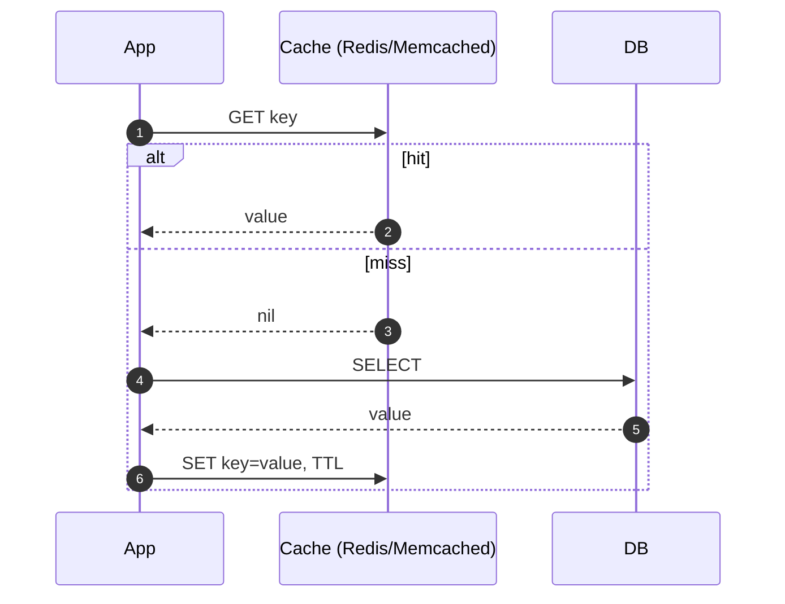

# 캐싱 전략 (Caching Strategies)

## 한 줄 정의

비용이 큰 응답이나 자주 접근되는 데이터를 빠른 메모리 계층에 임시 저장해 후속 요청을 가속하는 일반 기법 (ch01, p.22).

## 왜 필요한가

매 요청마다 DB를 치면 애플리케이션 성능이 DB I/O에 묶인다. 캐시는 DB 부하를 낮추고 응답 지연을 줄인다. DB와 별도의 **캐시 tier**로 분리하면 독립적으로 확장 가능 (ch01, p.22).

## 핵심 메커니즘

**Cache aside / read-through 패턴** (책 본문 기본 예시, ch01, p.22):

1. web server가 캐시 조회.
2. **hit**: 캐시 값 반환.
3. **miss**: DB 조회 → 캐시에 적재 → 반환.

[[memcached]] / [[redis]] 같은 in-memory store가 전형적. 그 외 write-through, write-behind 등 다양한 전략이 있다.

## 사용 시 고려사항 (ch01, p.23)

- **언제 캐시할까**: read 많고 write 적은 데이터. 캐시는 휘발성이므로 중요한 데이터는 영속 저장소에 함께.
- **만료 정책 (expiration/TTL)**: 너무 짧으면 DB 재조회 빈발, 너무 길면 stale.
- **일관성 (consistency)**: 캐시와 DB 변경이 한 트랜잭션이 아니므로 어긋날 수 있음. 멀티 리전에서 특히 어려움 (참고: "Scaling Memcache at Facebook").
- **장애 완화 (SPOF)**: 단일 캐시 노드는 [[single-point-of-failure]]. 멀티 노드·여러 DC 분산·메모리 오버프로비저닝 권장.
- **축출 정책 (eviction)**: 캐시 가득 차면 비워야 함. **LRU**(가장 오래 안 쓴 것)가 가장 일반적, LFU/FIFO도 상황에 따라.

## 트레이드오프

- 빠른 응답·DB 부하 감소 ↔ 일관성 관리 비용, 추가 인프라.
- 캐시 적중률(hit rate)이 낮으면 오히려 지연이 추가될 수 있다.

## 캐시 패턴 비교

| 패턴 | 동작 | 적합한 곳 |
|---|---|---|
| **Cache aside (lazy)** | 앱이 캐시 miss 시 DB 조회 후 캐시에 저장 | 가장 일반. read-heavy 워크로드 |
| **Read-through** | 캐시가 직접 DB를 조회·적재 | 캐시 라이브러리/서비스가 데이터 소스를 알 때 |
| **Write-through** | write 시 캐시·DB 동시 갱신 | 강한 일관성 필요, write 지연 감수 |
| **Write-behind (write-back)** | write를 캐시에만 즉시 반영, DB 동기는 비동기 | high write throughput, 데이터 손실 감수 |

## 실무 적용 시 고려사항

- **Thundering herd / cache stampede**: hot key의 TTL이 만료되면 동시 여러 요청이 DB로 몰려 polynomial 부하 폭증. 해법 — ① 락(분산 락 1개만 DB 조회) ② **request coalescing** ③ stale-while-revalidate ④ TTL **jitter**(만료 시각 ±랜덤)로 동기 만료 회피.
- **Cache invalidation의 어려움** (Phil Karlton의 "two hard things"): write 시 캐시 키를 정확히 무효화. 키 설계가 곧 일관성. 비교적 안전한 옵션은 **짧은 TTL + 명시적 무효화 보조**.
- **Negative caching**: "없음"도 캐싱해야 함. 그렇지 않으면 존재하지 않는 키 조회로 DB 부하 폭주(악성 트래픽의 표준 공격 패턴).
- **Hot key 문제**: 한 키에 트래픽이 몰리면 캐시 노드 한 곳이 핫스팟. 해법 — ① 같은 키의 응답을 여러 노드에 복제 ② 클라이언트 측 in-process 캐시로 1단 흡수.
- **메모리 모니터링**: eviction 비율이 높으면 capacity 부족 신호. evicted/hit/miss 카운터를 항상 본다.
- **재시작·장애 회복**: 캐시는 휘발성. 재시작 직후 hit ratio가 0이라 DB로 트래픽 쇄도 — **warm-up** 절차(상위 인기 키 미리 적재) 필요.

## 등장 사례

- ch01 — [[database-replication]] 이후, [[cdn]] 도입 직전 단계로 등장. 이후 [[stateless-web-tier]]에서 세션 저장소로 [[memcached]]·[[redis]]가 다시 등장한다.
- ch04 — rate limiter 카운터 저장소로 [[redis]]의 `INCR`/`EXPIRE`·sorted set이 본격 활용된다.
