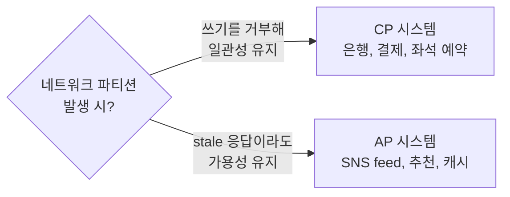

# CAP 정리 (CAP Theorem)

## 한 줄 정의

분산 시스템은 **Consistency(일관성), Availability(가용성), Partition tolerance(분단 내성)** 의 세 속성 중 동시에 **두 개만** 보장할 수 있다는 정리 (Eric Brewer, 2000) (ch06, p.91).

## 왜 필요한가

분산 데이터 시스템을 설계할 때 "강한 일관성"·"항상 응답"·"네트워크 분단 견디기"를 모두 원하지만, 이 셋 사이에는 **물리적 트레이드오프**가 존재한다. CAP 정리는 그 트레이드오프를 정식화해 **설계자가 어느 둘을 선택했는지 명확히 자각하도록** 강제한다.

## 핵심 정의 (ch06, p.91)

- **Consistency (C)**: 모든 클라이언트가 어느 노드에 접속하든 같은 시점에 같은 데이터를 본다.
- **Availability (A)**: 일부 노드가 다운돼도 요청에 응답을 받는다.
- **Partition tolerance (P)**: 노드 간 통신이 끊겨도(네트워크 파티션) 시스템이 계속 동작한다.

이 셋 중 한 속성을 포기해야 나머지 둘을 만족할 수 있다.

## CA·CP·AP의 의미

```
            Consistency
                /\
               /  \
              / CA \
             /------\
            /CP    AP\
           /----------\
        Partition   Availability
        Tolerance
```

- **CA (Consistency + Availability)**: 파티션이 없다고 가정한 시스템. **현실에선 존재 불가** — 네트워크 파티션은 분산 시스템에서 불가피하기 때문 (ch06, p.93).
- **CP (Consistency + Partition tolerance)**: 파티션 시 가용성 포기. 분리된 쪽은 응답 거부. 예: 은행 계좌 잔액.
- **AP (Availability + Partition tolerance)**: 파티션 시 일관성 포기. 응답은 하되 stale일 수 있음. 파티션 복구 후 동기화. 예: Dynamo, Cassandra.

## 실세계는 CP vs AP 양자택일

네트워크는 반드시 깨지므로 **P는 포기할 수 없다**. 따라서 현실의 분산 시스템 설계는 **CP인가 AP인가** 하나의 질문으로 환원된다 (ch06, p.93).



## 트레이드오프 & 선택 기준

| 비즈니스 특성 | 권장 |
|---|---|
| 잘못된 값보다 **응답 없음이 낫다** (금융, 좌석, 재고) | **CP** |
| 일시 stale이라도 **응답이 더 중요** (피드, 좋아요 카운트, 검색) | **AP** |
| 사용자가 강하지 않은 일관성을 곧 알아챈다 | CP |
| 짧은 시간 후 자동 reconcile 가능 (eventual consistency) | AP |

## 흔한 오해

- **"CAP는 always-on 트레이드오프다"는 잘못된 해석.** CAP는 **파티션이 발생했을 때**의 행동을 다룬다. 평상시(파티션 없음)엔 C와 A 모두 만족 가능하다 — 이걸 PACELC 모델이 명시적으로 다룬다 (Partition시 A vs C, Else Latency vs Consistency).
- **"NoSQL은 모두 AP다"도 틀림.** MongoDB는 CP에 가깝고, Cassandra·Dynamo·Riak이 AP. 카테고리가 아니라 **설정 가능한 dial**인 경우도 많다.
- **"CP는 strong consistency를 보장한다"도 정확하진 않다.** CP는 "파티션 시 일관성 우선"이라는 뜻이지, linearizability 같은 강력한 모델을 자동으로 의미하진 않는다.

## 실무 적용 시 고려사항

- **요구 분석 단계에서 CP/AP 결정 명시**. 이후 모든 컴포넌트 선택(DB, 캐시, 큐)이 이 결정에 종속된다.
- **부분적으로 다른 선택도 가능**. 시스템 안에서 도메인별로 다를 수 있음. 예: 결제는 CP, 알림 피드는 AP.
- **Tunable consistency**: Cassandra·Dynamo는 `W+R` 설정으로 한 시스템 안에서 CP 가까이/AP 가까이를 키 단위로 조절 가능 ([[quorum-consensus]] 참고).
- **PACELC로 보강**: 평상시에도 Latency vs Consistency 트레이드오프가 있다는 점은 CAP만으론 안 보임. 실제 운영의 80%는 PACELC의 E (else) 영역.
- **클라이언트 측 일관성 처리**: AP 시스템에서는 클라이언트가 **충돌 가능성**을 알고 [[vector-clock]] 같은 메타데이터를 다룰 수 있어야 한다.
- **체감 vs 이론**: 사용자 입장에선 "내가 방금 쓴 것은 즉시 보인다"가 일관성처럼 느껴짐 (read-your-writes). AP 시스템도 이걸 별도 기법으로 제공 가능.

## 다른 개념과의 관계

- [[consistency-models]] — CAP의 C는 일종의 강한 일관성을 가정하지만 실제론 [[consistency-models|일관성 모델 스펙트럼]] 위에서 더 정교하게 다뤄야 함.
- [[quorum-consensus]] — CAP의 추상적 선택을 N/W/R 다이얼로 구체화.
- [[database-replication]] — 복제가 있어야 비로소 CAP 문제가 발생.
- [[sloppy-quorum-hinted-handoff]] — AP 시스템에서 파티션 동안의 운영 기법.
- [[vector-clock]] — AP 선택의 부산물인 충돌을 해결하는 도구.

## 등장 사례

- ch06 — KV store 설계의 출발점 결정.
- **Cassandra·Dynamo·Riak** — AP 계열의 대표.
- **HBase·Zookeeper·etcd** — CP 계열의 대표.
- **Spanner** — Google. 실제로는 CP에 가깝지만 TrueTime API로 평상시 가용성도 극도로 높이려 함.

## 면접 관점 메모

- "당신의 시스템은 CAP 중 무엇을 선택?" → 단답하지 말고 **"평상시엔 둘 다, 파티션 시엔 X 선택"** 식으로 답하면 PACELC 이해도까지 보여줄 수 있다.
