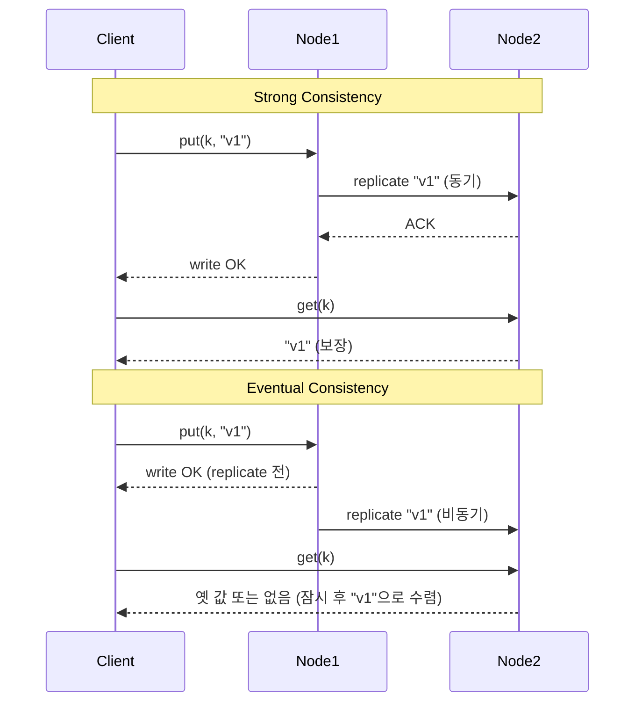

# 일관성 모델 (Consistency Models)

## 한 줄 정의

분산 시스템에서 복제된 데이터의 읽기·쓰기가 **얼마나 즉시·정확하게** 다른 노드에 보이는지를 정의하는 계약. 강함 ↔ 약함 사이의 **스펙트럼**이며 시스템·키 단위로 선택 가능 (ch06, p.99-100).

## 왜 필요한가

데이터가 N개 노드에 복제된 순간 "최신값"이라는 단어가 모호해진다. 클라이언트가 어떤 노드에 닿느냐에 따라 다른 값을 볼 수 있고, 시스템은 그것을 어디까지 허용할지 명시적으로 선언해야 한다. 일관성 모델은 그 **계약의 언어**다.

## 핵심 스펙트럼

ch06이 다루는 3단계(p.100)에 학계 표준 모델을 더 얹으면:

| 모델 | 정의 | 비고 |
|---|---|---|
| **Linearizability (Strict)** | 모든 작업이 실시간 순서대로 보임. CAP의 가장 강한 C. | etcd, ZooKeeper |
| **Sequential consistency** | 모든 노드에서 작업 순서가 일관됨 (실시간 순서 아닐 수 있음) | |
| **Strong consistency** (ch06) | 어떤 읽기든 가장 최근 쓰기의 값을 반환 | 일반적으론 linearizability와 혼용 |
| **Read-your-writes** | 본인이 쓴 값은 즉시 본인 read에 보임 | 세션 일관성의 일종 |
| **Monotonic reads** | 한 번 본 값보다 오래된 값은 보이지 않음 | |
| **Causal consistency** | 인과 관계 있는 작업의 순서만 보장 | |
| **Weak consistency** (ch06) | 후속 read가 최신값을 못 볼 수 있음 | |
| **Eventual consistency** (ch06) | 충분한 시간 지나면 모든 replica가 같은 값으로 수렴 | Dynamo/Cassandra |

ch06은 단순화해서 **Strong / Weak / Eventual** 3가지로 본다. eventual은 weak의 특수형 — "언젠가는 수렴" 보장이 더해진 것.

## Strong vs Eventual의 핵심 차이

- **Strong**: write가 성공한 순간부터 모든 read는 최신값. 동기 복제가 필요해 느리고 가용성 낮음.
- **Eventual**: write가 빠르고 가용성 높지만 일시적 불일치 허용. **충돌 해결**이 별도 필요 → [[vector-clock]].

## 트레이드오프 & 선택 기준

| 비즈니스 요구 | 권장 모델 |
|---|---|
| 잔액·재고·예약 — 잘못된 값 = 큰 손해 | Strong / Linearizability |
| "방금 내가 한 행동은 즉시 본다" | Read-your-writes (session) |
| 댓글 순서 — 인과만 맞으면 됨 | Causal |
| 피드·좋아요·뷰 카운트 — 살짝 늦어도 OK | Eventual |
| 추천·검색 — 정확도보다 가용성·지연 우선 | Eventual / Weak |

**Strong은 비싸다**: 모든 replica의 합의·동기 복제로 latency↑, availability↓.
**Eventual은 싸지만 복잡하다**: 충돌·정렬 문제를 클라이언트나 별도 reconcile 로직이 떠안음.

## Eventual Consistency가 실무에서 잘 작동하는 이유

- 대부분의 데이터는 한 명만 자주 수정 (own profile, own cart) → 충돌 발생률 자체가 낮음.
- 사용자는 자기 행동의 결과를 자기 클라이언트에서만 즉시 보면 됨 (UI-level read-your-writes).
- 충돌 시 클라이언트가 reconcile 화면을 보여줘도 사용자 경험에 큰 손상 없음 (예: 쇼핑카트 머지).

이게 Dynamo가 AP + eventual을 선택한 근거 (Vogels, 2009).

## 실무 적용 시 고려사항

- **시스템 전체가 아니라 작업/키 단위로 선택**. 한 시스템 안에서 "결제는 strong, 활동 로그는 eventual"이 흔하다.
- **클라이언트 측 read-your-writes 보장**: 사용자 본인이 쓴 값을 자기 화면에서 못 보면 강하게 항의받음. AP 시스템도 read-your-writes는 별도로 보장 — sticky session·write-through cache·timestamp 기반 read 등.
- **수렴 시간 SLO 정의**: eventual은 "언젠가" 수렴이지만 실제론 수 ms~수 분이 보통. **수렴 시간을 SLO로 측정·관리**해야 한다.
- **충돌 해결 정책 명시**: Last-Write-Wins(LWW), [[vector-clock]] sibling 머지, CRDT 등 어느 것을 쓸지 명문화.
- **테스트**: chaos testing으로 파티션·지연 상황을 인위적으로 만들어 일관성 위반 시 시스템 동작 확인.
- **모니터링**: replication lag, conflict 발생률, divergence 시간 — 3개 지표는 운영 필수.

## 다른 개념과의 관계

- [[cap-theorem]] — 일관성 모델 선택은 결국 CAP의 C-A 트레이드오프의 구체적 표현.
- [[quorum-consensus]] — N/W/R로 strong↔eventual을 연속적으로 조정.
- [[vector-clock]] — eventual 선택 시 등장하는 충돌을 해결.
- [[database-replication]] — 일관성 모델의 차이는 결국 복제가 동기냐 비동기냐.
- [[sloppy-quorum-hinted-handoff]] — eventual 시스템의 운영 기법.

## 등장 사례

- ch06 — KV store 권장 모델로 eventual consistency 채택.
- **Spanner** — 전 세계 strong consistency (TrueTime + Paxos).
- **DynamoDB** — eventual이 default, strong은 옵션 (latency 2배).
- **Cassandra** — `LOCAL_QUORUM`·`QUORUM`·`ALL` 등 8단계로 튜닝 가능.
- **Redis (단일 마스터)** — 마스터에 대해 strong, replica는 eventual.

## 면접 관점 메모

- "어떤 일관성을 택할 것인가?" 답할 때 **사례별로 다르다**고 답하면 +. 예: "결제는 strong, 알림은 eventual."
- "Eventual은 무책임 아닌가?" 반박엔 **read-your-writes·monotonic reads** 같은 더 좁은 보장을 별도로 제공할 수 있음을 언급.
