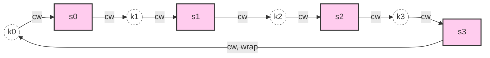

# 일관된 해싱 (Consistent Hashing)

## 한 줄 정의 / 동기

키와 서버를 **같은 해시 공간(원형 ring)** 에 매핑하고, 키는 시계 방향으로 처음 만나는 서버에 배치하는 분산 알고리즘. 서버 추가·제거 시 **재배치되는 키 비율을 평균 k/n으로 최소화**한다 (k = 키 수, n = 서버 수) (ch05, p.71-84).

본 알고리즘이 풀려는 문제는 **rehashing problem**이다.

## 왜 필요한가 — Rehashing Problem

분산 캐시·샤딩에서 가장 단순한 키 분배는 모듈러 해시:

```
serverIndex = hash(key) % N
```

이 방식은 N이 고정일 땐 잘 작동하지만, **서버가 한 대 추가되거나 빠지면 N이 변하고 거의 모든 키가 재배치**된다 (ch05, p.72-74).

```
N = 4 → key0 % 4 = 1   (server 1)
N = 3 → key0 % 3 = 0   (server 0)   ← 위치 변경
N = 3 → key1 % 3 = 0   (server 0)   ← 변경 없음 (우연)
N = 3 → key2 % 3 = 1   (server 1)   ← 변경
... (대부분의 키가 다른 서버로 이동)
```

캐시 환경에서 이건 **cache miss 폭풍**을 의미한다. 모든 클라이언트가 일제히 잘못된 서버로 가서 빈 응답을 받고 origin DB로 트래픽이 쏟아진다. 샤딩이면 데이터 마이그레이션 폭풍.

[[sharding]]의 resharding이나 [[memcached]] 클러스터 노드 변경에서 이 문제가 직접 드러난다.

## 동작

### 1. 해시 공간 (Hash Space)

암호 해시(보통 SHA-1, 0 ~ 2^160-1)의 전체 출력 범위를 직선으로 펼친 뒤 양 끝을 이어 **원형 링(hash ring)** 을 만든다 (ch05, p.75-76).

```
0 ────────────────────────────────────── 2^160-1
└─ ring: x0와 xn을 연결 ─────────────────────┘
```

### 2. 서버를 링에 매핑

서버 IP·이름을 같은 해시 함수로 해시해 링 위 위치를 결정. 4개 서버 s0~s3가 원형 어딘가에 흩어진다.

### 3. 키를 링에 매핑 (modular 없음)

키도 같은 해시 함수로 해시해 링 위 위치를 정한다. **모듈러 연산 없음** — 이 점이 단순 hash mod N과 결정적으로 다르다.

### 4. 서버 lookup — 시계 방향 첫 서버

키 위치에서 시계 방향으로 진행해 처음 만나는 서버가 그 키의 소유자.



각 키는 자신 직후에 있는 서버에 저장된다.

### 5. 서버 추가 / 제거 시 재배치 범위

- **서버 추가** (s4가 s3와 s0 사이에 들어옴): s3와 s4 사이에 있던 키만 s0 → s4로 이동. 나머지는 그대로.
- **서버 제거** (s1 삭제): s1에 있던 키만 다음 서버(s2)로 이동. 나머지는 그대로.

평균적으로 **k/n 비율의 키만 재배치** — Wikipedia 정의의 핵심 성질.

## 두 가지 약점과 Virtual Nodes

### 약점 1 — 파티션 크기 불균등 (ch05, p.81)

서버 위치가 균등하지 않으면 한 서버가 담당하는 hash space 구간이 다른 서버의 2배 이상일 수 있음. 트래픽·저장 부담 불균형.

### 약점 2 — 키 분포 불균등

서버 위치가 한쪽에 몰리면 대부분의 키가 한 서버로 쏠림 (figure 5-11처럼 s2만 데이터 다수, s1·s3는 비어 있음).

### 해법 — Virtual Nodes (Replicas)

한 물리 서버를 **여러 가상 노드**로 링에 반복 배치 (ch05, p.82-84).

```
물리 서버 s0 → 가상 노드 s0_0, s0_1, s0_2, ..., s0_(V-1)
물리 서버 s1 → 가상 노드 s1_0, s1_1, s1_2, ..., s1_(V-1)
```

각 가상 노드는 독립된 해시로 링에 자리 잡고, 그들이 책임지는 hash 구간들의 합이 곧 그 물리 서버의 부담이 된다.

**분포 정확도** (책 실측, ch05 p.84):

| 가상 노드 수 (per server) | 표준편차 |
|---:|---:|
| 100 | ~10% |
| 200 | ~5% |

가상 노드가 많을수록 분포는 균등해지지만 **링 메타데이터 메모리**가 늘어남. 일반적 운영값은 100~256개.

```
링 위 배치 (V=3):

        s0_2 ────────── s1_0
       /                    \
     s1_2                   s0_0
        \                  /
        s0_1 ── s1_1
                /
        (시계 방향으로 어떤 가상 노드를 만나든
         그 가상 노드의 물리 서버가 책임진다)
```

## 파라미터 · 튜닝 포인트

| 파라미터 | 영향 |
|---|---|
| **해시 함수** | 분포 균등성·계산 비용. SHA-1·MD5·MurmurHash 등. 균등성만 만족하면 비암호 해시도 OK |
| **가상 노드 수 V** | V↑ → 분포 균등성 ↑, 메모리·lookup 비용 ↑ |
| **링 자료구조** | 정렬된 자료구조 필요. TreeMap·SkipList·B+Tree. lookup은 O(log(N·V)) |
| **레플리카 정책** | 보통 시계 방향 다음 R개 서버에 복제 (Dynamo 스타일) |

## 트레이드오프

**Pros**
- **서버 변동 시 재분배 키 비율 최소**: cache miss 폭풍 회피.
- **수평 확장 친화**: 노드 추가가 자연스러움.
- **핫스팟 완화**: 가상 노드로 hotspot 키도 여러 물리 서버에 분산 가능.

**Cons**
- 자료구조·메모리가 단순 해시보다 큼. 가상 노드 수에 비례.
- 균등성은 통계적 — 운이 나쁘면 일부 서버가 더 무거울 수 있음.
- 복제·일관성은 별도 설계 필요 (Dynamo의 N/R/W 모델 등).
- 키 lookup이 O(log(N·V)) — 모듈러보다 비싸지만 실제로는 무시할 수준.

## 다른 분배 기법과의 위치

| 기법 | 재배치 비율 (서버 1개 변동) | 균등성 | 비고 |
|---|---|---|---|
| **Modular hash** (`hash % N`) | ~ (N-1)/N | 좋음 | 변동에 매우 취약 |
| **Range partitioning** | 부분적 | 키에 따라 | 범위 쿼리 효율, hot range 위험 |
| **Consistent hashing** | **~1/N** | 가상 노드로 보강 | 표준 |
| **Rendezvous (HRW) hashing** | ~1/N | 좋음 | 가상 노드 불필요, 매 lookup O(N) |
| **Jump consistent hash** | 1/N | 매우 좋음 | shard 수가 정수 인덱스, 노드 ID 정렬 의존 |

[[sharding]] 전략 선택의 핵심 옵션 중 하나.

## 실무 적용 시 고려사항

- **시작 시 가상 노드 수 결정**: 변경이 어렵다 (대부분의 키가 재배치됨). 보통 100~256으로 시작.
- **불균등 모니터링**: 운영 중 각 물리 서버의 키 수·트래픽을 모니터링. 표준편차가 큰 서버는 가상 노드 추가로 보정 가능.
- **노드 추가·제거 절차**:
  1. 새 서버 가상 노드들을 링에 추가.
  2. 영향 받는 hash 구간의 키만 데이터 마이그레이션.
  3. 마이그레이션 완료 후 ring metadata 전파.
  4. 클라이언트 라이브러리가 새 ring 적용.
- **Ring metadata 전파**: 클러스터 모든 노드·클라이언트가 같은 ring view를 가져야 일관 lookup. Gossip 프로토콜(Cassandra) 또는 중앙 coordinator(Dynamo의 membership service).
- **Replica placement**: 시계 방향 다음 R개 노드가 보통 표준. 단, **물리적 격리** 위해 같은 rack·AZ·DC의 노드는 제외하는 정책 필요 (Cassandra의 NetworkTopologyStrategy).
- **Hot key 한계**: 가상 노드로 데이터 분포는 균등해지지만 **특정 키 한 개의 read 폭주**는 여전히 한 서버로 몰림. 그건 별도로 캐시·읽기 복제로 해결.
- **클라이언트 측 라이브러리 일관성**: 다언어 환경이라면 모든 클라이언트가 같은 해시 함수·가상 노드 정책을 사용해야 lookup이 일치. 표준 라이브러리(ketama 등) 채택 권장.
- **마이그레이션 중 더블 쓰기**: 키 이동 중에는 이전 서버·새 서버 양쪽에 write를 보내 일관성을 보장하는 **dual-write** 패턴이 자주 쓰임.

## 등장 사례

- ch05 — 장 전체 주제.
- ch01 [[sharding]] 절 — resharding 비용 문제의 해법으로 ch05 예고.
- ch04 [[memcached]] — 노드 추가·제거 시 키 대부분 재배치되는 함정의 해결책으로 본 알고리즘이 사실상 표준.
- **Amazon Dynamo** — Dynamo의 partitioning 컴포넌트. (논문: ch05 reference [3])
- **Apache Cassandra** — 데이터 파티셔닝. (논문: ch05 reference [4])
- **Discord** — 채팅 백엔드 (Elixir 기반). (블로그: ch05 reference [5])
- **Akamai CDN** — 콘텐츠 분배.
- **Google Maglev LB** — 네트워크 로드 밸런서. (논문: ch05 reference [7])
- ch06 (예정) — Dynamo 스타일 key-value store 설계의 핵심 빌딩 블록으로 재등장.
