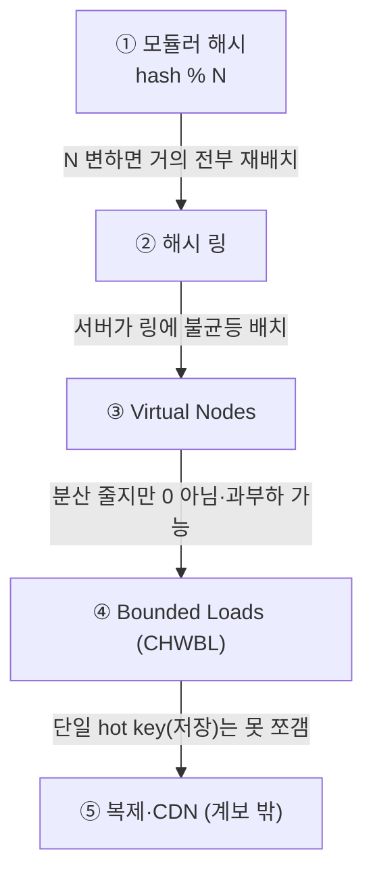
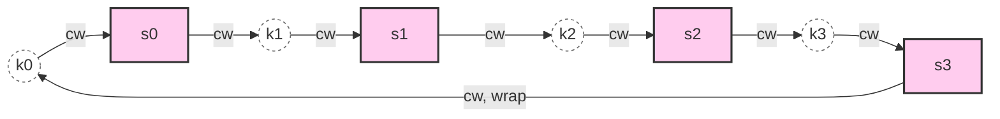

# 일관된 해싱 (Consistent Hashing)

## 한 줄 정의 / 동기

키와 서버를 **같은 해시 공간(원형 ring)** 에 매핑하고, 키는 시계 방향으로 처음 만나는 서버에 배치하는 분산 알고리즘. 서버 추가·제거 시 **재배치되는 키 비율을 평균 k/n으로 최소화**한다 (k = 키 수, n = 서버 수) (ch05, p.71-84).

본 알고리즘이 풀려는 문제는 **rehashing problem**이다.

## 계보 한눈에

각 기법은 **앞 기법의 딱 하나의 약점**을 겨냥해 등장한다. 아래 사슬이 이 페이지 전체의 지도다.


```mermaid
flowchart TD
    A["① 모듈러 해시<br/>hash % N"] -->|"N 변하면 거의 전부 재배치"| B["② 해시 링"]
    B -->|"서버가 링에 불균등 배치"| C["③ Virtual Nodes"]
    C -->|"분산 줄지만 0 아님·과부하 가능"| D["④ Bounded Loads (CHWBL)"]
    D -->|"단일 hot key(저장)는 못 쪼갬"| E["⑤ 복제·CDN (계보 밖)"]
```

| 단계 | 핵심 | 다음을 부른 약점 |
|---|---|---|
| ① 모듈러 | N으로 나눠 배정 | N 변동 = 전부 재배치 |
| ② 해시 링 | 옆 서버에 배정 (국소 의존) | 서버 배치 불균등 |
| ③ vnodes | 여러 점으로 평균화 | 분산 줄지만 0 아님 |
| ④ CHWBL | 상한 + 흘려보내기 | 단일 hot key 못 쪼갬 |
| ⑤ 복제/CDN | 키 자체 복제·엣지 분산 | (계보 밖) |

ring 계열(②~④) 외에 **옆길**도 있다 — 같은 "N 의존 끊기"를 ring 없이 푸는 Maglev·Jump·Rendezvous (아래 비교표).

## 왜 필요한가 — Rehashing Problem

분산 캐시·샤딩에서 가장 단순한 키 분배는 모듈러 해시:

```
serverIndex = hash(key) % N
```

이 방식은 N이 고정일 땐 잘 작동하지만, **서버가 한 대 추가되거나 빠지면 N이 변하고 거의 모든 키가 재배치**된다 (ch05, p.72-74).

```
N = 4 → key0 % 4 = 1   (server 1)
N = 3 → key0 % 3 = 0   (server 0)   ← 위치 변경
N = 3 → key1 % 3 = 0   (server 0)   ← 변경 없음 (우연)
N = 3 → key2 % 3 = 1   (server 1)   ← 변경
... (대부분의 키가 다른 서버로 이동)
```

캐시 환경에서 이건 **cache miss 폭풍**을 의미한다. 모든 클라이언트가 일제히 잘못된 서버로 가서 빈 응답을 받고 origin DB로 트래픽이 쏟아진다. 샤딩이면 데이터 마이그레이션 폭풍.

[[sharding]]의 resharding이나 [[memcached]] 클러스터 노드 변경에서 이 문제가 직접 드러난다.

### 직관 — 전역 의존 vs 국소 의존

왜 링으로 바꾸면 이동이 줄어드는가는 **키의 목적지가 무엇에 의존하는가**로 갈린다.

- **모듈러 해시**: 키의 목적지 = `hash(key) % N`. 모든 키의 운명이 **전역 값 N 하나**에 묶여 있다. 그래서 N이 4→5로 바뀌면 나머지 패턴 전체가 어긋나 평균 **(N-1)/N, 즉 거의 모든 키**가 다른 서버로 이동한다.
- **해시 링**: 키의 목적지 = "링 위에서 **시계 방향으로 만나는 바로 다음 서버**". 전역 값 N이 등장하지 않고, **내 옆 서버가 누구냐는 국소(local) 사실**에만 의존한다.

그 결과 서버를 한 대 추가·제거해도 **그 서버 주변 한 구간의 키만** 다음 서버가 바뀌고, 멀리 있는 키들은 "내 바로 다음 서버"가 그대로라 **움직이지 않는다**. 영향 범위가 *전체*에서 *한 구간*으로 좁혀지는 것이 이동 비율을 평균 k/n으로 떨어뜨리는 본질이다.

```
모듈러:  서버 1대 변동 → 전역 N 변화 → 거의 모든 키 재계산
링:      서버 1대 변동 → 그 서버 인접 구간만 영향 → 나머지 키 불변
```

## 동작

### 1. 해시 공간 (Hash Space)

암호 해시(보통 SHA-1, 0 ~ 2^160-1)의 전체 출력 범위를 직선으로 펼친 뒤 양 끝을 이어 **원형 링(hash ring)** 을 만든다 (ch05, p.75-76).

```
0 ────────────────────────────────────── 2^160-1
└─ ring: x0와 xn을 연결 ─────────────────────┘
```

### 2. 서버를 링에 매핑

서버 IP·이름을 같은 해시 함수로 해시해 링 위 위치를 결정. 4개 서버 s0~s3가 원형 어딘가에 흩어진다.

### 3. 키를 링에 매핑 (modular 없음)

키도 같은 해시 함수로 해시해 링 위 위치를 정한다. **모듈러 연산 없음** — 이 점이 단순 hash mod N과 결정적으로 다르다.

### 4. 서버 lookup — 시계 방향 첫 서버

키 위치에서 시계 방향으로 진행해 처음 만나는 서버가 그 키의 소유자.


```mermaid
flowchart LR
    classDef server fill:#fce,stroke:#333,stroke-width:2px
    classDef key fill:#fff,stroke:#666,stroke-dasharray: 3 3

    k0((k0)):::key -->|cw| s0:::server
    s0 -->|cw| k1((k1)):::key
    k1 -->|cw| s1:::server
    s1 -->|cw| k2((k2)):::key
    k2 -->|cw| s2:::server
    s2 -->|cw| k3((k3)):::key
    k3 -->|cw| s3:::server
    s3 -->|cw, wrap| k0
```

각 키는 자신 직후에 있는 서버에 저장된다.

### 5. 서버 추가 / 제거 시 재배치 범위

- **서버 추가** (s4가 s3와 s0 사이에 들어옴): s3와 s4 사이에 있던 키만 s0 → s4로 이동. 나머지는 그대로.
- **서버 제거** (s1 삭제): s1에 있던 키만 다음 서버(s2)로 이동. 나머지는 그대로.

평균적으로 **k/n 비율의 키만 재배치** — Wikipedia 정의의 핵심 성질.

## 두 가지 약점과 Virtual Nodes

### 약점 1 — 파티션 크기 불균등 (ch05, p.81)

서버 위치가 균등하지 않으면 한 서버가 담당하는 hash space 구간이 다른 서버의 2배 이상일 수 있음. 트래픽·저장 부담 불균형.

### 약점 2 — 키 분포 불균등

서버 위치가 한쪽에 몰리면 대부분의 키가 한 서버로 쏠림 (figure 5-11처럼 s2만 데이터 다수, s1·s3는 비어 있음).

### 해법 — Virtual Nodes (Replicas)

한 물리 서버를 **여러 가상 노드**로 링에 반복 배치 (ch05, p.82-84).

```
물리 서버 s0 → 가상 노드 s0_0, s0_1, s0_2, ..., s0_(V-1)
물리 서버 s1 → 가상 노드 s1_0, s1_1, s1_2, ..., s1_(V-1)
```

각 가상 노드는 독립된 해시로 링에 자리 잡고, 그들이 책임지는 hash 구간들의 합이 곧 그 물리 서버의 부담이 된다.

**분포 정확도** (책 실측, ch05 p.84):

| 가상 노드 수 (per server) | 표준편차 |
|---:|---:|
| 100 | ~10% |
| 200 | ~5% |

가상 노드가 많을수록 분포는 균등해지지만 **링 메타데이터 메모리**가 늘어남. 일반적 운영값은 100~256개.

```
링 위 배치 (V=3):

        s0_2 ────────── s1_0
       /                    \
     s1_2                   s0_0
        \                  /
        s0_1 ── s1_1
                /
        (시계 방향으로 어떤 가상 노드를 만나든
         그 가상 노드의 물리 서버가 책임진다)
```

## 부하 상한 보장 — Bounded Loads (CHWBL)

Virtual nodes는 분포의 **분산(variance)을 줄이지만 0으로 만들지 못한다** (vnode 200개여도 ~5% 편차). 동적 환경(요청·커넥션이 수시로 들고 남)이나 hot key가 끼면 운 나쁜 노드가 과부하날 수 있다. **Consistent Hashing with Bounded Loads (CHWBL)** 는 여기에 통계적 기대가 아니라 **하드 상한**을 건다:

> 어떤 노드도 **평균 부하의 (1+ε)배를 절대 넘지 않는다.**

책 범위 밖 기법. Google 2016 논문(Mirrokni·Thorup·Zadimoghaddam) + 2017 Research 블로그가 출처이며 이후 HAProxy·Envoy·Vimeo·Google Cloud Pub/Sub가 채택했다.

### 메커니즘

각 노드에 용량 상한을 정의한다:

```
capacity = ⌈ (1 + ε) × (전체 부하 / 노드 수) ⌉
```

키 배치 시 시계 방향 첫 노드가 이미 capacity면 **건너뛰고 여유 있는 다음 노드로 흘려보낸다(spillover)**. ε(>0)은 허용 초과율 — ε=0.25면 "어떤 노드도 평균의 125%까지만".

```
기본 CH:  k ──cw──▶ [A]              (A가 터지든 말든 무조건 A)
CHWBL:    k ──cw──▶ [A: 꽉 참 ✗] ──cw──▶ [B: 여유 ✓]   (옆으로 흘러감)
```

### ε 트레이드오프 (핵심 다이얼)

| ε | 균형 | locality / 이동성 |
|---|---|---|
| 작음 (→0) | 거의 완벽 | spillover 多 → 키가 제 노드를 벗어나 캐시 locality·k/n 이동성 악화 |
| 큼 | 느슨 (기본 CH에 수렴) | spillover 적음 → locality 유지, 과부하 보장은 약함 |

기본 consistent hashing은 사실상 ε=∞ 극단. 실무 기본값은 **ε=0.25** (HAProxy `hash-balance-factor 125`).

### 어디에 맞나 — 데이터 샤딩보다 로드밸런싱

lookup하려면 "그 노드가 배치 시점에 꽉 찼었는지"를 알아야 하므로 **현재 부하 상태**가 필요하다. 부하를 한곳에서 다 보는 **로드밸런서**에 자연스럽게 맞고(LB가 upstream 커넥션 수를 앎), 노드마다 부하 뷰가 다른 **분산 데이터 샤딩엔 덜 적합**(부하 동기화 부담). CHWBL의 killer app이 데이터 분배가 아니라 LB인 이유.

### hot key 한계의 정교화

"단일 hot key는 CH로 못 푼다"는 명제는 **부하의 단위**에 따라 갈린다:

- **stateless 요청 LB**: 그 key의 1차 노드가 capacity에 닿으면 이후 요청이 옆 노드로 흘러 **부하가 부분 완화**된다 (단, 엄격한 affinity는 깨짐).
- **저장 데이터 샤딩**: 데이터 한 조각은 쪼갤 수 없어 분산으로는 **미해결**. 단 같은 키가 한 노드로 모이는 성질을 살려 그 노드에서 **request coalescing**(동시 중복 read를 1쿼리로 합침)하면 read 폭주는 흡수 가능 → "실무 적용 시 고려사항"의 Hot key 항목 참조.

## 파라미터 · 튜닝 포인트

| 파라미터 | 영향 |
|---|---|
| **해시 함수** | 분포 균등성·계산 비용. SHA-1·MD5·MurmurHash 등. 균등성만 만족하면 비암호 해시도 OK |
| **가상 노드 수 V** | V↑ → 분포 균등성 ↑, 메모리·lookup 비용 ↑ |
| **링 자료구조** | 정렬된 자료구조 필요. TreeMap·SkipList·B+Tree. lookup은 O(log(N·V)) |
| **레플리카 정책** | 보통 시계 방향 다음 R개 서버에 복제 (Dynamo 스타일) |

## 트레이드오프

**Pros**
- **서버 변동 시 재분배 키 비율 최소**: cache miss 폭풍 회피.
- **수평 확장 친화**: 노드 추가가 자연스러움.
- **핫스팟 완화**: 가상 노드로 hotspot 키도 여러 물리 서버에 분산 가능.

**Cons**
- 자료구조·메모리가 단순 해시보다 큼. 가상 노드 수에 비례.
- 균등성은 통계적 — 운이 나쁘면 일부 서버가 더 무거울 수 있음.
- 복제·일관성은 별도 설계 필요 (Dynamo의 N/R/W 모델 등).
- 키 lookup이 O(log(N·V)) — 모듈러보다 비싸지만 실제로는 무시할 수준.

## ring을 안 쓰는 변종 — Maglev hashing

ring 계열이 **"이동 최소(k/n)"** 를 1순위로 두는 반면, Google의 **Maglev**(2016 NSDI, 네트워크 LB)는 트레이드오프를 반대로 잡아 **"균등성"을 1순위**로 둔다. ring을 버리고 고정 크기 **lookup table**(크기 M = 소수, 예: 65537)을 쓴다:

```
backend = table[ hash(5-tuple) % M ]   ← O(1) 배열 읽기
```

테이블 채우기는 각 백엔드의 **선호 순열**(`offset = h1(b)%M`, `skip = h2(b)%(M-1)+1`, `perm[j] = (offset + j·skip) % M`)을 라운드로빈으로 빈 칸에 하나씩 배정 → 각 백엔드가 `⌊M/N⌋ ~ ⌈M/N⌉`칸(±1)으로 **거의 완벽히 균등**.

| | Ring CH (+vnodes) | Maglev |
|---|---|---|
| 1순위 목표 | 이동 최소 | **균등 최대** |
| lookup | O(log(N·V)) | **O(1) table** |
| 변경 시 이동 | 최소(k/n) | 작지만 ring보다↑ |

이동이 ring보다 많은 걸 LB가 감수하는 이유: **connection tracking**으로 진행 중 flow는 원래 백엔드에 고정하고 해시 테이블은 신규 flow의 fallback이라 실제 영향이 작다. 또 여러 LB 머신이 같은 입력→같은 테이블을 **무조율(coordination-free)** 로 계산해 라우팅이 일치한다.

## 다른 분배 기법과의 위치

| 기법 | 재배치 비율 (서버 1개 변동) | 균등성 | 비고 |
|---|---|---|---|
| **Modular hash** (`hash % N`) | ~ (N-1)/N | 좋음 | 변동에 매우 취약 |
| **Range partitioning** | 부분적 | 키에 따라 | 범위 쿼리 효율, hot range 위험 |
| **Consistent hashing** | **~1/N** | 가상 노드로 보강 | 표준 |
| **CH + Bounded Loads (CHWBL)** | ~1/N + spillover | **하드 상한 (1+ε)·avg** | LB 표준, lookup에 부하 상태 필요 |
| **Rendezvous (HRW) hashing** | ~1/N | 좋음 | 가상 노드 불필요, 매 lookup O(N) |
| **Jump consistent hash** | 1/N | 매우 좋음 | shard 수가 정수 인덱스, 노드 ID 정렬 의존 |
| **Maglev hashing** | 작지만 ring보다↑ | **거의 완벽 (±1)** | table 기반 O(1) lookup, LB 특화 |

[[sharding]] 전략 선택의 핵심 옵션 중 하나.

## 실무 적용 시 고려사항

- **시작 시 가상 노드 수 결정**: 변경이 어렵다 (대부분의 키가 재배치됨). 보통 100~256으로 시작.
- **불균등 모니터링**: 운영 중 각 물리 서버의 키 수·트래픽을 모니터링. 표준편차가 큰 서버는 가상 노드 추가로 보정 가능.
- **노드 추가·제거 절차**:
  1. 새 서버 가상 노드들을 링에 추가.
  2. 영향 받는 hash 구간의 키만 데이터 마이그레이션.
  3. 마이그레이션 완료 후 ring metadata 전파.
  4. 클라이언트 라이브러리가 새 ring 적용.
- **Ring metadata 전파**: 클러스터 모든 노드·클라이언트가 같은 ring view를 가져야 일관 lookup. Gossip 프로토콜(Cassandra) 또는 중앙 coordinator(Dynamo의 membership service).
- **Replica placement**: 시계 방향 다음 R개 노드가 보통 표준. 단, **물리적 격리** 위해 같은 rack·AZ·DC의 노드는 제외하는 정책 필요 (Cassandra의 NetworkTopologyStrategy).
- **Hot key 한계 — 그리고 반전**: 가상 노드로 데이터 분포는 균등해지지만 **특정 키 한 개의 read 폭주**는 여전히 한 서버로 몰린다. 키 하나는 못 쪼개므로 별도 해결이 필요한데, 두 갈래다. ① 복제·읽기 복제·CDN. ② **request coalescing** — "같은 키→같은 노드"라는 성질을 **약점이 아니라 자산으로** 뒤집는다. 그 노드가 단순 forward 대신 **동시 중복 read를 1개 백엔드 쿼리로 합치면**(첫 요청이 worker를 띄우고 나머지는 거기 구독) read 폭주가 흡수된다. **집중이 곧 dedup 기회**. 단 동시 중복 read에만 유효(서로 다른 데이터·write엔 무력). Discord data services(2023)가 channel_id 라우팅으로 이 패턴을 적용.
- **클라이언트 측 라이브러리 일관성**: 다언어 환경이라면 모든 클라이언트가 같은 해시 함수·가상 노드 정책을 사용해야 lookup이 일치. 표준 라이브러리(ketama 등) 채택 권장.
- **마이그레이션 중 더블 쓰기**: 키 이동 중에는 이전 서버·새 서버 양쪽에 write를 보내 일관성을 보장하는 **dual-write** 패턴이 자주 쓰임.
- **ring 읽기 경로 자체가 병목이 될 수 있다**: 모든 lookup이 ring 메타데이터를 때리므로, 단일 프로세스가 ring을 중개하면 그게 SPOF·병목이 된다. Discord는 재접속 폭풍 시 ring 소유 프로세스가 못 버텨 전체 과부하 → 읽기를 **ETS 직접 읽기 → FastGlobal(read-only 공유 힙)** 으로 lock-free·복사-free화해 lookup 12µs→0.3µs, 서버 재접속 30초→750ms로 개선. 알고리즘만큼 **읽기 경로 최적화**가 중요. (Discord 블로그, ch05 ref [5])

## 등장 사례

- ch05 — 장 전체 주제.
- ch01 [[sharding]] 절 — resharding 비용 문제의 해법으로 ch05 예고.
- ch04 [[memcached]] — 노드 추가·제거 시 키 대부분 재배치되는 함정의 해결책으로 본 알고리즘이 사실상 표준.
- **Amazon Dynamo** — Dynamo의 partitioning 컴포넌트. (논문: ch05 reference [3])
- **Apache Cassandra** — 데이터 파티셔닝. (논문: ch05 reference [4])
- **Discord (2017)** — ring으로 `guild_id → 노드`를 매핑해 **어느 노드가 그 길드의 GenServer를 소유하는지** 결정 (Elixir, 500만 동접). 데이터 샤딩도 LB도 아닌 **stateful 프로세스/액터 배치**라는 제3 용도. fanout 분배 Manifold도 `:erlang.phash2`로 PID를 consistent hashing. ring 구현은 `ex_hash_ring`으로 오픈소스화. (블로그: ch05 reference [5])
- **Discord (2023)** — ScyllaDB 앞 Rust "data services"가 `channel_id`를 routing key로 consistent hashing → 같은 채널 요청을 한 인스턴스로 모아 **request coalescing**(동시 중복 read를 1쿼리로). 단일 hot channel의 read 폭주를 분산이 아니라 **집중→dedup**으로 해소. (Cassandra 177→ScyllaDB 72노드, read p99 40~125ms→15ms) (블로그: "How Discord Stores Trillions of Messages")
- **Akamai CDN** — 콘텐츠 분배.
- **Google Maglev LB** — 네트워크 로드 밸런서, table 기반 Maglev hashing. (논문: ch05 reference [7])
- **Envoy · Cilium · Katran** — Maglev hashing 채택 (Envoy LB 정책 · Cilium eBPF kube-proxy 대체 · Meta L4 LB).
- **HAProxy / Vimeo** — CHWBL을 LB에 구현 (`hash-balance-factor`). (Andrew Rodland, "Improving load balancing with a new consistent-hashing algorithm")
- **Google Cloud Pub/Sub** — CHWBL 적용. (Google 2016 논문 + 2017 Research 블로그)
- ch06 (예정) — Dynamo 스타일 key-value store 설계의 핵심 빌딩 블록으로 재등장.
