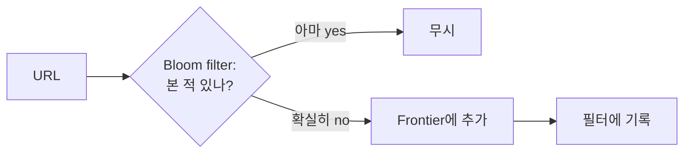

# Content Deduplication (Content Seen? / URL Seen?)

## 한 줄 정의

대규모 수집 시스템에서 **이미 본 콘텐츠/식별자를 다시 처리하지 않도록** hash·checksum·확률적 자료구조로 싸게 판정하는 기법. 웹 크롤러에서는 두 층위 — 콘텐츠 중복(Content Seen?)과 URL 중복(URL Seen?) — 로 나타난다 (ch09, p.137-139, 144).

## 왜 필요한가

웹의 약 **29%가 중복 콘텐츠**다 (ch09, p.138). 중복을 거르지 않으면:

- 같은 콘텐츠를 여러 번 저장 → 스토리지 낭비.
- 같은 URL을 반복 방문 → 서버 부하·**무한 루프**(spider trap) 위험.

두 종류의 중복을 구분해야 한다:

| 종류 | 무엇을 비교 | 막는 문제 |
|---|---|---|
| **Content Seen?** | 다운로드한 HTML 내용 | 다른 URL의 동일 콘텐츠 중복 저장 |
| **URL Seen?** | URL 문자열 | 같은 URL 중복 방문·무한 루프 |

## 핵심 메커니즘

### Content Seen? — 콘텐츠 hash

HTML을 문자 단위로 비교하면 수십억 페이지에선 느려 비현실적. 대신 **콘텐츠의 hash(또는 checksum/fingerprint)**를 계산해 저장된 hash 집합과 대조한다. hash가 같으면 중복으로 보고 폐기.

- Rabin fingerprint 같은 rolling hash로 빠르게 계산 가능.
- 정확도가 필요하면 hash 충돌 시에만 원문 비교(2단계).

### URL Seen? — bloom filter / hash table

방문했거나 frontier에 있는 URL인지 판정. 후보 자료구조:

- **Hash table**: 정확하지만 수억 URL → 메모리 부담.
- **[[bloom-filter]]**: 공간 효율적 확률 멤버십. false positive(아직 안 본 URL을 봤다고 오판 → 일부 페이지 누락) 허용하되 false negative 없음. 크롤 누락은 치명적이지 않아 트레이드오프가 맞다.

## 트레이드오프 & 선택 기준

- **정확 vs 공간**: hash table은 정확하나 메모리 多, bloom filter는 공간 효율적이나 false positive. 크롤러는 약간의 누락을 감수하고 bloom filter를 택하는 게 보통.
- Content Seen?은 false positive가 "콘텐츠를 잘못 버림"이라 더 신중해야 — 보통 full hash(충돌률 극히 낮음)를 쓰고 bloom filter는 URL 쪽에 쓴다.
- 분산 환경에선 dedup 자료구조 자체를 샤딩·복제해야 하며 일관성 비용이 생긴다.

## 실무 적용 시 고려사항

- bloom filter는 삭제가 안 되므로 frontier에서 URL이 빠져도 필터에 남는다. 재크롤 정책과 충돌하면 counting bloom filter나 주기적 재구축 고려.
- near-duplicate(거의 같은 페이지) 탐지는 정확 hash로 안 되고 SimHash·MinHash 같은 LSH 계열이 필요 — 책 범위 밖이지만 실무에서 흔함.
- 같은 dedup 발상이 [[bloom-filter]]를 쓰는 [[lsm-tree-storage-engine]] read 경로, URL 단축기의 충돌 검사([[base62-encoding]] 대안)에서도 재등장.

## 다른 개념과의 관계

- [[bloom-filter]] — URL Seen?의 표준 구현.
- [[url-frontier]] — URL Seen?을 통과한 URL만 frontier에 적재.
- hash 기반 식별이라는 점에서 [[consistent-hashing]]·[[snowflake-id]]와 같은 "결정적 식별" 계열.

## 등장 사례

- ch09 — 크롤러의 Content Seen?/URL Seen? 두 컴포넌트
- ch06 — [[bloom-filter]]가 LSM read의 1차 필터로 동일 발상 재사용
- 검색엔진 — near-duplicate 페이지 클러스터링에 SimHash 활용
