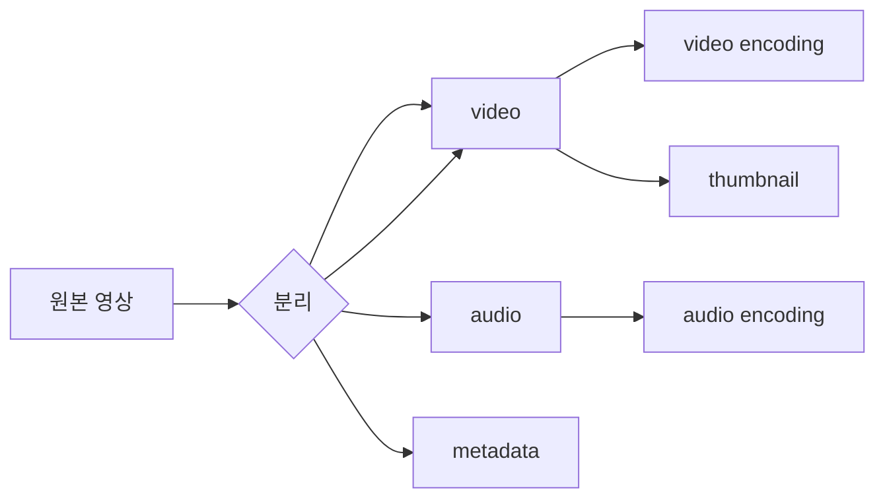

# DAG Task Pipeline (작업 그래프 처리)

## 한 줄 정의

처리 작업을 **방향 비순환 그래프(Directed Acyclic Graph)**의 노드로 정의해, 의존성에 따라 단계별로 순차·병렬 실행하는 처리 모델. 작업 종류가 다양하고 일부는 병렬 가능할 때 유연성과 병렬성을 동시에 얻는다 (ch14, p.230-234).

## 왜 필요한가

비디오 transcoding처럼 **비싸고 작업 구성이 가변적인** 처리를 생각해보자. 어떤 창작자는 워터마크를, 어떤 이는 직접 만든 썸네일을, 어떤 이는 여러 해상도 인코딩을 원한다. 이를 하드코딩하면:

- 새 작업 유형마다 코드 변경.
- 의존 없는 작업도 직렬 실행 → 느림.

DAG로 **"무엇을 어떤 순서로"를 데이터(설정 파일)로 표현**하면, 클라이언트 프로그래머가 파이프라인을 정의하고 시스템은 의존성만 지켜 최대한 병렬 실행한다. Facebook SVE가 이 모델을 쓴다.

## 핵심 메커니즘

작업 예: inspection(품질·malformed 검사), video encoding(해상도·코덱·비트레이트), thumbnail, watermark.

### 아키텍처 (transcoding)

| 컴포넌트 | 역할 |
|---|---|
| **Preprocessor** | GOP 분할, 설정 파일→DAG 생성, 세그먼트 캐시(재시도용 temp storage) |
| **DAG scheduler** | DAG를 단계(stage)별 task로 쪼개 task 큐에 투입 |
| **Resource manager** | task 큐·worker 큐·running 큐 + task scheduler로 최적 task/worker 배정 |
| **Task workers** | DAG에 정의된 작업 실행(워커마다 다른 작업) |
| **Temporary storage** | 메타는 메모리 캐시, 영상/오디오는 blob. 완료 시 해제 |

resource manager 흐름: task 큐에서 최고 우선순위 task → worker 큐에서 최적 worker → 실행 지시 → running 큐 바인딩 → 완료 시 제거.

## 트레이드오프 & 선택 기준

- **유연성·병렬성 vs 복잡도**: DAG 추상화는 강력하나 스케줄러·리소스 관리가 복잡. 작업 구성이 단순·고정이면 과한 설계.
- 우선순위 큐 기반 배정은 자원 효율을 높이나 starvation·공정성 관리가 필요.
- 단계 간 의존을 [[message-queue]]로 끊으면 결합도가 낮아져 병렬성이 올라간다(다음 단계가 이전 단계의 직접 출력을 기다리지 않음).

## 실무 적용 시 고려사항

- DAG 모델은 transcoding 전용이 아니라 **일반 배치/데이터 처리**의 표준(Airflow, Spark DAG, CI 파이프라인)이다.
- 실패 복구: preprocessor가 GOP·메타를 temp storage에 영속화해 재시도 가능. task worker 다운 시 새 worker로 retry.
- 멱등성·재시도가 전제 → [[delivery-semantics]]와 함께 설계.

## 다른 개념과의 관계

- [[video-transcoding]] — DAG가 실행하는 작업의 도메인.
- [[message-queue]]·[[decoupling-with-message-queue]] — 단계 디커플링으로 병렬화.
- [[delivery-semantics]] — task 재시도의 멱등 보장.

## 등장 사례

- ch14 — YouTube 비디오 transcoding 파이프라인
- Facebook SVE — DAG 기반 분산 비디오 처리(원전)
- Apache Airflow/Spark — 범용 DAG 작업 오케스트레이션
