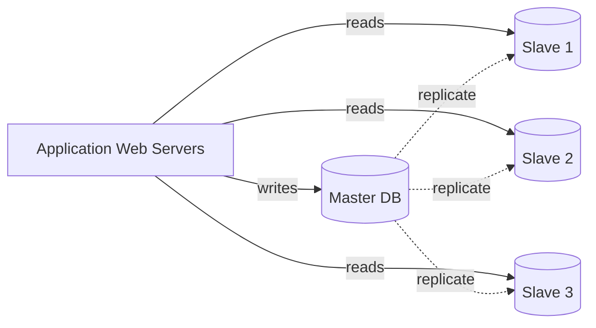

# 데이터베이스 복제 (Database Replication)

## 한 줄 정의

원본 DB(master)의 데이터를 복사본 DB(slave)에 비동기 또는 동기로 동기화해서 읽기 분산·신뢰성·고가용성을 얻는 기법 (ch01, p.20).

## 왜 필요한가

단일 DB 인스턴스는 [[single-point-of-failure]]다. 또한 대부분의 애플리케이션은 **읽기:쓰기 비율이 매우 높아** 모든 쿼리를 한 노드에서 처리하면 금세 병목이 된다 (ch01, p.20).

## 핵심 메커니즘

표준 모델은 **master-slave (1:N)**:

- **master**: 모든 write/insert/update/delete를 받음.
- **slave**: master로부터 변경분을 받아 read 전용으로 서비스. 일반적으로 N개의 slave를 둔다.

장애 처리 (ch01, p.21):

- **slave 다운**: 해당 read 트래픽을 다른 slave 또는 일시적으로 master로 우회. 새 slave 프로비저닝.
- **master 다운**: slave 하나를 master로 승격(promotion). 프로덕션에서는 slave의 데이터가 최신이 아닐 수 있어 데이터 복구 스크립트가 필요하다. multi-master·circular replication은 더 복잡한 대안.

## 트레이드오프

- **장점**: 성능(읽기 병렬화), 신뢰성(지리적 분산 복사본), 가용성(노드 1개 다운에도 서비스).
- **단점**: **복제 지연(replication lag)** — slave가 잠시 stale할 수 있어 read-after-write가 어긋날 수 있음. 일관성 모델 선택이 필요하다.
- master 1개 모델은 **쓰기 확장에는 도움이 안 됨** → [[sharding]]이 필요해진다.

## 실무 적용 시 고려사항

- **복제 지연(replication lag) 측정·알림**: PostgreSQL `pg_stat_replication`, MySQL `Seconds_Behind_Master` 같은 표준 지표를 모니터링. lag이 크면 read replica를 트래픽에서 빼야 한다.
- **Read-after-write 일관성**: "방금 쓴 내가 다시 읽었을 때 보여야 한다"는 일반적 UX 기대. 해법 — ① 짧은 시간 동안 master에서 읽기 ② session affinity ③ write 시 응답에 충분한 데이터 포함.
- **복제 방식 선택**: 비동기(빠르지만 데이터 손실 가능) / 반동기(slave 1개 ack 후 commit) / 동기(가장 안전, 가장 느림). 비즈니스의 RPO에 따라 결정.
- **자동 failover의 위험**: 잘못된 split-brain 회피 로직 없이 자동 promotion하면 데이터 분기 발생. 보통 **외부 합의 시스템**(etcd, Consul, ZooKeeper)이 master를 결정.
- **slave 백업·DDL의 어려움**: 대용량 ALTER TABLE은 replication을 막거나 lag을 폭증시킴. 온라인 DDL 도구(pt-online-schema-change, gh-ost) 필수.
- **멀티 리전 복제**: 비동기가 기본이지만 지역 간 conflict 발생 가능. multi-master는 conflict resolution 정책(LWW, CRDT, app-level merge)이 본질.

## 등장 사례

- ch01 — single DB의 SPOF·읽기 부하 문제 해결책으로 load balancer 도입 직후 등장. [[stateless-web-tier]] 도입 전 단계의 표준 확장 패턴.
- 대부분의 RDBMS([[relational-database]])는 표준 복제 기능을 제공. PostgreSQL streaming, MySQL binlog, Aurora 등.
