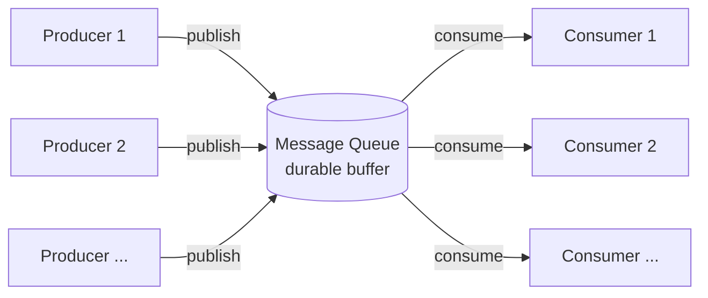

# 메시지 큐로 결합도 낮추기 (Decoupling with Message Queue)

## 한 줄 정의

producer가 메시지를 큐에 publish하고 consumer가 비동기로 consume함으로써 두 측을 시간적·공간적으로 분리하는 패턴 (ch01, p.34).

## 왜 필요한가

동기 호출 구조에서는 producer와 consumer가 **같이 살아 있어야** 작동한다. 둘 중 하나가 느리거나 죽으면 다른 한쪽도 영향 받는다. 또한 함께 묶여 있으면 독립적으로 스케일하기도 어렵다.

## 핵심 메커니즘

- **Producer/publisher**: 메시지를 만들어 큐에 publish.
- **Message queue**: 메모리·디스크에 메시지를 버퍼링하며 내구성(durability) 제공.
- **Consumer/subscriber**: 큐에서 메시지를 꺼내 정의된 동작 수행 (Figure 1-17).

책 예시 (ch01, p.34): 사진 처리 — web server가 작업을 큐에 publish, photo processing worker가 비동기로 처리. 큐가 길어지면 worker 추가, 비면 줄이는 식으로 **producer와 consumer가 독립 스케일**된다.

## 트레이드오프

- **장점**: 시간적 분리(consumer 다운에도 producer 동작), 부하 평탄화(buffer), 독립 스케일.
- **비용**: 추가 인프라(큐 자체의 가용성 관리), 처리 지연 증가, 메시지 중복·순서·정확히-한 번(exactly-once) 같은 분산 의미론 문제. 큐가 새 [[single-point-of-failure]]가 되지 않도록 이중화 필요.
- 동기 응답이 꼭 필요한 흐름엔 부적합.

## 실무 적용 시 고려사항

- **메시지 전달 보장 수준**:
  - **At-most-once**: 중복 없음, 손실 가능. 단순.
  - **At-least-once**: 손실 없음, 중복 가능. **표준** — 그래서 consumer는 idempotent해야 함.
  - **Exactly-once**: 이상적이지만 비싸고 제한적(Kafka transactional producer 등). 대부분은 at-least-once + idempotency로 푸는 게 현실적.
- **Idempotency 설계가 본질**: 메시지에 idempotency key를 박고 consumer는 "이미 처리한 키"를 별도 저장소(Redis SET, DB unique index)로 추적. 비즈니스 로직을 새로 쓸 때 가장 자주 빠지는 부분.
- **DLQ (Dead Letter Queue)**: 반복 실패 메시지를 격리하는 별도 큐. 무한 retry로 큐가 막히는 사고 방지. DLQ 자체 alert·복구 절차 필요.
- **순서 보장의 함정**: 글로벌 순서 보장은 처리량을 죽임. **partition 단위 순서 보장**(같은 사용자/주문 키는 같은 partition)이 표준 절충. Kafka·SQS FIFO 등이 이 모델.
- **큐 적체 모니터링**: 큐 길이, consumer lag, oldest message age. lag이 일정 임계 초과 시 alert. 적체 시 worker scale-out 또는 producer 차단.
- **Backpressure**: producer가 큐를 무한 채우지 않도록 응답 throttle, 또는 큐 full 시 producer 측 차단/스토리지로 폴백.
- **큐 자체 SPOF 회피**: HA 클러스터(Kafka 3+ broker, RabbitMQ mirror) 필수. 큐 다운 시 producer fallback(로컬 disk buffer 또는 동기 처리)도 고려.
- **메시지 스키마 진화**: Avro/Protobuf 같은 schema registry로 forward/backward compatibility 관리. 깨지면 consumer 무한 실패.

## 등장 사례

- ch01 — [[multi-data-center]] 다음 단계. 시스템 컴포넌트를 더 잘게 쪼개 독립 확장하기 위해 도입. 이후 본격 큐 시스템([[message-queue]] 기술 페이지 참조)으로 구체화.
- ch04 — rate limited 요청을 즉시 drop 대신 메시지 큐로 보내 후처리하는 패턴(주문 보존 등).
- 사진 처리·이메일 발송·트랜스코딩·웹훅 전송 등 거의 모든 비동기 백그라운드 작업의 표준 도구.
