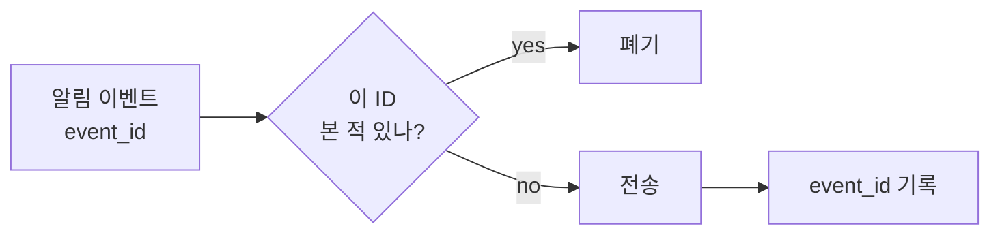

# Delivery Semantics (At-least-once / Exactly-once / Dedupe)

## 한 줄 정의

분산 메시징에서 **메시지가 수신자에게 몇 번 도달하는가**를 규정하는 보장 수준. at-most-once(0~1회), at-least-once(1회 이상), exactly-once(정확히 1회) 셋으로 나뉘며, 실무에서 진짜 exactly-once는 **불가능에 가깝고** at-least-once + dedupe로 근사한다 (ch10, p.157).

## 왜 필요한가

알림 시스템의 제1 요구는 "지연·재정렬은 허용해도 **유실은 불가**"다 (ch10, p.156). 유실을 막으려면 실패 시 재전송(retry)이 필요한데, retry는 필연적으로 **중복**을 만든다. 즉:

- 유실 0을 원하면 → 최소 1회 보장(at-least-once) → 중복 발생.
- 중복 0을 원하면 → 전송을 머뭇거리다 유실 위험(at-most-once).

둘 다 만족하는 exactly-once는 네트워크·노드 장애가 있는 분산 환경에서 **단일 원자 연산으로 보장 불가**(전송과 "전송했다는 기록"이 서로 다른 시스템이라 사이에서 죽으면 모호). 그래서 현실적 답은 **at-least-once를 받아들이고 수신/처리 측에서 중복을 흡수**하는 것이다.

## 핵심 메커니즘

### 세 가지 보장 수준

| 수준 | 의미 | 대가 |
|---|---|---|
| at-most-once | 보내고 잊음(fire-and-forget) | 유실 가능, 중복 없음 |
| **at-least-once** | ack 받을 때까지 retry | 유실 없음, **중복 가능** |
| exactly-once | 정확히 1회 | 분산에선 사실상 불가, 근사만 |

### Dedupe — event ID로 중복 흡수

- 각 이벤트에 고유 ID 부여.
- 처리 전 ID를 본 적 있는지 조회 → 있으면 폐기, 없으면 처리 후 ID 저장.
- 이것이 **idempotency(멱등성)**의 구현: 같은 이벤트를 몇 번 받아도 결과가 한 번 처리한 것과 같다.

### Retry

third-party 전송 실패 시 메시지를 큐에 재투입. 지속 실패하면 alert. retry가 at-least-once를 떠받치는 동시에 중복의 원천이라, dedupe와 항상 짝으로 설계한다.

## 트레이드오프 & 선택 기준

- **금융·결제**: 중복이 치명적(이중 청구) → idempotency key를 강하게(요청자가 생성, 서버가 영속 저장) 적용.
- **알림·로그·메트릭**: 약간의 중복은 감수 가능 → 가벼운 dedupe(TTL 있는 캐시 기반)면 충분.
- dedupe 저장소의 보존 기간이 곧 "중복 탐지 윈도우" — 너무 짧으면 늦게 온 중복을 놓침, 너무 길면 비용.

## 실무 적용 시 고려사항

- "exactly-once delivery"를 표방하는 시스템(Kafka 등)은 대개 **exactly-once processing** — 즉 at-least-once 전달 + consumer 측 멱등/트랜잭션으로 결과를 1회처럼 만든 것이다. 전달 자체의 exactly-once가 아님을 구분해야.
- idempotency key는 클라이언트가 만들어 보내야 retry가 같은 키를 재사용한다(서버 생성이면 retry마다 달라져 무의미).
- dedupe 저장소가 SPOF/병목이 되지 않게 — [[redis]] 같은 빠른 store에 TTL로 두는 게 흔하다.
- [[message-queue]]의 ack/visibility timeout 설정이 중복률을 좌우한다.

## 다른 개념과의 관계

- [[message-queue]] — at-least-once는 큐의 ack 모델에서 나온다.
- [[content-deduplication]] — 같은 "ID/hash로 중복 흡수" 발상의 다른 적용(크롤러 URL Seen?).
- [[decoupling-with-message-queue]] — retry·dedupe가 동작하는 비동기 파이프라인의 전제.

## 등장 사례

- ch10 — 알림 유실 금지(at-least-once) + event ID dedupe
- Kafka — exactly-once *processing* (전달 exactly-once 아님)
- Stripe — idempotency key로 결제 중복 청구 방지
