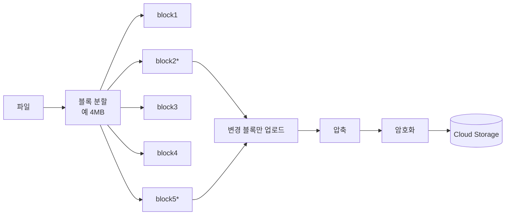

# Delta Sync (블록 단위 동기화)

## 한 줄 정의

파일을 **블록(chunk)으로 쪼개고, 변경된 블록만 전송**해 동기화 대역폭을 최소화하는 기법. 큰 파일을 매번 통째로 보내는 낭비를 없앤다 (ch15, p.252-253). rsync 알고리즘이 이론적 뿌리.

## 왜 필요한가

10GB 파일에서 한 줄만 바뀌어도 전체를 다시 올리면:

- 망 대역폭 폭증(특히 모바일 데이터에서 사용자 불만).
- sync가 느려져 제품 이탈.

파일을 블록으로 나눠 **변경분만** 보내면 전송량이 변경 크기에 비례하게 된다.

## 핵심 메커니즘

1. **분할(chunking)**: 파일을 고정·가변 크기 블록으로. Dropbox는 최대 4MB.
2. **블록 hash**: 각 블록의 hash를 메타 DB에 저장 → 변경 감지·재구성·dedup의 키.
3. **delta 전송**: 변경된 블록만 클라우드로(예 block2·block5).
4. **압축**: 파일 타입별(텍스트는 gzip/bzip2, 이미지·비디오는 다른 알고리즘).
5. **암호화** 후 업로드.
6. **재구성**: 다운로드 시 블록을 순서대로 join.

### 블록 dedup

같은 hash 블록은 동일 → 계정 단위로 중복 블록 제거해 저장 공간 절약([[content-deduplication]]과 같은 hash 기반 발상).

## 트레이드오프 & 선택 기준

- **블록 크기**: 작으면 변경 전송이 정밀하나 메타데이터·hash 오버헤드↑, 크면 그 반대. 4MB는 절충값.
- **고정 vs 가변 분할**: 고정 크기는 단순하나 파일 앞부분에 삽입이 생기면 이후 모든 블록 경계가 밀려 전부 변경으로 보임. 가변(content-defined chunking, rsync rolling hash)은 이를 회피하나 복잡.
- chunking·압축·암호화를 **클라이언트 vs 서버(block server)** 어디서 하느냐 — 서버 중앙화는 플랫폼별 중복 구현·클라이언트 변조 위험을 피하나 전송이 2단계(클라→block server→클라우드).

## 실무 적용 시 고려사항

- 블록 hash는 변경 감지·dedup·무결성 검증을 한 번에 해결하는 핵심 메타데이터.
- 버전 관리와 결합: File_version이 블록 목록을 가리키면 임의 버전을 블록 join으로 재구성([[ch15-google-drive]] 스키마).
- 압축률은 파일 타입 의존 — 이미 압축된 미디어(jpg/mp4)는 재압축 이득이 거의 없어 생략.

## 다른 개념과의 관계

- [[content-deduplication]] — 블록 dedup의 hash 기반 동일 발상.
- [[blob-storage]] — 블록의 저장소.
- [[sync-conflict-resolution]] — delta sync 중 동시 수정이 겹치면 충돌 해소 필요.

## 등장 사례

- ch15 — Google Drive/Dropbox block server의 delta sync + 압축
- rsync/librsync — delta 전송 알고리즘의 원전
- Dropbox — 4MB 블록·content-defined chunking
