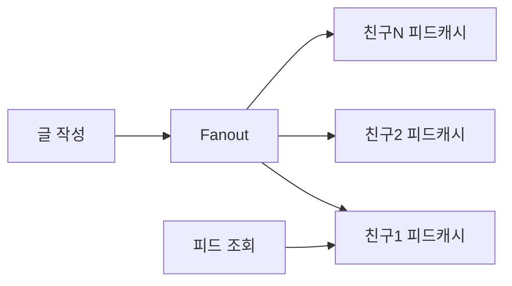

# Fanout (On Write vs On Read)

## 한 줄 정의

한 사용자의 글을 **여러 구독자(친구·팔로워)의 피드에 전달**하는 과정. 전달을 **언제 계산하느냐**에 따라 fanout on write(push)와 fanout on read(pull)로 갈리며, 둘의 트레이드오프가 피드 시스템 설계의 중심축이다 (ch11, p.171-173).

## 왜 필요한가

피드는 본질적으로 "내가 팔로우한 N명의 최신 글을 시간순으로 합친 것"이다. 이 합치기(병합)를 **쓰기 시점에 미리 해둘지, 읽기 시점에 즉석에서 할지**가 성능·비용을 가른다. 사용자 1천만 명 × 친구 5천 명 규모에선 이 선택이 시스템을 좌우한다.

## 핵심 메커니즘

### Fanout on write (push model)

글 작성 즉시 모든 친구의 피드 캐시에 해당 글 ID를 밀어넣는다(사전 계산).

- **Pros**: 피드 조회가 매우 빠름(이미 계산됨), 실시간 전파.
- **Cons**: 친구가 매우 많으면(celebrity) 한 번의 글에 수백만 쓰기 = **hotkey 문제**. 비활성 사용자에게도 미리 계산 → 자원 낭비.

### Fanout on read (pull model)

피드 조회 시점에 친구들의 최근 글을 즉석에서 모아 생성(on-demand).

- **Pros**: 비활성 사용자 자원 낭비 없음, push가 없으니 hotkey 없음.
- **Cons**: 피드 조회가 느림(매번 병합 계산).

### 하이브리드 (실제 채택)

읽기 속도가 중요하므로 **대다수 사용자는 push**, 친구/팔로워가 많은 **celebrity는 pull**(follower가 조회 시 직접 당겨옴)로 과부하 회피. hotkey는 [[consistent-hashing]]으로 요청/데이터를 고르게 분산해 추가 완화.

## 트레이드오프 & 선택 기준

| 기준 | push 유리 | pull 유리 |
|---|---|---|
| 읽기 빈도 | 높음(읽기 최적화) | 낮음 |
| 팔로워 수 | 적음 | 많음(celebrity) |
| 사용자 활성도 | 활성 | 비활성 많음 |
| 쓰기 비용 | 비쌈(N배 증폭) | 저렴 |

핵심 판단: **읽기:쓰기 비율과 fan-out 크기(팔로워 수 분포)**. 분포가 극단적(소수 celebrity + 다수 일반)이라 단일 모델이 안 맞고 하이브리드가 필연.

## 실무 적용 시 고려사항

- push는 **write amplification**(글 1개 → 쓰기 N개)이 본질 비용. celebrity 한 명이 시스템을 마비시킬 수 있어 임계 팔로워 수에서 pull로 전환하는 경계를 둔다.
- 피드 캐시에는 전체 객체가 아니라 **ID만** 저장하고 조회 시 hydrate ([[caching-strategies]]) — push의 메모리 증폭을 줄이는 짝꿍 기법.
- fanout worker는 [[message-queue]] 뒤에서 비동기 처리 → 작성 응답을 막지 않음. 전달 보장은 [[delivery-semantics]].
- 정렬이 시간순이 아니라 ranking(ML score)으로 가면 pull/하이브리드 비중이 커진다 — 사전 계산이 무의미해지므로.

## 다른 개념과의 관계

- [[consistent-hashing]] — hotkey/celebrity 데이터를 분산.
- [[caching-strategies]] — push 결과(피드 ID)를 담는 캐시 계층.
- [[message-queue]]·[[delivery-semantics]] — fanout 비동기 파이프라인.
- [[graph-database]] — fanout 대상(친구 ID)을 조회하는 소스.

## 등장 사례

- ch11 — Facebook/Instagram/Twitter 피드의 push/pull 하이브리드
- Twitter — 일반 사용자 push + 유명인 pull의 대표 사례(역사적으로 timeline fanout 문제로 유명)
