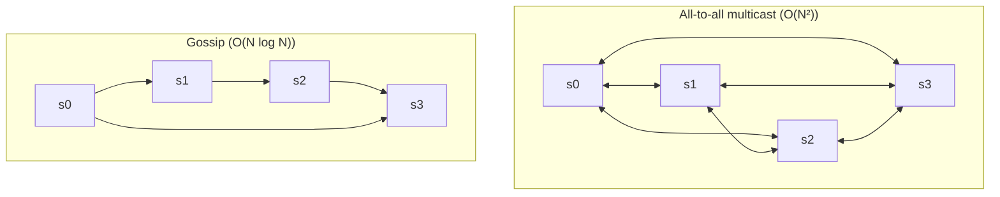

# Gossip Protocol (소문 프로토콜)

## 한 줄 정의 / 동기

각 노드가 **소수의 랜덤 노드**에게 자신·타 노드의 상태를 주기적으로 전파해, 결과적으로 클러스터 전체가 멤버십·장애 정보를 공유하도록 만드는 분산 통신 패턴 (ch06, p.106-107). all-to-all multicast의 O(N²) 비용을 피하고도 정보가 클러스터 전체에 **지수적으로 확산**(epidemic)된다.

## 왜 필요한가

분산 시스템에서 한 노드의 down 여부를 단독 판정하면 false positive가 잦다 (네트워크 일시 끊김 등). ch06이 명시하듯 "한 서버가 다른 서버를 down이라 단정하기엔 불충분 — 최소 2개의 독립 소스가 필요" (p.105).



All-to-all은 노드 수가 늘면 메시지 폭증. Gossip은 각 노드가 매 라운드 k개 랜덤 노드에만 전파해도 정보가 클러스터 전체에 빠르게 퍼진다 (감기 확산과 같은 모델).

## 동작

ch06 (p.106)의 단순 모델:

```
각 노드 N:
  membership_list = { (memberId, heartbeat_counter, last_seen_time), ... }

  주기적으로 (예: 1초):
    1. 자신의 heartbeat_counter += 1
    2. membership_list를 랜덤 k개 노드에 전송
    3. 다른 노드로부터 받은 membership_list를 자신 것과 머지
       - 각 memberId에 대해 더 큰 heartbeat_counter·더 최근 time 채택

  주기적으로 (예: 5초):
    for each member m in membership_list:
      if now - m.last_seen_time > threshold (예: 30초):
        m을 offline으로 표시
```

### 예시 (ch06 Figure 6-11)

```
s0의 membership list:
| ID | heartbeat | time     |
|----|-----------|----------|
| 0  | 10232     | 12:00:01 |
| 1  | 10224     | 12:00:10 |
| 2  | 9908      | 11:58:02 | ← heartbeat 정지
| 3  | 10237     | 12:00:20 |
| 4  | 10234     | 12:00:34 |

s0: "s2의 heartbeat이 오랫동안 증가 안 함 → 의심"
→ 다음 gossip 라운드에 s2 정보를 다른 노드에 전파
→ 여러 노드가 같은 판단 도달 → s2 down으로 합의
```

## 파라미터 · 튜닝 포인트

| 파라미터 | 영향 |
|---|---|
| **gossip 주기 T** | T↓ → 정보 전파 빠름, 네트워크 부하↑. 보통 0.5~1초. |
| **fan-out k** | k↑ → 전파 속도↑, 부하↑. 보통 1~3. |
| **failure threshold** | 너무 짧으면 false positive, 너무 길면 dead node 오래 살아있다고 인식. 보통 10초~수분. |
| **suspicion mechanism** | down 판정 전 "의심" 단계를 두는 변형 (SWIM 프로토콜) |
| **anti-entropy 빈도** | gossip은 휘발성. 누락 보강용으로 주기적 full sync 별도 실행. |

## 트레이드오프

**Pros**
- **확장성**: O(log N) 전파 시간, O(1) per-node 부하.
- **장애 내성**: 일부 노드가 down돼도 정보 흐름 유지.
- **간단한 구현**: 중앙 coordinator 없음.

**Cons**
- **수렴이 즉시가 아님**: 정보가 클러스터 전체에 퍼지는 데 수 초~수십 초.
- **False positive 가능성**: 일시적 네트워크 지연을 down으로 오인.
- **메타데이터 크기**: membership_list 크기는 클러스터 크기에 비례.
- **두 노드가 잠시 서로 모순된 view**: 결국 수렴하지만 그 동안 운영상 혼란.

## 다른 멤버십·탐지 기법과의 위치

| 기법 | 확장성 | 정확도 | 비고 |
|---|---|---|---|
| **Centralized (ZooKeeper)** | 낮음 (중앙 의존) | 높음 | 강한 일관성, leader 의존 |
| **All-to-all heartbeat** | O(N²) | 빠름 | 소규모만 |
| **Gossip** | O(N log N) | 수 초 수렴 | 본 페이지 |
| **SWIM** | gossip + 의심 단계 | 더 정확 | Hashicorp Serf, Consul 채택 |
| **Phi Accrual** | gossip + 확률적 탐지 | 매우 정확 | Cassandra 채택 |

## 실무 적용 시 고려사항

- **단순 heartbeat counter는 시계 동기화 필요 없음** — 단조 증가만 보면 됨. NTP에 의존 안 해서 좋다.
- **Bootstrap node 정책**: 새 노드가 클러스터에 합류할 때 seed node 목록이 있어야 첫 gossip 가능. seed는 보통 3~5개를 DNS·config로 제공.
- **장애와 떠난(graceful exit) 구분**: gossip로 down 판정과 사용자 결정의 노드 제거는 별도. tombstone으로 명시.
- **메시지 압축**: membership_list가 커지면 gossip 페이로드가 커짐. delta gossip(변경분만)·push-pull 방식 사용.
- **모니터링**: gossip lag, false positive rate, suspect 노드 수 — 운영 핵심 지표.
- **partition healing 후 reconciliation**: 네트워크 파티션 시 양쪽이 서로 다른 멤버십 view를 가짐. 복구 후 머지 정책 필요.
- **gossip + anti-entropy 조합**: gossip은 휘발성 정보 전파, anti-entropy([[merkle-tree]])는 영구 데이터 동기화. 역할 분리.

## 다른 개념과의 관계

- [[cap-theorem]] — 분산 합의 없이 멤버십 정보를 퍼뜨리므로 본질적으로 eventual.
- [[sloppy-quorum-hinted-handoff]] — gossip이 탐지한 down 노드를 우회.
- [[merkle-tree]] — gossip은 멤버십, merkle tree는 데이터 동기화. 둘 다 anti-entropy 계열.
- [[multi-data-center]] — DC 간 gossip은 latency 문제로 별도 정책 필요 (예: rack-aware gossip).

## 등장 사례

- ch06 — KV store의 failure detection 표준 기법.
- **Apache Cassandra** — Phi Accrual + gossip으로 노드 멤버십 관리.
- **Amazon Dynamo** — gossip-based membership protocol.
- **Hashicorp Consul/Serf** — SWIM 변형으로 멤버십·서비스 디스커버리.
- **Redis Cluster** — 노드 간 gossip으로 슬롯·장애 정보 전파.
- **Bitcoin** — 트랜잭션 전파에 gossip 사용 (P2P 네트워크).

## 면접 관점 메모

- "노드 장애 어떻게 탐지?" 답에 **all-to-all의 O(N²) 문제 → gossip의 O(N log N)** 을 한 줄로 비교하면 +.
- false positive 방지를 위해 **다중 source 합의**가 필요하다는 점 언급 가능.
