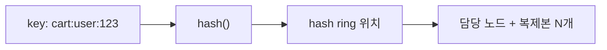

# 키-값 데이터 모델링 (Key-Value Data Modeling)

## 한 줄 정의

KV store는 값(value)을 **불투명한 덩어리(opaque object)**로만 다루므로, 데이터의 소유·관계·접근 단위를 전부 **키(key) 이름에 인코딩**해 설계한다. "쿼리 패턴이 키 설계를 결정한다."

## 왜 필요한가

[[cap-theorem]]·[[quorum-consensus]]·[[vector-clock]] 같은 ch06의 페이지들은 모두 **분산 메커니즘**(어떻게 쪼개고·복제하고·일관성을 맞추나)을 다룬다. 하지만 그 위에서 **"실제 데이터를 어떻게 모델링할 것인가"**는 별개의 문제다.

[[relational-database]]는 `WHERE`·`JOIN`·인덱스로 데이터를 **여러 각도에서** 질의할 수 있다. 모델(테이블)을 먼저 정규화해두면 쿼리는 나중에 자유롭게 짠다. KV store에는 그게 **전부 없다.** API는 사실상 `get(key)` / `put(key, value)` 둘뿐이고, value 내부는 DB가 들여다보지 않는다. 따라서 "이 데이터를 어떻게 꺼내 쓸 것인가(접근 패턴)"를 **먼저** 정한 뒤, 그 패턴에 맞는 키를 디자인해야 한다. KV에서 **키 설계 = 스키마 설계**다.

## 핵심 메커니즘

### 1. Value는 opaque object

`opaque(불투명)`는 DB가 값의 속을 **해석하지 않는다**는 뜻이다. value에 JSON을 넣든 직렬화된 객체를 넣든, DB 눈엔 그냥 바이트 덩어리다.

```
"cart:user:123" → {"items":[{"product_id":"A","qty":2}, ...]}   ← DB가 보는 건 바이트열
```

결과:
- **값 내부 기준 쿼리 불가** — "상품 A가 담긴 장바구니 전부" 같은 건 못 한다(그건 [[relational-database]]나 검색엔진의 일).
- 대신 스키마 검증·파싱·인덱싱 오버헤드가 없어 **단순·고속·확장 친화적**. 불투명성은 KV의 약점이자 곧 속도·확장성의 원천 — 같은 동전의 양면.

### 2. 소유자·관계를 키에 인코딩

RDB가 `user_id` 컬럼 + `WHERE user_id = 123`으로 표현하는 소유 관계를, KV는 **키 문자열에 박아 넣는다.**

```
RDB:  SELECT * FROM carts WHERE user_id = 123
KV:   get("cart:user:123")
```

키 네이밍 컨벤션(흔히 `엔티티:타입:식별자` 형태)이 사실상 데이터 모델이 된다:

```
cart:user:123          유저 123의 장바구니
session:abc-xyz        세션 abc-xyz (비로그인 게스트)
profile:user:123       유저 123 프로필
post:42:comments       포스트 42의 댓글 묶음
```

### 3. 키가 곧 파티셔닝 단위

키를 [[consistent-hashing]] 링에 넣으면 특정 노드(+복제본 N개)로 결정된다. 즉 **키 설계가 곧 데이터 배치(locality)와 [[sharding]] 단위**를 결정한다.



- `cart:user:123`은 항상 같은 노드에 산다 → 한 유저의 읽기/쓰기가 한 곳에서 처리(원자성·locality 확보).
- 유저별 데이터가 자연스럽게 독립 → JOIN이 없으니 샤딩해도 잃을 게 없다. 노드를 추가하면 그냥 용량이 는다.

### 4. 복합 키와 비정규화

RDB의 JOIN이 없으므로, 함께 읽는 데이터는 **함께 저장(비정규화)**하거나, 복합 키로 묶는다.

- 함께 읽는 것 묶기: 유저+장바구니+최근주문을 한 value에 담아 한 번에 `get`.
- 데이터 중복을 감수: 같은 정보가 여러 키에 복제된다. **업데이트 시 일관성 유지는 애플리케이션 책임** — 누락이 흔한 버그다([[nosql-database]] 실무 함정과 동일).

## 트레이드오프 & 선택 기준

| | 키 인코딩 모델 (KV) | 컬럼/관계 모델 (RDB) |
|---|---|---|
| 소유·관계 표현 | 키 이름 (`cart:user:123`) | 컬럼·외래키·JOIN |
| 쿼리 유연성 | 키를 알 때만. 한 축 | 여러 축, 임의 조건 |
| 모델링 순서 | **접근 패턴 먼저 → 키 설계** | 모델(정규화) 먼저 → 쿼리 나중 |
| 확장 | 키가 곧 샤드 → 수평 확장 공짜 | 샤딩 시 cross-shard JOIN 고통 |
| 모델 변경 비용 | 큼 (접근 패턴 바뀌면 키 재설계·마이그레이션) | 상대적으로 유연 |

**KV 모델링이 맞는 경우**: 접근이 "키로 한 개 꺼내기"로 끝나고(세션·프로필·장바구니·카운터), 규모가 크며, 잠깐의 불일치를 견딜 수 있을 때. 하나라도 어긋나면(임의 조건 검색·집계·강한 트랜잭션 필요) [[relational-database]]부터 의심.

**핵심 경고**: NoSQL은 "query-driven design"이다. 접근 패턴을 잘못 잡고 키를 설계하면, 나중에 새 쿼리 패턴이 생겼을 때 마이그레이션이 매우 어렵다. RDB처럼 "일단 정규화해두고 쿼리는 나중에"가 통하지 않는다.

## 실무 적용 시 고려사항

- **키 네이밍 컨벤션을 먼저 문서화** — `엔티티:타입:식별자`처럼 팀 전체가 따르는 규칙. 일관성이 곧 운영성.
- **게스트→로그인 머지**: 비로그인은 `session:abc`, 로그인 후 `cart:user:123`으로 합친다. 이 "합치기"가 ch06 [[vector-clock]] 충돌 해결의 실제 사례 — Dynamo는 갈라진 두 장바구니를 **합집합으로 머지**한다(그래서 "삭제한 상품이 되살아나는" 부작용으로도 유명).
- **Hot key 주의**: 특정 키(예: 인기 상품, 글로벌 카운터)에 트래픽이 몰리면 그 키를 담당하는 한 노드가 폭주. 키 prefix 분산·복제·로컬 캐시로 완화([[consistent-hashing]]의 bounded loads, [[nosql-database]]의 hot partition).
- **값 크기 상한**: opaque value가 무한정 커지면(예: 장바구니에 수천 아이템) 한 번의 read/write가 무거워진다. 큰 컬렉션은 페이지네이션 키(`post:42:comments:page:3`)로 쪼갠다.
- **값 안의 스키마는 결국 코드에 산다**: DB가 강제하지 않으므로 애플리케이션 레벨 검증·버전 필드가 필요. "schema-less ≠ schema-free".

## 다른 개념과의 관계

- [[consistent-hashing]] — 키를 노드로 매핑하는 메커니즘. 키 설계가 곧 파티셔닝·locality를 결정.
- [[quorum-consensus]] / [[vector-clock]] — 키 단위로 복제·일관성·충돌 해결이 일어난다. 모델링은 이 메커니즘 "위에서" 데이터를 어떻게 배치할지의 문제.
- [[nosql-database]] — query-driven design·비정규화·hot partition 등 일반론의 KV 특화 버전.
- [[relational-database]] — 정반대 철학(관계·JOIN·임의 쿼리). 둘을 데이터 종류별로 나눠 쓰는 게 polyglot persistence.

## 등장 사례

- ch06 — Dynamo/Cassandra식 KV store 설계의 데이터 모델 측면. 책은 분산 메커니즘에 집중하지만, 장바구니 예제가 키 인코딩·opaque value·충돌 머지를 관통한다.
- Amazon Dynamo — 장바구니 서비스가 원조 사례. user별 독립 키 + AP(항상 담기 가능) + 충돌은 합집합 머지.
- Redis — `session:*`, `cart:*`, 레이트리미터 카운터 등 키 네이밍 컨벤션이 사실상 스키마로 쓰이는 전형.

## 면접 관점 메모

"NoSQL로 X를 설계하라"가 나오면 테이블이 아니라 **접근 패턴 → 키 설계**부터 말한다. "이 데이터를 어떤 키로 읽고 쓰나"를 먼저 정의하면 파티셔닝·핫키·일관성 논의가 자연스럽게 따라온다.
