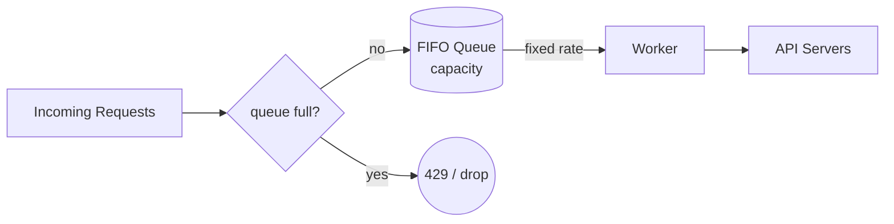

# 누출 버킷 알고리즘 (Leaking Bucket Algorithm)

## 한 줄 정의 / 동기

요청을 FIFO 큐에 적재하고 **일정 outflow rate로 처리**해 다운스트림에 흘러가는 트래픽을 평탄화하는 처리율 제한 알고리즘 (ch04, p.62). 토큰 버킷이 입력의 버스트를 흡수해 통과시키는 반면, 누출 버킷은 **출력의 속도를 고정**한다. Shopify가 채택.

## 동작



```
queue = FIFO with size = capacity
outflow_rate = N requests/sec

on request:
    if queue.size < capacity:
        queue.push(request)
    else:
        drop(request)       # 큐 가득 → 429

# 워커 (백그라운드)
every 1/outflow_rate seconds:
    if not queue.empty():
        req = queue.pop()
        forward(req)
```

큐가 가득 차면 신규 요청을 거절. 워커는 일정 간격으로 큐에서 꺼내 처리하므로 **다운스트림이 보는 RPS는 항상 ≤ outflow_rate**.

## 파라미터 · 튜닝 포인트

| 파라미터 | 의미 | 튜닝 방향 |
|---|---|---|
| `capacity` | 큐 길이 (= 흡수 가능한 버스트 크기) | 다운스트림이 회복할 시간을 고려해 충분히 |
| `outflow_rate` | 초당 처리율 | 다운스트림이 안정적으로 처리 가능한 상한 |

큐 길이가 길면 burst 흡수에 좋지만 **대기 지연이 길어진다**. 클라이언트 SLA(예: 500ms 응답 기한)와 큐 길이 사이 트레이드오프.

## 트레이드오프

**Pros**
- 큐 크기로 메모리 상한이 명확.
- **일정 outflow** 보장 — 다운스트림이 안정.
- 트래픽 shaping 본연의 의미와 가장 가깝다.

**Cons**
- 버스트가 큐를 채우면 **그 안의 오래된 요청을 처리하느라 최근 요청이 차단**될 수 있음. 최신 요청 입장에선 손해.
- 큐 대기로 인한 **응답 지연 증가** — latency-sensitive 서비스엔 부적합.
- 워커가 죽거나 느리면 큐가 적체되며 전체가 막힘.

## 다른 알고리즘과의 위치

- [[token-bucket-algorithm]] — 입력 버스트 허용, outflow 가변. 누출 버킷과 반대 방향의 평탄화.
- [[fixed-window-counter-algorithm]] / [[sliding-window-log-algorithm]] / [[sliding-window-counter-algorithm]] — 모두 **카운터 기반 차단** 방식. 누출 버킷은 **큐잉 기반 평탄화** — 결이 다르다.

큐잉 vs drop의 본질적 차이가 누출 버킷의 정체성.

## 실무 적용 시 고려사항

- **다운스트림 capacity와 합의가 필수**: outflow_rate는 다운스트림이 지속적으로 처리 가능한 값. 일시 처리량이 아니라 sustained capacity 기준으로 잡아야 함.
- **큐 구현**: 메모리 큐는 SPOF — 영속 큐([[message-queue]] Kafka 같은) 위에 얹으면 신뢰성 ↑.
- **대기 시간 모니터링**: 큐 길이만 보면 안 됨, **wait time p50/p95/p99**를 함께 봐야 사용자 경험 보호.
- **timeout과의 상호작용**: 클라이언트 timeout이 큐 대기 시간보다 짧으면 요청이 처리되지 않고도 자원만 소모. timeout 정책과 일관성 유지 필요.

## 등장 사례

- ch04 — 두 번째 알고리즘. Shopify의 rate-limiting 채택.
- 네트워크 트래픽 shaping의 고전적 알고리즘. ATM·QoS 정책에서도 사용.
- [[message-queue]] 위에서 worker가 일정 속도로 consume하는 구조도 같은 직관 — "메시지 큐 + 워커 풀"이 사실상 누출 버킷.
