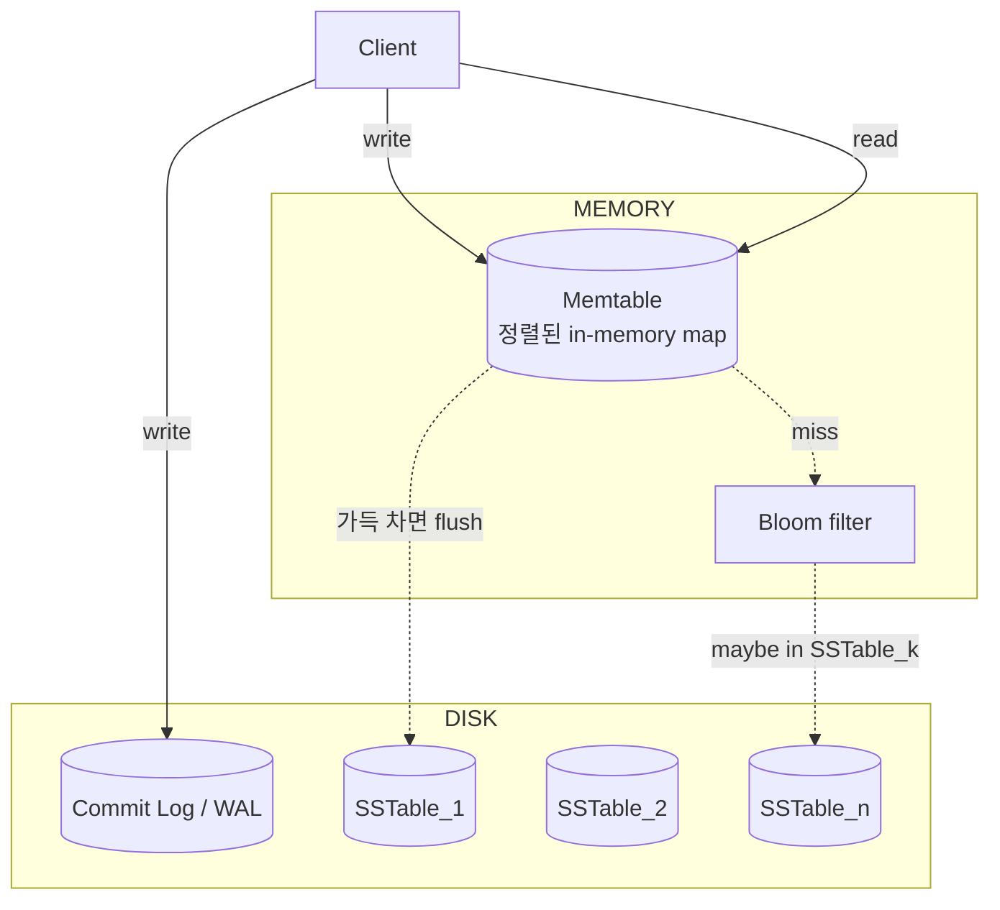

# LSM Tree 기반 Storage Engine

## 한 줄 정의 / 동기

**Log-Structured Merge tree**: 모든 쓰기를 메모리 자료구조(memtable)에 받아두고, 가득 차면 디스크에 **immutable한 정렬 파일(SSTable)** 로 flush. 디스크 쓰기는 항상 **sequential append**만 발생시켜 write 성능을 극대화한 storage engine 아키텍처 (O'Neil et al. 1996, LevelDB/Cassandra/BigTable 채택) (ch06, p.112-114).

## 왜 필요한가

전통적 B-tree 기반 storage(InnoDB, PostgreSQL)는 **random in-place update** 비용이 크다. 디스크는 sequential I/O가 random보다 100~1000배 빠르다. 대용량 write-heavy 워크로드(시계열, KV, 로그)에선 이 차이가 결정적.

LSM의 핵심 아이디어:
- 쓰기는 모두 **sequential append** (commit log + SSTable flush).
- 정렬·머지는 **백그라운드 compaction**으로 분리.
- 읽기는 약간 복잡해지지만 [[bloom-filter]]로 디스크 seek 폭증 방지.

## 동작

### 컴포넌트



### Write path (ch06, p.112-113)

```
1. Commit log에 write 기록 (sequential append, fsync)
   → 크래시 복구용 durability.
2. Memtable에 (key, value) 삽입
   → 정렬 자료구조 (skip list, red-black tree).
3. Memtable 크기가 threshold 도달:
   a. Memtable을 immutable로 마크.
   b. 새 memtable 시작.
   c. 백그라운드에서 immutable memtable을 SSTable로 sequential flush.
   d. flush 완료 후 해당 commit log 부분 회수.
```

### Read path (ch06, p.113-114)

```
1. Memtable 조회 → 있으면 반환.
2. (없으면) 각 SSTable에 대해:
   a. Bloom filter 확인 → "없음" 단정 가능하면 skip.
   b. 가능성 있으면 SSTable index lookup → disk read.
3. 가장 최신(가장 최근 SSTable의) 값을 반환.
```

### SSTable 구조

**S**orted **S**tring **T**able — 디스크에 저장된 정렬된 (key, value) 쌍의 immutable 파일 (BigTable paper, Cassandra 차용).

```
SSTable file:
  - Data block: 정렬된 (key, value) 페어들
  - Index block: 키 → data block 오프셋
  - Bloom filter: 빠른 멤버십 확인
  - Footer/metadata
```

Immutable이라 **동시 read는 lock-free**, 변경은 새 SSTable + compaction.

### Compaction

여러 SSTable이 쌓이면:
- 같은 키의 여러 버전이 흩어짐 → read 비용↑.
- 디스크 공간 낭비.
- → 백그라운드에서 **여러 SSTable을 merge·deduplicate**해 새 SSTable로 재작성. (Compaction)

**Compaction 전략:**
- **Size-tiered (Cassandra default)**: 비슷한 크기의 SSTable을 묶어 머지. write-heavy 친화.
- **Leveled (LevelDB, RocksDB)**: 레벨별로 크기 한도. read·space 친화, write amplification↑.
- **Time-windowed**: 시계열 데이터용.

## 파라미터 · 튜닝 포인트

| 파라미터 | 영향 |
|---|---|
| **Memtable size** | 크면 flush 적음·write 효율↑, 작으면 메모리·복구 시간↓ |
| **Compaction 전략** | size-tiered vs leveled — read/write/space 트레이드오프 |
| **Compaction throughput throttle** | 너무 빠르면 I/O 경합, 느리면 SSTable 누적 |
| **Bloom filter false positive rate** | 낮을수록 read 효율↑, 메모리↑. 보통 1% |
| **Block size** | 큰 block은 throughput↑, 작은 block은 latency↓ |
| **WAL fsync 정책** | sync per write (안전·느림) vs batch (빠름·약간의 손실 위험) |

## 트레이드오프

**Pros**
- **Sequential write**: 디스크 I/O 효율 극대화. SSD에선 write amplification↓·수명 연장.
- **Immutable SSTable**: lock-free read, snapshot·backup 단순.
- **Compression 친화**: 정렬된 데이터는 압축률 높음.
- **Write throughput**: B-tree 대비 수 배~수십 배.

**Cons**
- **Read amplification**: 여러 SSTable + bloom filter + index lookup → B-tree보다 read 비쌈.
- **Compaction overhead**: 백그라운드 부하·I/O bandwidth 소비.
- **Tombstone 문제**: delete는 "삭제 마커" 기록. compaction 전까진 디스크 공간 미회수.
- **Tail latency 불안정**: compaction 중인 SSTable이 read 경로면 P99 latency↑.

## 다른 storage engine과의 위치

| 엔진 | Write | Read | 활용 |
|---|---|---|---|
| **B-Tree** | random update 비싸 | 빠른 indexed read | OLTP, MySQL InnoDB, Postgres |
| **LSM Tree** | sequential append (빠름) | 느림 (bloom·index 보강) | KV, 시계열, Cassandra·RocksDB |
| **Heap + index** | 단순 | 인덱스 의존 | 일반 RDBMS table |
| **Log-only (Kafka)** | 가장 빠름 | scan만 | 메시지 큐, 이벤트 로그 |
| **Hash table** | O(1) | O(1) | 인메모리 Redis, 단순 KV |

## 실무 적용 시 고려사항

- **워크로드 매칭**: write:read 비율이 높을수록 LSM 유리. 90% read인 워크로드는 B-tree가 나을 수도.
- **Compaction은 적이 아니라 비용**: 모니터링 필수 지표. compaction queue depth, pending bytes, throughput.
- **Tombstone GC tuning**: TTL 짧으면 compaction이 충분히 지운 후 삭제. delete-heavy 워크로드에서 tombstone 누적 주의.
- **Bloom filter 메모리 관리**: 모든 SSTable이 bloom filter를 메모리에 들고 있어야 read 효율. 데이터 1TB면 bloom 수 GB.
- **WAL의 disk와 SSTable disk 분리**: WAL은 sequential·항상 디스크 끝까지. SSTable은 random read. 가능하면 별도 디바이스.
- **Read latency 변동**: compaction 진행 중 P99 latency 튐. background priority 조절.
- **Snapshot·backup**: SSTable이 immutable이라 hard-link으로 즉시 snapshot 가능 — Cassandra의 `nodetool snapshot`.
- **disk full 위험**: compaction 중에는 일시적으로 디스크 사용량이 2배 가까이 됨 — 여유 공간 30%+ 확보.

## 다른 개념과의 관계

- [[bloom-filter]] — LSM read path 핵심 보조 자료구조.
- [[caching-strategies]] — memtable·OS page cache가 hot data를 빠르게 응답.
- [[database-replication]] — LSM 단독은 단일 노드. 분산 KV에선 replication과 결합.
- [[merkle-tree]] — replica 간 SSTable 동기화는 anti-entropy 기법.
- [[consistent-hashing]] — LSM storage 위에 sharding 계층.

## 등장 사례

- ch06 — Cassandra write/read path의 직접 모델 (paper [8]).
- **Google BigTable** — SSTable의 원조 (paper [6]).
- **Apache Cassandra** — SSTable + memtable + commit log + tombstone.
- **LevelDB / RocksDB** — Google·Facebook의 임베디드 KV (RocksDB는 leveled compaction).
- **HBase** — BigTable 클론.
- **InfluxDB·Prometheus TSDB** — 시계열용 LSM 변형.
- **AWS DynamoDB** — 내부 storage engine은 LSM 기반으로 알려짐.

## 면접 관점 메모

- "왜 random write보다 sequential write가 빠른가?" — HDD seek time / SSD write amplification 한 줄 설명할 수 있어야.
- "compaction의 비용은?" — read amplification·write amplification 둘 다 언급하면 +.
- B-tree와의 비교 표는 외워두면 강력.
