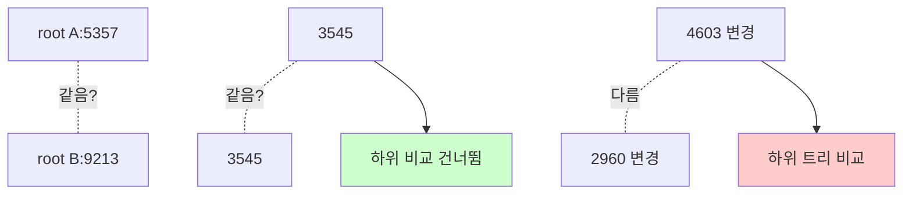

# Merkle Tree (해시 트리)

## 한 줄 정의 / 동기

각 leaf가 데이터 블록의 해시이고 상위 노드가 자식 해시들의 해시인 **이진(또는 다진) 트리**. 두 replica의 root hash만 비교해서 같으면 데이터 동일, 다르면 트리를 내려가며 **차이 나는 부분만** 동기화하는 anti-entropy 자료구조 (Ralph Merkle, 1979) (ch06, p.109-111).

## 왜 필요한가

[[sloppy-quorum-hinted-handoff]]는 짧은 down은 처리하지만, **영구 장애·장기 누락**은 보강 못 한다. Replica 간 데이터를 다시 맞추려면:

- **단순 비교**: 모든 키 전송 → 비용 폭증 (billion key면 무리).
- **Merkle tree**: 차이 나는 부분만 정확히 찾아 전송 → **차이에 비례하는 비용**.

→ Anti-entropy(엔트로피 = 무질서; 감쇠시키는 protocol) 의 핵심 자료구조.

## 동작

ch06 (p.109-111)의 4단계:

### Step 1: 키 공간을 버킷으로 분할

키 1~12를 4개 버킷으로 나눔:
```
[1,2,3] [5,6] [7,8,9] [10,11,12]
```

각 버킷은 trim된 leaf 모음. 깊이 제한용.

### Step 2: 버킷 내 각 키를 해시

```
1→2343, 2→1456, 3→9865, 5→2145, 6→7456, 7→9654, 8→1356, 9→4358 ...
```

### Step 3: 버킷별 hash 노드 생성

각 버킷 안 키 해시들을 모아 다시 한 번 해시 → 버킷 hash.
```
bucket0: 6901
bucket1: 6773
bucket2: 8601  (← 8의 값이 server2와 다름)
bucket3: 7812
```

### Step 4: 상위 트리 구축

```
       root: 5357
        /        \
     3545        4603
     /  \        /  \
  6901  6773 [8601] 7812
   |     |    |     |
  bucket bucket bucket bucket
```

### 비교 알고리즘

```
compare(treeA, treeB):
  if A.root_hash == B.root_hash: return identical
  if A is leaf and B is leaf:
    return diff = bucket의 키 단위 비교
  recurse(A.left, B.left) + recurse(A.right, B.right)
```



루트만 같으면 → O(1)로 동일성 판단.
다르면 → 차이 나는 가지만 따라 내려가 차이 나는 버킷·키만 동기화.

## 파라미터 · 튜닝 포인트

| 파라미터 | 영향 |
|---|---|
| **버킷 수** | 많을수록 정확한 위치 추적·메모리↑. 보통 백만 단위 (10억 키 / 1000 키 per bucket). |
| **트리 분기 수** | 2진 vs n진. 분기↑ → 트리 얕음·각 노드 부피↑. |
| **해시 함수** | MD5·SHA-1 등. 충돌 가능성·계산 비용 트레이드오프. |
| **재구축 빈도** | 매 write마다 갱신은 비용. 보통 백그라운드 주기적. |
| **압축** | 트리 자체를 전송할 때 메타데이터 압축. |

## 트레이드오프

**Pros**
- **차이에 비례한 동기화 비용**: 1% 차이면 1%만 전송.
- **root hash 한 번 비교로 95% 케이스 O(1) 종료** (동일 시).
- **암호학적 검증 보너스**: leaf까지 hash chain이라 위변조 감지에도 사용.

**Cons**
- **메모리·계산 비용**: 트리 구축·유지 부담.
- **변경 빈번 시 갱신 비용 폭증**: write-heavy 시스템에선 다른 anti-entropy도 검토.
- **트리 buckets의 hash가 갱신되어야 root 갱신**: 한 키 변경에 log N 노드 갱신.
- **bucket 내부의 미세한 차이는 결국 키 단위 비교 필요** — 버킷 크기 조정 중요.

## 다른 anti-entropy 기법과의 위치

| 기법 | 비용 | 활용 |
|---|---|---|
| **Full scan compare** | O(N) 전송 | 작은 데이터셋 |
| **Bloom filter compare** | O(N) hash 비교 (false positive) | 빠른 1차 필터 |
| **Merkle tree** | O(diff) 전송 + O(log N) 탐색 | 본 페이지, 표준 |
| **Read repair** | 자동 (read 부산물) | 미세 불일치 점진 보정 |
| **Last-write-wins per row** | 단순 timestamp | 정밀도 낮음 |

→ 보통 read repair (실시간) + Merkle tree (주기적)을 함께 운영.

## 실무 적용 시 고려사항

- **버킷 크기 설계**: bucket이 작아야 충돌 시 전송량 작음. 그러나 작으면 트리 깊이↑·메모리↑. ch06 예시: 10억 키 / 100만 bucket = 1000 키/bucket.
- **변경 빈번한 키 vs 잘 안 변하는 키 분리**: hot bucket은 항상 다르게 보일 수 있어 anti-entropy 효과 떨어짐.
- **압축·delta sync**: 차이 나는 키 전송 시 압축·delta encoding으로 추가 절감.
- **rate-limited repair**: 한 번에 동기화하면 네트워크·디스크 부하 폭증. throttle 필수.
- **schedule 운영**: 보통 저트래픽 시간대(야간) 또는 노드 합류·복귀 시점 트리거.
- **incremental build**: 매 write마다 트리 전체 재계산은 무리. 영향 받은 leaf→root 경로만 갱신.
- **disk vs memory 균형**: 매우 큰 데이터는 트리 자체도 디스크에 저장. 비교 시 일부만 메모리에.
- **모니터링**: anti-entropy 실행 빈도, 동기화 데이터량, repair 실패율.

## 다른 곳에서의 Merkle Tree 활용

본 페이지는 분산 KV 맥락이지만, Merkle tree는 **모든 효율적 데이터 무결성 검증** 영역의 기초:

- **Bitcoin/블록체인**: 블록 내 트랜잭션 무결성 — root만 블록 헤더에 저장, 검증은 path만 보면 됨 (SPV).
- **Git**: object tree가 사실상 Merkle tree. 커밋 해시 chain.
- **IPFS·CDN**: 콘텐츠 주소 검증.
- **Certificate Transparency**: 인증서 로그의 무결성.
- **Cassandra/Dynamo/Riak**: 본 페이지.

## 다른 개념과의 관계

- [[sloppy-quorum-hinted-handoff]] — 임시 장애 회복 후 누락된 데이터를 anti-entropy로 보강.
- [[gossip-protocol]] — 멤버십 anti-entropy. Merkle tree는 데이터 anti-entropy.
- [[bloom-filter]] — 또 다른 확률적 자료구조. 둘 다 효율적 비교에 쓰임.
- [[consistency-models]] — eventual consistency 시스템의 수렴 메커니즘.

## 등장 사례

- ch06 — KV store 영구 장애 복구의 표준.
- **Amazon Dynamo** — replica 동기화에 사용. paper 5.5 절.
- **Apache Cassandra** — `nodetool repair`가 Merkle tree 기반.
- **Riak** — Active Anti-Entropy (AAE) 백그라운드 프로세스.
- **Bitcoin** — 블록 헤더의 Merkle root.
- **Git** — object graph 자체가 Merkle DAG.
- **AWS DynamoDB** — 내부 anti-entropy.

## 면접 관점 메모

- "10억 키 중 1개 차이를 어떻게 효율적으로 찾나?" → Merkle tree로 O(log N) 탐색 답이 클래식.
- root hash 한 번 비교로 동일성 판단의 효율을 강조하면 +.
