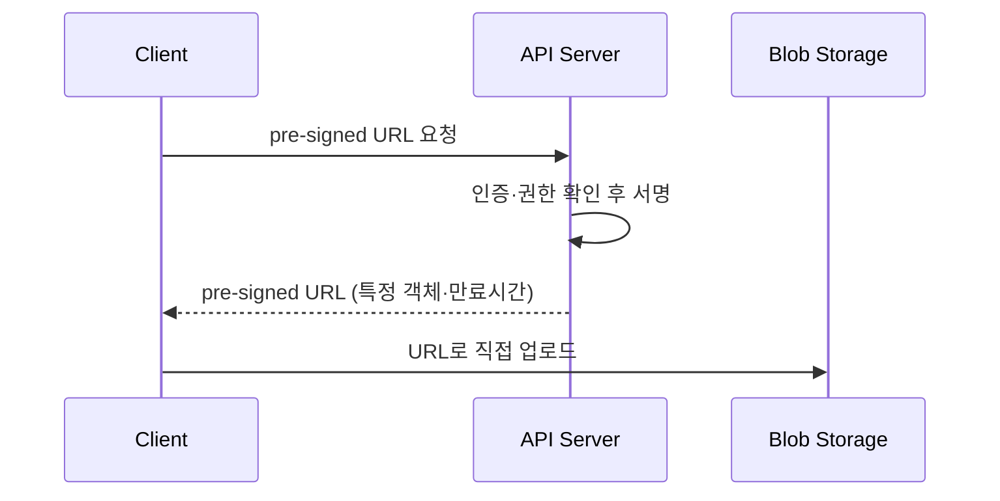

# Pre-signed URL (직접 업로드 인가)

## 한 줄 정의

서버가 **특정 객체에 대한 시간 제한 접근 권한을 담아 서명한 URL**. 클라이언트가 이 URL로 [[blob-storage]]에 **직접** 업로드/다운로드하되, 서버를 거치지 않고도 인가된 위치에만 접근하게 한다 (ch14, p.236-237). AWS S3는 "pre-signed URL", Azure는 "Shared Access Signature(SAS)".

## 왜 필요한가

대용량(영상 1GB) 파일을 **클라이언트 → API 서버 → 스토리지**로 중계하면:

- API 서버가 거대 트래픽의 병목·비용이 된다.
- 그렇다고 스토리지를 누구나 쓰게 열면 보안 붕괴.

pre-signed URL은 **인가는 서버가, 전송은 클라이언트가 직접** 담당하게 분리한다 — 서버는 짧은 제어 요청만 처리하고, 무거운 바이트 전송은 스토리지가 직접 받는다.

## 핵심 메커니즘

- URL에 **대상 객체·허용 동작(PUT/GET)·만료 시각**이 서명되어 들어감.
- 스토리지는 서명을 검증해 해당 범위 내 요청만 허용.
- 만료 후엔 무효 → 유출돼도 피해 한정.

## 트레이드오프 & 선택 기준

- **장점**: 서버 부하·대역폭 비용 절감, 스토리지 직결로 빠름, 세분화된 시간 제한 권한.
- **주의**: URL이 유효 기간 내 유출되면 누구나 사용 가능 → 만료를 짧게, 필요 시 1회용/IP 제한.
- 업로드 후 검증(바이러스·malformed·크기)은 별도 단계로(직접 업로드라 서버가 내용을 못 봄).

## 실무 적용 시 고려사항

- 영상·이미지·첨부처럼 **큰 파일 업로드의 표준 패턴**. 작은 메타데이터는 일반 API로.
- 업로드 완료를 서버가 알아야 하면 스토리지 이벤트 알림(S3 event → 큐)으로 후처리 트리거([[message-queue]]).
- 영상 보호(재생 측)는 별개 — DRM·AES 암호화·워터마크와 조합 (ch14).

## 다른 개념과의 관계

- [[blob-storage]] — pre-signed URL이 가리키는 대상.
- [[video-transcoding]] — 직접 업로드된 원본이 인코딩 파이프라인의 입력.
- [[message-queue]] — 업로드 완료 이벤트 후처리.

## 등장 사례

- ch14 — YouTube 영상 업로드를 인가된 스토리지 위치로 직접
- AWS S3 pre-signed URL / Azure SAS — 클라우드 직접 업로드의 표준
