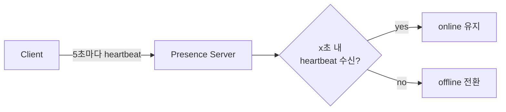

# Online Presence & Heartbeat

## 한 줄 정의

사용자의 **온라인/오프라인 상태를 추적하고 친구들에게 전파**하는 메커니즘. 잦은 끊김에도 상태가 깜빡이지 않도록 **heartbeat**로 생사를 판정하고, 변경은 **pub/sub fanout**으로 알린다 (ch12, p.193-196).

## 왜 필요한가

채팅·협업 앱의 "초록 점"은 단순해 보이지만 분산 환경에서 까다롭다:

- 연결이 끊길 때마다 offline으로 바꾸면, 터널 통과처럼 **짧게 끊겼다 붙는** 경우 상태가 계속 깜빡여 UX가 나빠진다.
- 상태가 바뀔 때 친구 전원에게 알려야 하는데, 친구/그룹이 크면 **fanout 비용**이 폭발한다.

## 핵심 메커니즘

### 상태 변경 트리거

| 이벤트 | 처리 |
|---|---|
| 로그인 | WebSocket 연결 후 KV에 online + `last_active_at` 저장 |
| 로그아웃 | KV 상태 offline |
| 끊김 | naive하게 즉시 offline 금지 → heartbeat로 판정 |

### Heartbeat — 깜빡임 방지

온라인 클라이언트가 주기적(예 5초) heartbeat 전송. presence server가 x초(예 30초) 내 수신하면 online, 아니면 offline. 짧은 끊김/재연결은 윈도우 안에서 흡수돼 상태가 안정된다.

### 상태 fanout — pub/sub

[[publish-subscribe]]로 **친구쌍마다 채널**(A-B, A-C, A-D)을 두고, A의 상태 변경을 세 채널에 발행 → B·C·D가 각 채널 구독으로 수신. 전달은 실시간 [[websocket]].

## 트레이드오프 & 선택 기준

- heartbeat 주기·타임아웃은 **반응성 vs 부하** 절충. 짧으면 빠른 감지+높은 트래픽, 길면 그 반대.
- 친구쌍 채널 pub/sub은 **소규모에 적합**. 10만 명 그룹은 1회 변경 = 10만 이벤트라 비현실적 → **그룹 진입/수동 새로고침 시에만 조회**로 전환(on-demand). [[fanout]]의 push vs pull 트레이드오프와 동형.

## 실무 적용 시 고려사항

- heartbeat는 죽은 WebSocket 연결을 감지하는 일반 수단이기도 하다(presence뿐 아니라 연결 정리에 활용).
- `last_active_at`을 함께 저장하면 "방금 전 활동" 같은 세분화 상태 표현 가능.
- presence는 strong consistency가 불필요한 대표 사례 — 약간의 지연·부정확을 허용해 비용을 아낀다([[consistency-models]]).
- 대규모에선 presence 전용 서비스를 분리하고, 구독 관계를 캐시로 관리.

## 다른 개념과의 관계

- [[websocket]] — 상태 전달 채널이자 heartbeat의 운반체.
- [[publish-subscribe]] — 상태 변경 이벤트 라우팅.
- [[fanout]] — 대규모 상태 전파의 push/pull 선택은 피드 fanout과 같은 문제.

## 등장 사례

- ch12 — 채팅 온라인 표시기, heartbeat 30초 타임아웃 예시
- WeChat — 500명 상한이라 친구쌍 pub/sub 방식 사용
- Slack/Discord — presence를 별도 서비스로 운영
