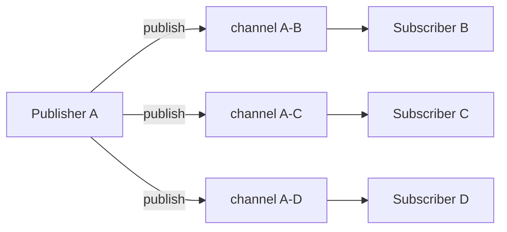

# Publish-Subscribe (Pub/Sub)

## 한 줄 정의

발행자(publisher)가 **채널/토픽**에 이벤트를 보내면, 그 채널을 구독(subscribe)한 모든 수신자가 받는 메시징 패턴. 발행자와 구독자가 서로를 직접 알 필요가 없어 **N:M 비동기 분리**를 이룬다 (ch12, p.195-196).

## 왜 필요한가

"한 이벤트를 관심 있는 여러 대상에게 동시에 전파"가 필요할 때, 발행자가 수신자 목록을 직접 관리하면 결합도가 폭증한다. 채팅의 온라인 상태 전파가 전형 — A의 상태 변경을 친구 전원이 알아야 하지만, A가 친구 연결을 일일이 들고 있을 순 없다. 채널을 매개로 두면 발행자는 "채널에 던지기"만 하면 된다.

## 핵심 메커니즘

- **Topic/Channel**: 이벤트가 흐르는 논리적 통로.
- **Publisher**: 채널에 이벤트 발행 (구독자를 모름).
- **Subscriber**: 채널을 구독, 발행된 이벤트 수신.
- 채팅 presence는 **친구쌍마다 채널**(A-B 등)을 두어 정밀 라우팅.

## 트레이드오프 & 선택 기준

### vs Message Queue (point-to-point)

| | Pub/Sub | [[message-queue]] (작업 큐) |
|---|---|---|
| 수신자 수 | N명 모두 받음(broadcast) | 보통 1 consumer가 처리 |
| 의미 | 이벤트 알림 | 작업 분배 |
| 메시지 보존 | 구독자 없으면 유실 가능 | 처리될 때까지 보존 |

핵심 구분: **"여럿에게 알린다"(pub/sub) vs "하나가 처리한다"(작업 큐)**. 같은 미들웨어(Redis, Kafka)가 둘 다 지원하기도 한다.

## 실무 적용 시 고려사항

- 채널 수가 폭발할 수 있다(친구쌍마다 채널 = O(친구쌍)). 대규모는 채널을 토픽으로 묶거나 on-demand 조회로 전환([[presence-and-heartbeat]]·[[fanout]]).
- 기본 pub/sub은 "지금 구독 중인 자"에게만 전달 — 오프라인 구독자가 놓친 이벤트가 필요하면 영속 로그(Kafka)나 별도 저장이 필요.
- 전달 보장은 구현에 따라 다름([[delivery-semantics]]) — Redis pub/sub은 at-most-once에 가깝고, Kafka는 영속·재생 가능.

## 다른 개념과의 관계

- [[message-queue]] — 같은 메시징 계열이나 broadcast vs 작업 분배로 갈림.
- [[presence-and-heartbeat]] — 상태 변경 fanout의 라우팅 수단.
- [[delivery-semantics]] — pub/sub의 전달 보장 수준.
- [[decoupling-with-message-queue]] — 발행자/구독자 분리라는 같은 디커플링 철학.

## 등장 사례

- ch12 — 온라인 상태 변경을 친구쌍 채널로 발행
- Redis Pub/Sub — 경량 실시간 브로드캐스트
- Kafka — 영속·재생 가능한 토픽 기반 pub/sub
