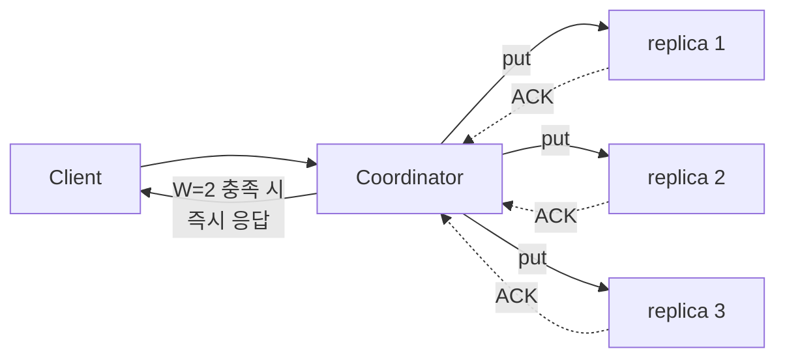

# Quorum Consensus (정족수 합의)

## 한 줄 정의 / 동기

복제된 데이터에 대해 **N개 replica 중 W개 쓰기 ACK·R개 읽기 응답**을 받아야 작업을 성공으로 간주하는 모델. N/W/R 세 파라미터로 **일관성·지연·가용성**의 트레이드오프를 정량적으로 조절한다 (ch06, p.98-99).

## 핵심 정의

- **N**: replica의 총 개수.
- **W**: write quorum. 쓰기 성공으로 인정되려면 W개 replica의 ACK가 필요.
- **R**: read quorum. 읽기 응답으로 인정되려면 R개 replica의 응답이 필요.

Coordinator(클라이언트가 닿은 노드)가 모든 N replica에 요청을 보내되 **W 또는 R개의 응답을 받으면 즉시 결과 반환**.



## 핵심 부등식: `W + R > N`

이 조건이 만족되면 **strong consistency** 보장 — 적어도 한 노드는 가장 최근 쓰기와 읽기 quorum 양쪽에 겹쳐서 등장하므로, 최신값이 read 응답에 반드시 포함된다 (ch06, p.99).

```
N = 3, W = 2, R = 2  → W + R = 4 > 3 → strong
N = 3, W = 1, R = 1  → W + R = 2 ≤ 3 → weak (eventual)
```

가장 흔한 설정: **N=3, W=R=2** — Dynamo·Cassandra 권장.

## 파라미터 선택 패턴

| 설정 | 특성 | 용도 |
|---|---|---|
| `W=1, R=N` | fast write, slow read | 쓰기 폭주 시스템 |
| `W=N, R=1` | fast read, slow write | 읽기 폭주 시스템 (캐시 같은 곳) |
| `W=R=quorum`<br/>(W+R>N) | strong consistency | 일반적 균형 |
| `W=R=1` | fast 양쪽, eventual | 가용성 극단 우선 |

## 트레이드오프

| 차원 | W↑ R↑ | W↓ R↓ |
|---|---|---|
| Consistency | ↑ | ↓ |
| Write latency | ↑ (느린 replica 대기) | ↓ |
| Read latency | ↑ | ↓ |
| Availability | ↓ (응답 필요 노드 많아짐) | ↑ |

핵심 직관: **W와 R은 "몇 명에게 확인받았는지"**. 많이 확인받을수록 안전하지만 느리다.

## 운영 시 변형

### Sloppy quorum

엄격한 quorum은 노드 down 시 즉시 실패. 실제 시스템은 [[sloppy-quorum-hinted-handoff|sloppy quorum]] 사용 — **"링 위에서 healthy 한 첫 W·R개"** 로 완화. 가용성↑, 일관성 약간↓.

### Read repair

R개 응답 중 stale인 게 있으면 coordinator가 즉시 최신값으로 갱신. quorum read의 부수 효과로 데이터 일관성이 점점 수렴.

### Hinted handoff

원래 노드가 down일 때 다른 노드가 "hint"와 함께 임시 보관. 복귀 후 hand-back.

## 흔한 함정

- **W=1은 빠르지만 위험**: 1개 ACK만으로 성공 처리하면 그 노드가 즉시 죽으면 데이터 손실. Dynamo paper도 "W=1 권장 안 함" 명시.
- **W+R > N이라도 일관성 100% 아님**: 시간 차로 일시적 불일치 가능. linearizability와 동일하지 않음.
- **N의 의미는 "유효한 replica 수"**: 가상 노드 환경에선 unique physical server 수로 봐야 함.
- **모든 노드 latency가 같지 않음**: P99 read latency는 R 중 가장 느린 노드가 결정 (tail latency). R 키우면 tail이 더 길어짐.

## 다른 알고리즘과의 위치

| 모델 | 일관성 | 가용성 | 비고 |
|---|---|---|---|
| **2PC (Two-Phase Commit)** | strong | 낮음 | 모든 노드 합의, 1개 실패 = 전체 abort |
| **Paxos/Raft** | strong | 다수결 작동 시 | leader 기반 합의 |
| **Quorum (N/W/R)** | 튜닝 가능 | 튜닝 가능 | Dynamo 계열, leaderless |
| **Eventual (no quorum)** | weak | 매우 높음 | 충돌은 클라이언트 reconcile |

## 실무 적용 시 고려사항

- **N=3, W=R=2가 디폴트로 안전한 출발**. 트래픽·도메인에 따라 조정.
- **N은 trade-off 비용**: N↑ → 신뢰성·가용성↑, 저장·쓰기 비용↑. 보통 3, 자산 중요도 따라 5.
- **다른 일관성 레벨을 도메인별로**: Cassandra의 `consistency_level` per query. 결제는 `LOCAL_QUORUM`, 로그는 `ONE`.
- **DC 단위 quorum**: cross-DC replication이면 `LOCAL_QUORUM`(같은 DC 내 quorum) vs `EACH_QUORUM`(모든 DC에서 quorum) 선택. 후자는 latency 폭증.
- **Read repair의 cost**: 모든 read에서 비교 + 갱신은 비용. async background repair로 일부 대체 가능.
- **W=N은 가용성 0에 가까움**: replica 1개만 down돼도 write 실패. 이런 설정은 함정.
- **Sloppy quorum의 함정**: hinted handoff가 누적되면 임시 노드 디스크가 차오를 수 있음 — 한계 정책 필요.

## 등장 사례

- ch06 — KV store consistency 튜닝 핵심.
- **Amazon Dynamo** — N/W/R 모델의 원조. paper 5.2 절.
- **Cassandra** — `ONE / QUORUM / LOCAL_QUORUM / EACH_QUORUM / ALL` 등 다양한 레벨.
- **Riak** — Dynamo 영감, 마찬가지 N/W/R 노출.
- **MongoDB** — `writeConcern` (w: majority 등)이 비슷한 컨셉.
- **Kafka** — `acks=0/1/all`이 W의 변형.

## 면접 관점 메모

- `W+R > N` 부등식은 외워두면 단답으로 인상적. 단, 추가로 **"단 linearizability와는 다르다"** 한 줄 보태면 깊이 있음.
- N/W/R을 묻는 질문은 결국 "비즈니스 요구가 latency 우선이냐 consistency 우선이냐"로 답하면 통한다.
