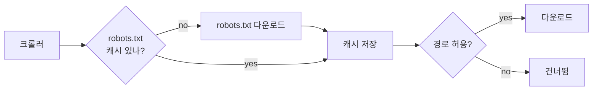

# Robots.txt (Robots Exclusion Protocol)

## 한 줄 정의

웹사이트가 크롤러에게 **"어떤 경로를 수집해도 되고 안 되는지"를 알리는 표준 텍스트 파일**. 사이트 루트(`/robots.txt`)에 두며, 예의 바른 크롤러는 다운로드 전에 이를 먼저 확인·준수한다 (ch09, p.143).

## 왜 필요한가

크롤러는 기술적으로 모든 공개 페이지를 가져올 수 있지만, 그것이 허용·바람직하다는 뜻은 아니다. 사이트 운영자는:

- 민감/무의미 경로(로그인, 무한 파라미터 페이지)를 크롤 대상에서 빼고 싶다.
- 서버 부하를 유발하는 경로 접근을 막고 싶다.

robots.txt는 이를 **사회적 계약**으로 표현한다 — 강제력은 없지만 정상 크롤러(Googlebot 등)는 반드시 따른다.

## 핵심 메커니즘

`User-agent`별로 `Disallow`/`Allow` 규칙을 나열한다. Amazon 예시 (ch09, p.143):

```
User-agent: Googlebot
Disallow: /creatorhub/*
Disallow: /rss/people/*/reviews
Disallow: /gp/cdp/member-reviews/
```

- `User-agent: *` → 모든 크롤러 대상.
- `Disallow: /path` → 해당 경로 수집 금지.
- (확장) `Crawl-delay: N` → 요청 사이 N초 대기 권고.
- (확장) `Sitemap: URL` → 크롤 도우미용 사이트맵 위치.

**캐싱**: 매 URL마다 robots.txt를 다시 받으면 낭비. 한 번 받아 캐시하고 주기적으로 갱신한다.



## 트레이드오프 & 선택 기준

- robots.txt는 **권고이지 보안 장치가 아니다**. 비공개로 만들고 싶으면 인증·robots가 아니라 접근 제어를 써야 한다 (Disallow는 오히려 "여기 뭔가 있다"는 힌트가 됨).
- 준수는 평판·법적 리스크 회피 문제. 무시하면 IP 차단·DoS 신고 대상.

## 실무 적용 시 고려사항

- robots.txt 캐시 TTL은 너무 길면 운영자의 최신 정책을 못 따르고, 너무 짧으면 요청 낭비 — 보통 수 시간~하루.
- `Crawl-delay`를 [[url-frontier]]의 back queue delay에 반영하면 politeness가 더 정교해진다.
- robots.txt 파싱 실패·부재 시 정책(보수적으로 전부 허용 vs 금지)을 명확히 정해야.

## 다른 개념과의 관계

- [[url-frontier]] — politeness 구현의 일부. robots 규칙이 큐 라우팅·delay에 반영됨.
- [[content-deduplication]]와 함께 "수집해도 되는가/이미 봤는가"를 거르는 전치 필터 계열.

## 등장 사례

- ch09 — HTML Downloader가 크롤 전 robots.txt 확인·캐시
- Googlebot — robots.txt를 엄격 준수하는 대표 크롤러
