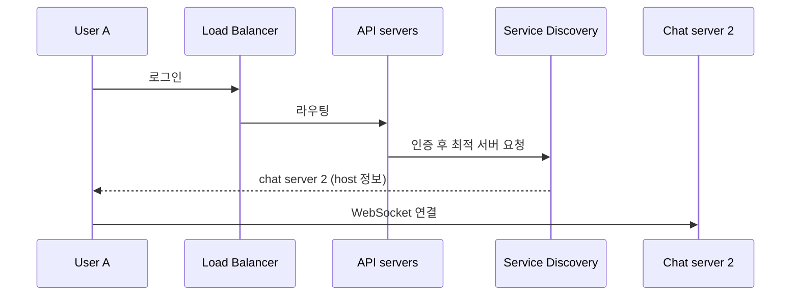

# Service Discovery

## 한 줄 정의

클라이언트(또는 서비스)가 **어느 서버 인스턴스에 접속해야 하는지를 동적으로 찾아주는** 메커니즘. 채팅에서는 지리·용량 기준으로 최적 chat server를 골라 클라이언트에 추천한다 (ch12, p.189-190).

## 왜 필요한가

서버 인스턴스는 수시로 추가·제거·장애가 난다. 클라이언트가 특정 서버 주소를 하드코딩하면:

- 서버가 죽으면 클라이언트가 멈춘다.
- 부하가 한 서버에 쏠려도 분산 못 한다.
- 새 서버를 늘려도 트래픽이 안 간다.

특히 WebSocket처럼 **stateful 지속 연결**에서는 "어느 서버에 붙을지"가 부하·가용성을 직접 좌우하므로 동적 배정이 필수다 ([[websocket]]).

## 핵심 메커니즘

- 가용 chat server들이 코디네이션 서비스([[zookeeper]])에 **등록**.
- service discovery가 지리적 위치·서버 용량 등 기준으로 **최적 서버 선택**.
- 클라이언트는 받은 host로 직접 연결.
- chat service와 긴밀히 협조해 **서버 과부하 방지**.

### 두 가지 패턴

- **Client-side discovery**: 클라이언트가 레지스트리를 조회해 직접 인스턴스 선택(이 챕터 방식).
- **Server-side discovery**: LB/프록시가 레지스트리를 보고 라우팅(클라이언트는 모름).

## 트레이드오프 & 선택 기준

- 레지스트리(Zookeeper 등) 자체가 **SPOF·일관성 병목**이 될 수 있어 보통 합의 기반으로 복제.
- 헬스체크 주기가 너무 길면 죽은 서버로 보내고, 너무 짧으면 레지스트리 부하.
- stateful 연결(WebSocket)은 한 번 붙으면 재배정을 피하는 게 보통(연결 비용) — 서버가 살아있는 한 유지.

## 실무 적용 시 고려사항

- 등록·헬스체크·리더 선출을 직접 만들기보다 [[zookeeper]]·etcd·Consul 같은 검증된 코디네이션 서비스를 쓴다.
- chat server 장애 시 service discovery가 즉시 대체 서버를 제공해 클라이언트가 재연결 ([[websocket]] 재연결 흐름과 짝).
- DNS 기반 단순 discovery는 TTL·캐싱 때문에 빠른 변동에 약함 — 동적 환경엔 전용 레지스트리.

## 다른 개념과의 관계

- [[websocket]] — stateful 연결의 배정 대상.
- [[load-balancer]] — server-side discovery는 LB와 역할이 겹치나, stateful 연결 배정은 LB만으론 부족.
- [[zookeeper]] — 등록·선출의 구현 기반.

## 등장 사례

- ch12 — Zookeeper로 최적 chat server 배정
- Kafka·HBase — 내부적으로 Zookeeper 기반 코디네이션/디스커버리
- Consul/etcd — 마이크로서비스 service discovery의 현대적 표준
