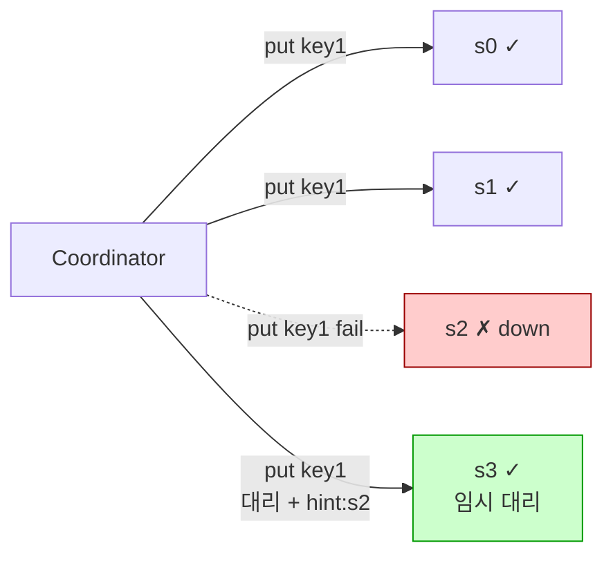
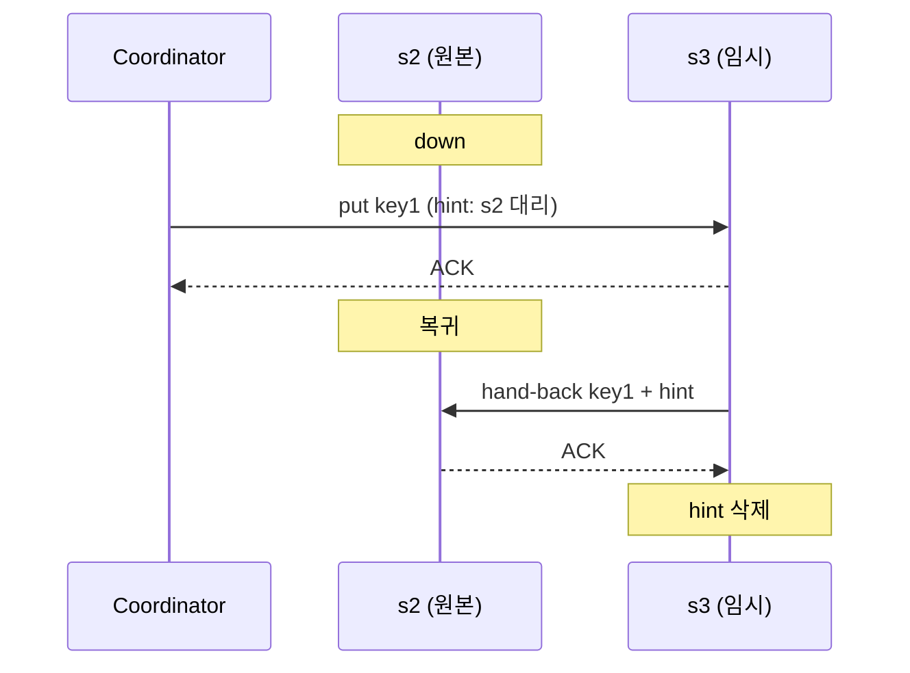

# Sloppy Quorum + Hinted Handoff

## 한 줄 정의 / 동기

엄격한 quorum이 노드 일부 down 시 즉시 실패하는 문제를 우회하기 위해:
- **Sloppy quorum**: 링 위 **healthy한 첫 W·R개 노드**로 quorum을 채워 가용성 유지.
- **Hinted handoff**: 임시 대리 노드가 hint(원 노드 정보)를 들고 데이터 보관, 원 노드 복귀 시 hand-back (ch06, p.108).

Dynamo paper의 "sloppy quorum" 용어가 그대로 표준화된 패턴.

## 왜 필요한가

엄격한 [[quorum-consensus]]는 다음 문제를 가진다:

```
N = 3, W = 2.
지정된 3개 replica 중 1개 일시 down.
→ healthy 2개가 ACK 줘도 OK?  엄격 quorum은 OK.
지정된 3개 replica 중 2개 down.
→ 엄격 quorum: 즉시 write 실패. (가용성 0)
```

AP 시스템은 일시 장애에도 가용성 유지가 핵심 가치. **"지정된 replica가 down이면 다른 노드가 임시로 받는다"** 가 sloppy quorum의 아이디어.

## 동작

### Sloppy quorum



1. 키 위치에서 시계 방향 N개 노드 중 일부 down.
2. Coordinator는 링을 더 돌아 **healthy한 노드까지 W개를 채움**.
3. 임시로 받은 노드는 데이터에 **"이건 원래 s2의 데이터"라는 hint** 메타데이터를 붙여 별도 보관.

### Hinted handoff

1. 임시 대리 노드(s3)는 주기적으로 down 노드(s2)의 회복을 polling.
2. s2가 복귀하면 hint와 함께 데이터를 s2로 전송.
3. s2가 ACK하면 s3는 hint 데이터 삭제 (hand-back 완료).



## 파라미터 · 튜닝 포인트

| 파라미터 | 영향 |
|---|---|
| **Hint TTL** | 대리 노드가 hint를 들고 있는 최대 기간. 너무 길면 임시 노드 디스크 차오름. 보통 수 시간~수 일. |
| **Hand-back polling 주기** | 자주 → 복구 빠름·부하↑. 보통 수 분. |
| **Sloppy 허용 거리** | 링 위에서 얼마나 멀리 떨어진 노드까지 임시 대리 허용? 너무 멀면 cross-DC가 임시 대리됨 — latency·일관성 영향. |
| **Hint 저장 한도** | 임시 노드 디스크 보호. 한도 초과 시 새 write 거부 or 다른 노드로. |

## 트레이드오프

**Pros**
- **일시 장애 중에도 write/read 가용성 유지**.
- **자동 복구**: 원 노드 복귀 시 자동 hand-back, 운영 개입 최소.
- **Dynamo의 "Always writable" 약속 실현**.

**Cons**
- **일관성 약화**: 임시 대리 노드는 원래 quorum 멤버가 아니므로, sloppy quorum은 strong consistency 보장 안 함.
- **Hand-back 중 충돌 가능**: hint 머지 시 [[vector-clock]] 충돌 발생 가능.
- **임시 노드 디스크 압박**: 장기 down 상황에서 hint 누적.
- **운영 복잡도**: hint 큐, hand-back 상태, partial failure 처리 모두 다뤄야 함.

## 운영 시 주의

- **장기 down에는 무력**: hint TTL을 넘어가면 hinted handoff로는 복구 불가. **anti-entropy ([[merkle-tree]])** 가 필요.
- **분리되었던 노드 합류 시**: 노드가 며칠 만에 복귀하면 hint + anti-entropy 양쪽으로 데이터 동기화 필요. 단계적 절차.
- **클라이언트 일관성 환상 주의**: 임시 대리에 쓰고 즉시 원 노드 read하면 못 찾을 수 있음. eventual 명시.

## 다른 failure handling 기법과의 위치

| 기법 | 다루는 장애 | 동기·비동기 |
|---|---|---|
| **Strict quorum** | 없음 — 장애 시 실패 | 동기 |
| **Sloppy quorum + Hinted handoff** | 임시 노드 down | 동기(write) + 비동기(hand-back) |
| **Anti-entropy / Merkle tree** | 영구 노드 손실·장기 누락 | 비동기, 주기적 |
| **Read repair** | replica 간 미세 불일치 | 비동기, read 부산물 |
| **Cross-DC replication** | DC 전체 장애 | 비동기, 멀리 |

→ 보통 위 3~4개 기법을 **층으로 함께 운영**. ch06이 그렇게 설계.

## 실무 적용 시 고려사항

- **hint 저장은 별도 스토리지로**: 일반 데이터와 섞이면 GC·복구가 복잡. Cassandra는 `system.hints` 테이블.
- **hand-back 우선순위**: 노드 복귀 직후 트래픽 + hint 동기화가 겹치면 부하 폭주. 점진적 hand-back rate-limit.
- **Hint 저장 한도 초과 시 정책**: alert + 새 hint 거부 or 다른 healthy 노드로 회전.
- **모니터링 필수 지표**: 클러스터 내 누적 hint 수, 가장 오래된 hint age, hand-back rate, failed hand-back.
- **Repair window 정의**: hint TTL을 넘어가는 down은 즉시 anti-entropy repair 또는 노드 교체로 회수.
- **strict이 필요한 도메인은 별도 quorum 레벨**: Cassandra `EACH_QUORUM`은 sloppy 허용 안 함. 금융 트랜잭션에 사용.
- **hand-back 도중 노드 down**: 임시 노드가 hand-back 전에 down → hint 손실 가능성. replication factor·hint 자체 복제 정책으로 보강.

## 다른 개념과의 관계

- [[quorum-consensus]] — sloppy quorum은 strict quorum의 가용성 보강 변형.
- [[gossip-protocol]] — gossip이 노드 down 탐지 → sloppy 발동.
- [[vector-clock]] — hand-back 시 충돌 해결.
- [[merkle-tree]] — sloppy + handoff로 못 복구한 영구 장애를 anti-entropy로 보강.
- [[cap-theorem]] — AP 시스템의 "always writable" 약속을 구현하는 핵심 도구.

## 등장 사례

- ch06 — failure handling 표준 기법.
- **Amazon Dynamo** — sloppy quorum + hinted handoff의 원조. paper 5.5 절.
- **Apache Cassandra** — `system.hints` 테이블에 hint 저장, 자동 hand-back.
- **Riak** — Dynamo 영감으로 동일 패턴 채택.
- **Voldemort** (LinkedIn) — 같은 패턴.

## 면접 관점 메모

- "노드 down 시 쓰기 어떻게?" → "임시 대리 + hint로 받고 복귀 시 hand-back" 한 줄이면 깊이 인상.
- "Strong consistency와의 차이?" → "엄격 quorum과 달리 임시 노드 포함이라 strong 보장 안 됨" 명시.
