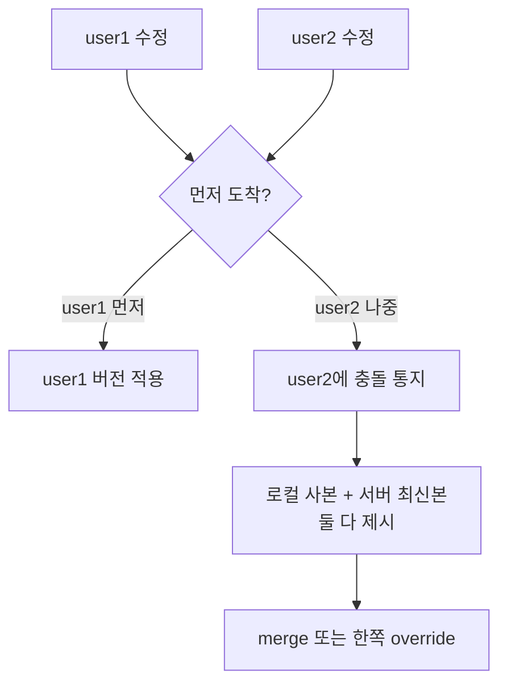

# Sync Conflict Resolution

## 한 줄 정의

여러 사용자/기기가 **같은 파일을 동시에 수정**할 때 발생하는 충돌을 처리하는 전략. Google Drive는 "**먼저 처리된 버전이 이긴다(first-write-wins)**, 나중 버전은 충돌 통지 + 양쪽 버전 제시"를 쓴다 (ch15, p.248-249).

## 왜 필요한가

분산 동기화 시스템에서 동시 수정은 피할 수 없다. user1과 user2가 같은 파일을 같은 시각에 바꾸면, 둘 다 "성공"으로 처리할 수 없다 — 한쪽 변경이 조용히 사라지면(lost update) 데이터 무결성이 깨진다. 충돌을 **명시적으로 드러내고 사용자가 결정**하게 해야 한다.

## 핵심 메커니즘

- 시스템이 **처리 순서**로 승자 결정(first-write-wins).
- 패자에게는 충돌을 알리고 **두 버전(로컬 + 서버 최신)을 모두 보존**.
- 사용자가 **merge**하거나 **한쪽으로 override**.

## 트레이드오프 & 선택 기준

| 전략 | 동작 | 적합 |
|---|---|---|
| **First-write-wins + 양쪽 제시** | 순서로 승자, 패자에 선택권 | 파일 동기화(Drive/Dropbox) |
| Last-write-wins | 타임스탬프 늦은 게 덮어씀 | 충돌 드물고 유실 허용 가능 |
| [[vector-clock]] 기반 | 인과/동시성 판정 후 sibling 보존 | KV store(Dynamo) — 자동 충돌 검출 |
| Operational Transform / CRDT | 동시 편집을 연산 병합 | 실시간 공동 편집(Google Docs) |

핵심 판단: **충돌 빈도와 자동 병합 가능성**. 파일 통째 동기화는 자동 병합이 어려워 사용자에게 위임(first-write-wins + 제시). 실시간 공동 편집은 OT/CRDT로 자동 병합(이 챕터 범위 밖).

## 실무 적용 시 고려사항

- "처리 순서"를 정하려면 단일 직렬화 지점(메타 DB의 순서·버전 번호)이 필요 — strong consistency가 전제([[consistency-models]]).
- 충돌 사본을 별도 파일("conflicted copy")로 남기는 게 Dropbox식 실무 패턴 — 무엇도 잃지 않음.
- [[delta-sync]]의 블록 단위로 보면, 겹치지 않는 블록 변경은 충돌이 아닐 수 있어 더 정교한 병합 여지가 있다.

## 다른 개념과의 관계

- [[vector-clock]] — 충돌을 타임스탬프 대신 인과관계로 판정하는 대안(ch06 KV store).
- [[consistency-models]] — first-write-wins는 strong consistency(직렬 처리 순서) 위에서 성립.
- [[delta-sync]] — 동기화 도중 동시 변경이 충돌의 발생 지점.

## 등장 사례

- ch15 — Google Drive 동시 수정 시 first-write-wins + 양쪽 버전 제시
- Dropbox — "conflicted copy" 파일 생성
- Google Docs — OT 기반 실시간 공동 편집(다른 계열, 자동 병합)
