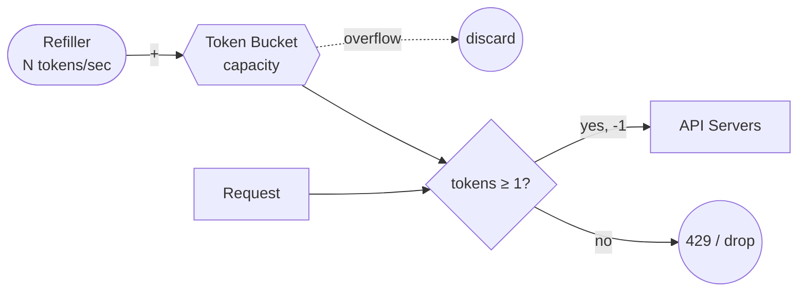

# 토큰 버킷 알고리즘 (Token Bucket Algorithm)

## 한 줄 정의 / 동기

용량이 정해진 버킷에 토큰이 일정 속도로 채워지고, 각 요청이 토큰 1개를 소모하는 처리율 제한 알고리즘. **단기 버스트를 자연스럽게 허용**하면서도 평균 속도를 제한할 수 있어 가장 널리 채택된다 (ch04, p.59-61). Amazon, Stripe API throttling이 채택.

## 동작



```
bucket = capacity      # 시작은 가득 찬 상태가 일반적
refill_rate = N tokens/sec

# Refiller (백그라운드)
on every tick:
    bucket = min(capacity, bucket + refill_rate * elapsed)

# 요청 처리
on request:
    if bucket >= 1:
        bucket -= 1
        forward(request)
    else:
        drop(request)   # 또는 큐잉 / 429 응답
```

실제 구현은 별도 timer 없이 **lazy 방식**으로 한다 — 요청이 올 때 마지막 refill 시각과 현재 시각의 차이로 보충량을 계산해 한 번에 더한다. 이 방식은 [[redis]] Lua 스크립트로 원자 실행하기 쉽다.

### 책의 시각화 (Figure 4-6, capacity 4, refill 4/min)

- `1:00:00` 토큰 4 → 요청 1 통과, 토큰 3.
- `1:00:05` 토큰 3 → 동시 요청 3 모두 통과, 토큰 0.
- `1:00:20` 토큰 0 → 요청 drop.
- `1:01:00` 1분 후 refill 완료, 토큰 4 복귀.

## 파라미터 · 튜닝 포인트

| 파라미터 | 의미 | 튜닝 방향 |
|---|---|---|
| `capacity` | 한 번에 허용할 최대 버스트 크기 | 정상 사용자의 자연스러운 단발 사용량을 덮을 수 있도록 |
| `refill_rate` | 평균 처리율 (RPS, RPM 등) | 비즈니스 SLA·다운스트림 capacity와 합의 |

**버킷 단위**(누구의 버킷인가)도 핵심 결정 (ch04, p.61):

- **사용자별** — 일반적인 사용자 행위 제한.
- **IP별** — 익명 트래픽·로그인 시도 차단.
- **엔드포인트별** — endpoint마다 별도 버킷 (post, friend-add, like 등이 각각 다른 비용).
- **글로벌** — 시스템 전체 capacity 보호 (예: 10,000 RPS 상한).

대규모 서비스는 위 차원을 **조합**한다 — "사용자 X의 POST 엔드포인트 버킷" 처럼.

## 트레이드오프

**Pros**
- 구현 단순, 메모리 효율 (버킷당 정수 2개).
- **단기 버스트 허용** — 토큰이 남아 있는 동안은 통과. 정상 사용자의 단발 폭증·flash sale에 친화적.
- lazy 갱신으로 원자 연산 한 번에 처리 가능.

**Cons**
- 두 파라미터(capacity·refill rate)를 비즈니스에 맞게 튜닝하기 의외로 어려움.
- 버스트 직후 토큰이 비면 정상 사용자도 즉시 차단당함 — UX에서 retry-after 안내가 중요.

## 다른 알고리즘과의 위치

- [[leaking-bucket-algorithm]] — 비슷한 직관(버킷)이지만 **outflow가 고정**. 다운스트림 평탄화가 필요할 때.
- [[fixed-window-counter-algorithm]] — 단순하지만 경계 burst 취약. 토큰 버킷은 그 약점 없음.
- [[sliding-window-log-algorithm]] — 더 정확하지만 메모리 많이 씀.

## 실무 적용 시 고려사항

- **분산 환경**: [[redis]]에 `bucket_size`, `last_refill_ts`를 hash로 저장. 모든 갱신을 Lua 스크립트로 원자 실행해 race condition 회피.
- **클럭 동기화**: lazy 방식은 시각 차이로 보충량을 계산하므로 노드 간 clock skew에 민감. NTP 동기화 권장.
- **첫 요청 처리**: 사용자 첫 진입 시 버킷이 비어 있다면 즉시 차단 — 보통 capacity로 시작하도록 초기화.
- **모니터링**: 버킷 hit/miss 비율, drop 사유별 카운트, 사용자별 retry-after 분포. 정상 사용자 다수가 drop이면 capacity·refill 재조정.

## 등장 사례

- ch04 — 첫 번째로 소개되는 알고리즘. AWS/Stripe API throttling 채택 사례.
- ch04 모니터링 절 — flash sale 같은 급증을 다른 알고리즘이 못 막을 때 token bucket으로 교체 권장.
- 네트워크 트래픽 shaping에서 고전적으로 사용. Linux `tc` (traffic control)에도 구현되어 있음.
