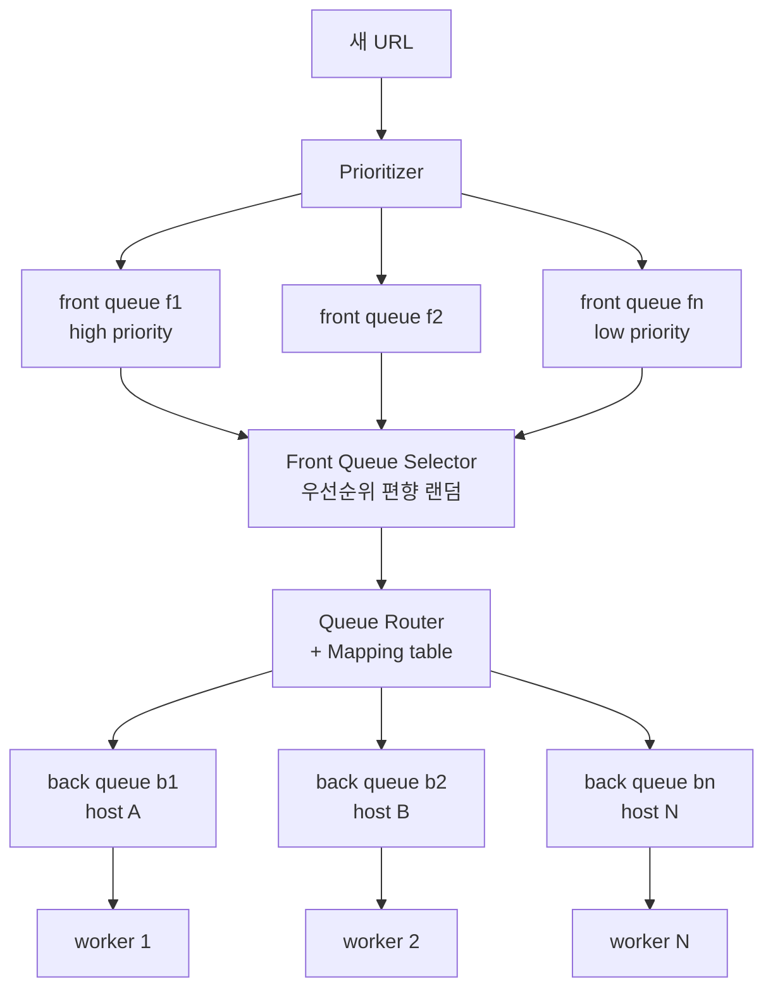

# URL Frontier

## 한 줄 정의

웹 크롤러에서 **다운로드 대기 중인 URL을 저장·스케줄링**하는 데이터 구조. 단순 FIFO 큐가 아니라 politeness·priority·freshness를 동시에 관리하는 복합 큐 시스템이다 (ch09, p.140-143).

## 왜 필요한가

크롤러를 단일 FIFO 큐(순수 BFS)로 만들면 두 가지가 깨진다:

1. **Politeness 붕괴** — 한 웹페이지의 링크는 대부분 같은 호스트(내부 링크)다. FIFO로 꺼내 병렬 다운로드하면 그 호스트에 요청이 폭주해 DoS처럼 보인다.
2. **우선순위 무실** — 웹페이지 품질·중요도는 천차만별인데 FIFO는 enqueue 순서만 본다. Apple 홈페이지와 포럼의 잡담글을 동일 취급.

URL Frontier는 이 둘을 **두 단계 큐 계층**으로 분리해 푼다.

## 핵심 메커니즘

### Front queues — 우선순위(priority)

- **Prioritizer**: URL의 PageRank·트래픽·갱신빈도로 우선순위 점수 계산.
- 큐 f1..fn 각각에 우선순위 부여. **Front queue selector**가 높은 우선순위 큐를 더 높은 확률로(편향 랜덤) 선택.

### Back queues — 예의(politeness)

- **Queue router + Mapping table**: 각 back queue가 **한 호스트의 URL만** 담도록 라우팅 (hostname→큐 매핑).
- worker thread 1개가 back queue 1개에 1:1로 묶임 → 한 worker는 한 호스트만 다운로드, 두 다운로드 사이에 **지연(delay)** 삽입.
- 결과: 호스트당 동시에 한 페이지만, 일정 간격 → 예의 보장.

### Freshness — 재크롤

웹은 끊임없이 추가·삭제·수정된다. 전수 재크롤은 비싸므로:

- 페이지 갱신 이력 기반 재크롤 주기 결정.
- 중요 페이지를 우선·더 자주 재크롤.

### Storage — 하이브리드

실제 검색엔진 frontier는 수억 URL. 메모리만 두면 비내구·비확장, 디스크만 두면 느려 병목. → **대부분 디스크 + 메모리에 enqueue/dequeue 버퍼**, 버퍼를 주기적으로 디스크에 flush.

## 트레이드오프 & 선택 기준

- front/back 2계층은 **우선순위와 예의가 서로 간섭하지 않게** 분리하는 게 핵심. 한 큐로 둘을 동시에 만족시키기 어렵다.
- 편향 랜덤 선택은 starvation(저우선순위 영구 미선택)을 완화하면서 우선순위를 존중하는 절충.
- worker:back queue = 1:1은 단순하지만 호스트 수가 worker 수보다 많으면 회전 스케줄이 필요.

## 실무 적용 시 고려사항

- 본질은 **rate limiting을 호스트 단위로 적용한 분산 작업 큐**다. [[rate-limiting]]의 token/leaky bucket 발상이 politeness delay와 통한다.
- delay를 고정값이 아니라 서버 응답시간·robots.txt의 `Crawl-delay`에 맞춰 적응시키면 더 예의 바르다 ([[robots-txt]]).
- 분산 환경에서 frontier 자체를 샤딩할 때 [[consistent-hashing]]으로 URL 공간을 다운로더에 분배.

## 다른 개념과의 관계

- [[content-deduplication]]의 URL Seen? 판정을 통과한 URL만 frontier에 들어온다.
- [[message-queue]]의 일반 큐와 달리 frontier는 우선순위·호스트 그룹핑이라는 도메인 제약을 내장.
- [[rate-limiting]] — back queue의 delay = 호스트별 처리율 제한.

## 등장 사례

- ch09 — 웹 크롤러의 politeness·priority·freshness를 책임지는 중심 컴포넌트
- Mercator(Heydon & Najork, 1999) — front/back 큐 분리 frontier의 원전 설계
