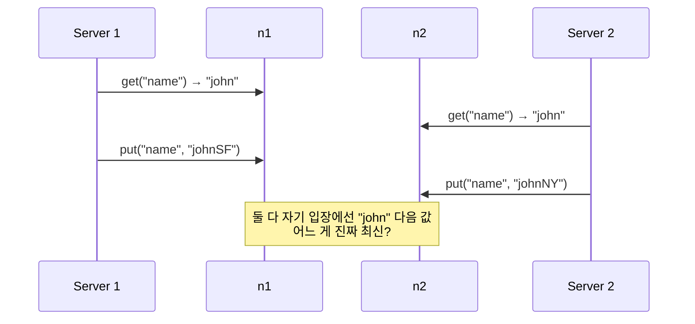

# 벡터 시계 (Vector Clock)

## 한 줄 정의 / 동기

각 데이터 항목에 **[server, version] 쌍의 배열**을 함께 저장해, 두 버전이 **선후 관계**인지 **동시 발생(충돌)** 인지 판정하는 분산 버전 관리 알고리즘 (Lamport 1978, Dynamo paper 적용) (ch06, p.101-104).

[[consistency-models|Eventual consistency]] 시스템에서 동시 쓰기로 발생하는 **충돌을 감지하고 해결**하기 위해 필요하다.

## 왜 필요한가



단순 timestamp로는 어느 쪽이 진짜 "이후"인지 판단 불가. 시계 동기화도 분산 환경에선 완벽하지 않다. **인과 관계(causal ordering)** 자체를 추적하는 구조가 필요 — 그게 vector clock이다.

## 동작

### 자료구조

데이터 항목 D는 vector clock과 함께 저장됨:

```
D([S1, v1], [S2, v2], ..., [Sn, vn])
```

여기서 `Si`는 서버 식별자, `vi`는 그 서버가 본 버전 카운터.

### 업데이트 규칙

서버 `Si`가 데이터 `D`에 쓰기를 처리하면:
1. `[Si, vi]`가 vector clock에 있으면 → `vi`를 1 증가.
2. 없으면 → `[Si, 1]` 추가.

### 예시 흐름 (ch06 Figure 6-9)

```
1. Sx가 D1을 씀          → D1([Sx, 1])
2. Sx가 D1 → D2          → D2([Sx, 2])
3. Sy가 D2 → D3          → D3([Sx, 2], [Sy, 1])
4. Sz가 D2 → D4 (동시)   → D4([Sx, 2], [Sz, 1])
5. D3·D4 충돌 발견·머지  → D5([Sx, 3], [Sy, 1], [Sz, 1])
```

3-4단계가 핵심 — 같은 D2로부터 Sy와 Sz가 동시에 분기. 두 결과의 vector clock이 sibling 관계.

### Ancestor / Sibling 판정

두 vector clock X, Y가 있을 때:

- **X is ancestor of Y**: Y의 모든 [Si, vi]에서 vi(Y) ≥ vi(X). → 충돌 없음, Y가 X를 덮음.
- **X and Y are siblings**: X의 어떤 카운터가 Y의 대응 카운터보다 크고, 동시에 Y의 어떤 카운터가 X의 대응 카운터보다 큼. → 충돌, 클라이언트 reconcile 필요.

예 (ch06, p.104):
- `D([s0, 1], [s1, 1])` is ancestor of `D([s0, 1], [s1, 2])` → 충돌 X
- `D([s0, 1], [s1, 2])` and `D([s0, 2], [s1, 1])` → sibling, 충돌 O

## 충돌 해결 (Reconciliation)

Sibling이 발견되면 시스템은 **두 버전을 모두 클라이언트에 반환** (Dynamo 방식). 클라이언트가 도메인 지식으로 머지:

- **쇼핑카트**: 두 항목 union → 사용자가 원하는 모든 상품이 보존됨 (Dynamo의 유명한 예).
- **사용자 프로필**: last-write-wins 또는 사용자에게 선택 시킴.
- **카운터**: CRDT 같은 자료구조 사용.

머지된 결과를 새 vector clock(`[Sx, 3], [Sy, 1], [Sz, 1]`)으로 다시 쓴다.

## 파라미터 · 튜닝 포인트

| 파라미터 | 영향 |
|---|---|
| **Vector clock 길이 한도** | 노드 수만큼 자라면 메타데이터 폭증. Dynamo는 threshold(예: 10) 두고 오래된 entry 제거 |
| **충돌 응답 정책** | 두 값 모두 반환 vs LWW로 자동 머지 (Cassandra) vs CRDT |
| **버전 정리(GC)** | 한 노드만 계속 쓰면 카운터만 늘고 다른 노드 entry는 죽은 entry — TTL로 제거 |

## 트레이드오프

**Pros**
- **동시 쓰기 충돌을 정확히 감지** (timestamp 단순 비교는 못 함).
- **인과 관계 보존**: ancestor 관계는 자동 해결 → 클라이언트 부담 적음.
- **leaderless 시스템 가능** — 어느 노드가 받아도 충돌 처리 가능.

**Cons**
- **클라이언트 복잡도 증가**: 도메인별 머지 로직 필요.
- **메타데이터 크기**: 노드 많을수록 vector 길이 증가, 데이터당 추가 저장 비용.
- **truncation 위험**: 오래된 entry 제거하면 ancestor 관계를 잘못 판정할 가능성 (Dynamo paper는 "실제로 본 적 없음"이라고 보고).

## 다른 충돌 해결 기법과의 위치

| 기법 | 충돌 감지 | 충돌 해결 | 비고 |
|---|---|---|---|
| **Last-Write-Wins (LWW)** | 못 함 | timestamp 최신 우선 | 단순, 잃는 쓰기 발생 |
| **Version vector** | 가능 | sibling 시 머지 필요 | vector clock과 거의 동의어로 쓰이기도 |
| **Vector clock** | 가능 | 클라이언트 머지 | 본 페이지 |
| **CRDT** | 자동 | 자료구조 자체가 충돌 없는 머지 정의 | 카운터·set·map 등 한정적 |
| **Operational Transformation (OT)** | 가능 | 작업 변환으로 머지 | Google Docs 등 협업 편집 |

## 실무 적용 시 고려사항

- **써야 할 때**: AP 시스템 + 충돌이 도메인적으로 의미가 있을 때 (쇼핑카트, 협업 편집).
- **쓰지 말아야 할 때**: 충돌이 거의 없거나 LWW로 무방한 도메인 (활동 로그, 카운터). 메타데이터 비용만 발생.
- **클라이언트 측 머지 로직 명확화**: 어떤 sibling이 와도 결정론적으로 머지되어야 함. 비결정적이면 두 사용자가 다른 결과를 봄.
- **vector clock truncation 정책**: Dynamo는 ([server, version, timestamp]) 트리플로 저장하고 timestamp 오래된 것부터 제거. truncation 시 잘못된 ancestor 판정의 영향은 도메인적으로 평가해야 함.
- **모니터링**: sibling 발생률, vector 길이 분포 — 충돌 폭증을 조기 감지.
- **클라이언트 라이브러리 추상화**: vector clock·sibling 머지를 직접 노출하면 사용자 코드가 복잡. 표준 SDK가 머지 콜백만 받도록 추상화.
- **DB 자체가 못 푸는 케이스**: vector clock은 "어느 게 신선한가"는 알지만 "어느 게 옳은가"는 모름. 비즈니스 정합성은 결국 클라이언트 책임.

## 다른 개념과의 관계

- [[consistency-models|Eventual consistency]] — vector clock은 eventual의 부산물인 충돌을 다루는 도구.
- [[quorum-consensus]] — N/W/R로 충돌 발생률은 낮출 수 있지만 0은 불가.
- [[cap-theorem]] — AP 선택 시 충돌은 불가피.
- [[sloppy-quorum-hinted-handoff]] — sloppy 운영 중에는 동시 쓰기 증가 → vector clock 부담↑.

## 등장 사례

- ch06 — eventual consistency KV store의 충돌 해결 표준.
- **Amazon Dynamo** — vector clock의 가장 유명한 실전 사용. paper 6.3 절.
- **Riak** — Dynamo 영감, vector clock 직접 노출.
- **Voldemort** (LinkedIn) — Dynamo 클론, vector clock 사용.
- **반대로 Cassandra**는 vector clock 대신 LWW timestamp 선택 — 단순함 우선.

## 면접 관점 메모

- 단순 timestamp만으로는 안 되는 이유(시계 skew, 인과 관계)를 한 줄로 설명할 수 있어야 함.
- ancestor·sibling 판정 규칙 한 번씩 외워두면 + 효과.
- 쇼핑카트 union 예시는 클래식 — 알고 있으면 인상적.
